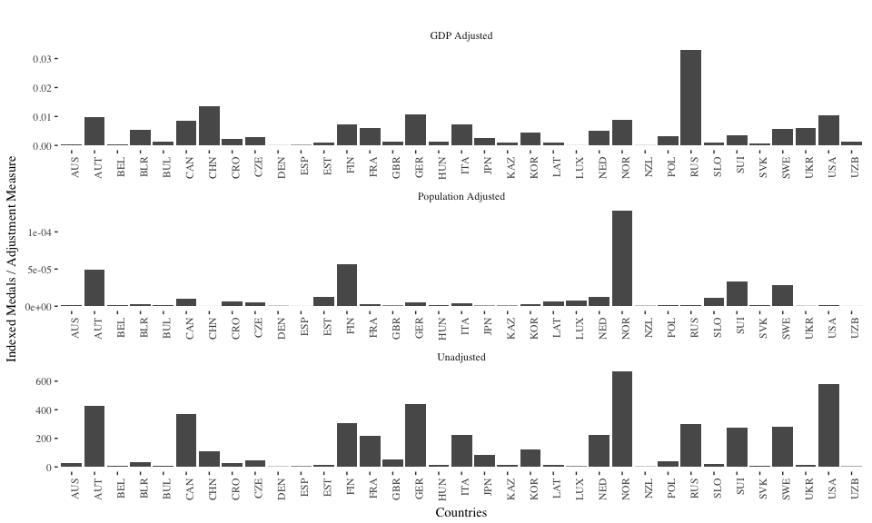
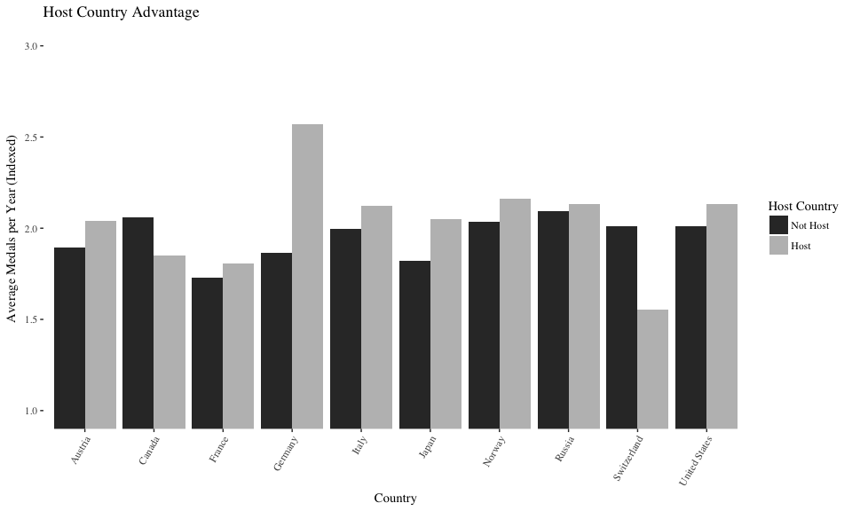
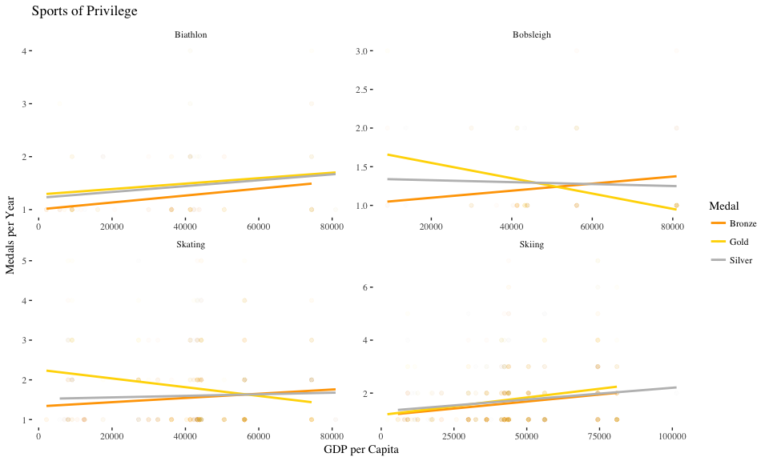
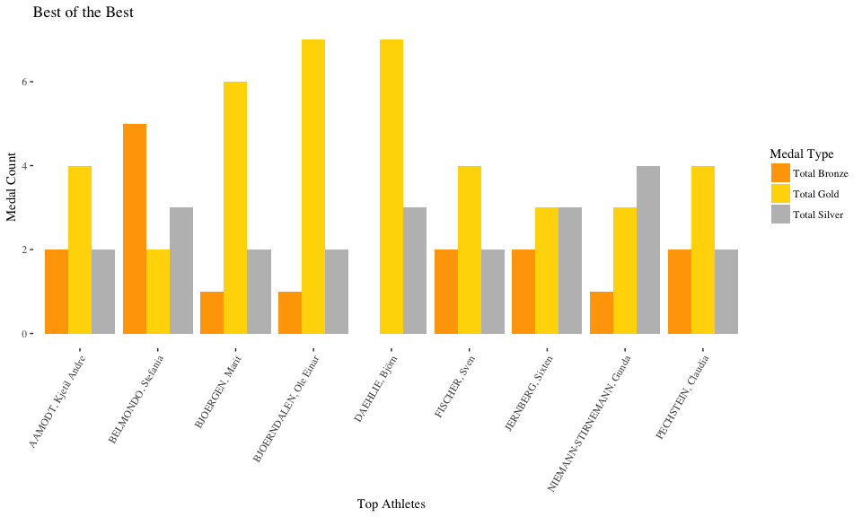
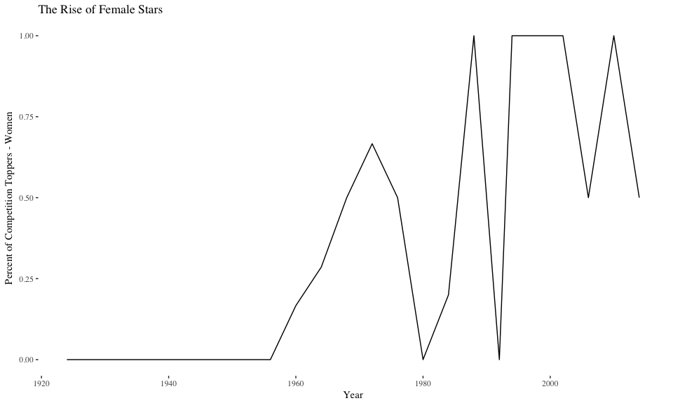

### Question 1

Below we can see a bar graph of the top 10 countries in the Winter Olympics by gender. Top 10 here is defined as those with the highest number of overall medals. 

Team sports have been accounted for such that a medal in a team sport is only counted as one, rather than being overcounted as the number of players in the team.

Next we compare the country currently leading the Winter Olympics with the USA. Interestingly we see that Norway has historically dominated the US in men's medals, with the reverse true for women. However for both Norway and the USA, the number of medals won by women has been rising.

I would reccomend the second visualization as it allows a better comparision between the country of the target audience USA and a contender of interst (Norway). The time-senstive comparision as opposed to the cumulative snapshot allow for a more interesting compairsion between the two, and less data which may not be of interest.

### Question 2

The plot below presents data on a cross-section of countries and an index of performance based on medals. The index is a cumulative summation which takes a value of 3 for each gold medal, 2 for each silver, and 1 for each bronze medal won between 1924 and 2014.

The index is then adjusted for Population and GDP per capita. The GDP adjusted measure depcits the outstanding performance of Russia and China, and greatly diminishes the achievements of the US and Norway.

### Question 3

The plot below shows the average yearly medals (using the same indexing of gold, silver, and bronze as above), of the countries that have hosted the Olympics. We break it down by the averages for those years where the country hosted the Olympics vs those they did not. We find small some evidence suggesting that there may be a small Host-Country effect. 

From the graph below we see that every country, with the exception of Canada and Switzerland have done better in the years where they hosted the Olympics.

### Question 4

Below I plot some of the different sports to try to understand the relationship between different sports and income. Many sports have an association with class background (think Polo vs. Rugby), and this I thought it may be interesting to study whether there different olympics sports react differently to different levels of national income. Due to the low number of observations in Luge, Curling, and Ice Hockey, we dropped those Sports.

Based on the plots, it seems as if Skiing and the Biathlon are the most clearly linked to income, whereas this relationship is less clear for Skating and Bobsleigh

### Question 5

The bar graph below shows the best atheletes of all times, as defined by total medals won. The bars also distinguish between the different types of medals one by the all-time champions.

Next we look at how champions have changed over time. The plot below looks at only those athletes that won the highest number of medals in the respective years, along with the gender compostion of that group. As we can see, altought the trend is highyl senstitive, there does seem to be a rise in the number of women achieving the highest honors.

### Question 6

Interactivity in the following two plots can be useful to readers. The first plot will be beneficial, because scrolling along the linear fit lines will allow the reader to interpolate a predicted medal rate based on income. Although meaningful inference is highly limited due to non-reporting of standard errors, or any form of model checking, the act of simply being able to look at a predicted medal rate in a sport for a given level of GDP per Capita may be a fun and interest gauging activity for the audience.

<!--html_preserve-->

<script type="application/json" data-for="htmlwidget-272a7f4c3f41a63cefcc">{"x":{"data":[{"x":[43774.985173612,43774.985173612,5740.45649479562,5740.45649479562,5740.45649479562,6993.47735975728,43248.529909341,11535.8293558997,17548.3382129701,42311.0362306446,42311.0362306446,36205.5681017036,36205.5681017036,36205.5681017036,36205.5681017036,36205.5681017036,36205.5681017036,36205.5681017036,36205.5681017036,36205.5681017036,41313.3139945434,41313.3139945434,41313.3139945434,41313.3139945434,41313.3139945434,41313.3139945434,41313.3139945434,29957.8043154372,29957.8043154372,29957.8043154372,74400.3697770928,74400.3697770928,74400.3697770928,74400.3697770928,74400.3697770928,9092.58053606884,9092.58053606884,9092.58053606884,9092.58053606884,9092.58053606884,9092.58053606884,9092.58053606884,20726.5398863708,16088.2775872723,50579.6736486777,50579.6736486777,50579.6736486777,50579.6736486777,2114.95471628444,2114.95471628444,2114.95471628444],"y":[1,1,1,1,1,1,1,1,2,1,1,1,1,1,1,1,1,1,2,1,1,1,2,1,1,1,2,2,1,1,1,1,1,3,2,1,1,1,1,2,1,1,1,1,1,1,2,2,1,1,1],"text":["Medal: Bronze GDP.per.Capita:  43775 Total_medals: 1","Medal: Bronze GDP.per.Capita:  43775 Total_medals: 1","Medal: Bronze GDP.per.Capita:   5740 Total_medals: 1","Medal: Bronze GDP.per.Capita:   5740 Total_medals: 1","Medal: Bronze GDP.per.Capita:   5740 Total_medals: 1","Medal: Bronze GDP.per.Capita:   6993 Total_medals: 1","Medal: Bronze GDP.per.Capita:  43249 Total_medals: 1","Medal: Bronze GDP.per.Capita:  11536 Total_medals: 1","Medal: Bronze GDP.per.Capita:  17548 Total_medals: 2","Medal: Bronze GDP.per.Capita:  42311 Total_medals: 1","Medal: Bronze GDP.per.Capita:  42311 Total_medals: 1","Medal: Bronze GDP.per.Capita:  36206 Total_medals: 1","Medal: Bronze GDP.per.Capita:  36206 Total_medals: 1","Medal: Bronze GDP.per.Capita:  36206 Total_medals: 1","Medal: Bronze GDP.per.Capita:  36206 Total_medals: 1","Medal: Bronze GDP.per.Capita:  36206 Total_medals: 1","Medal: Bronze GDP.per.Capita:  36206 Total_medals: 1","Medal: Bronze GDP.per.Capita:  36206 Total_medals: 1","Medal: Bronze GDP.per.Capita:  36206 Total_medals: 2","Medal: Bronze GDP.per.Capita:  36206 Total_medals: 1","Medal: Bronze GDP.per.Capita:  41313 Total_medals: 1","Medal: Bronze GDP.per.Capita:  41313 Total_medals: 1","Medal: Bronze GDP.per.Capita:  41313 Total_medals: 2","Medal: Bronze GDP.per.Capita:  41313 Total_medals: 1","Medal: Bronze GDP.per.Capita:  41313 Total_medals: 1","Medal: Bronze GDP.per.Capita:  41313 Total_medals: 1","Medal: Bronze GDP.per.Capita:  41313 Total_medals: 2","Medal: Bronze GDP.per.Capita:  29958 Total_medals: 2","Medal: Bronze GDP.per.Capita:  29958 Total_medals: 1","Medal: Bronze GDP.per.Capita:  29958 Total_medals: 1","Medal: Bronze GDP.per.Capita:  74400 Total_medals: 1","Medal: Bronze GDP.per.Capita:  74400 Total_medals: 1","Medal: Bronze GDP.per.Capita:  74400 Total_medals: 1","Medal: Bronze GDP.per.Capita:  74400 Total_medals: 3","Medal: Bronze GDP.per.Capita:  74400 Total_medals: 2","Medal: Bronze GDP.per.Capita:   9093 Total_medals: 1","Medal: Bronze GDP.per.Capita:   9093 Total_medals: 1","Medal: Bronze GDP.per.Capita:   9093 Total_medals: 1","Medal: Bronze GDP.per.Capita:   9093 Total_medals: 1","Medal: Bronze GDP.per.Capita:   9093 Total_medals: 2","Medal: Bronze GDP.per.Capita:   9093 Total_medals: 1","Medal: Bronze GDP.per.Capita:   9093 Total_medals: 1","Medal: Bronze GDP.per.Capita:  20727 Total_medals: 1","Medal: Bronze GDP.per.Capita:  16088 Total_medals: 1","Medal: Bronze GDP.per.Capita:  50580 Total_medals: 1","Medal: Bronze GDP.per.Capita:  50580 Total_medals: 1","Medal: Bronze GDP.per.Capita:  50580 Total_medals: 2","Medal: Bronze GDP.per.Capita:  50580 Total_medals: 2","Medal: Bronze GDP.per.Capita:   2115 Total_medals: 1","Medal: Bronze GDP.per.Capita:   2115 Total_medals: 1","Medal: Bronze GDP.per.Capita:   2115 Total_medals: 1"],"type":"scatter","mode":"markers","marker":{"autocolorscale":false,"color":"rgba(255,165,0,1)","opacity":0.025,"size":5.66929133858268,"symbol":"circle","line":{"width":1.88976377952756,"color":"rgba(255,165,0,1)"}},"hoveron":"points","name":"Bronze","legendgroup":"Bronze","showlegend":true,"xaxis":"x","yaxis":"y","hoverinfo":"text","frame":null},{"x":[40324.0277657215,43248.529909341,43248.529909341,36205.5681017036,43875.9696143686,43875.9696143686,43875.9696143686,43875.9696143686,41313.3139945434,41313.3139945434,41313.3139945434,41313.3139945434,41313.3139945434,41313.3139945434,41313.3139945434,29957.8043154372,29957.8043154372,29957.8043154372,9092.58053606884,9092.58053606884,80945.0792194742,80945.0792194742,80945.0792194742,80945.0792194742,80945.0792194742,80945.0792194742,80945.0792194742,80945.0792194742,80945.0792194742,56115.7184261955,56115.7184261955,56115.7184261955,56115.7184261955,56115.7184261955,56115.7184261955,56115.7184261955,56115.7184261955],"y":[1,1,1,1,1,1,1,1,1,1,1,1,1,1,1,2,1,1,2,1,2,1,1,1,1,1,1,2,3,1,1,2,1,1,1,3,1],"text":["Medal: Bronze GDP.per.Capita:  40324 Total_medals: 1","Medal: Bronze GDP.per.Capita:  43249 Total_medals: 1","Medal: Bronze GDP.per.Capita:  43249 Total_medals: 1","Medal: Bronze GDP.per.Capita:  36206 Total_medals: 1","Medal: Bronze GDP.per.Capita:  43876 Total_medals: 1","Medal: Bronze GDP.per.Capita:  43876 Total_medals: 1","Medal: Bronze GDP.per.Capita:  43876 Total_medals: 1","Medal: Bronze GDP.per.Capita:  43876 Total_medals: 1","Medal: Bronze GDP.per.Capita:  41313 Total_medals: 1","Medal: Bronze GDP.per.Capita:  41313 Total_medals: 1","Medal: Bronze GDP.per.Capita:  41313 Total_medals: 1","Medal: Bronze GDP.per.Capita:  41313 Total_medals: 1","Medal: Bronze GDP.per.Capita:  41313 Total_medals: 1","Medal: Bronze GDP.per.Capita:  41313 Total_medals: 1","Medal: Bronze GDP.per.Capita:  41313 Total_medals: 1","Medal: Bronze GDP.per.Capita:  29958 Total_medals: 2","Medal: Bronze GDP.per.Capita:  29958 Total_medals: 1","Medal: Bronze GDP.per.Capita:  29958 Total_medals: 1","Medal: Bronze GDP.per.Capita:   9093 Total_medals: 2","Medal: Bronze GDP.per.Capita:   9093 Total_medals: 1","Medal: Bronze GDP.per.Capita:  80945 Total_medals: 2","Medal: Bronze GDP.per.Capita:  80945 Total_medals: 1","Medal: Bronze GDP.per.Capita:  80945 Total_medals: 1","Medal: Bronze GDP.per.Capita:  80945 Total_medals: 1","Medal: Bronze GDP.per.Capita:  80945 Total_medals: 1","Medal: Bronze GDP.per.Capita:  80945 Total_medals: 1","Medal: Bronze GDP.per.Capita:  80945 Total_medals: 1","Medal: Bronze GDP.per.Capita:  80945 Total_medals: 2","Medal: Bronze GDP.per.Capita:  80945 Total_medals: 3","Medal: Bronze GDP.per.Capita:  56116 Total_medals: 1","Medal: Bronze GDP.per.Capita:  56116 Total_medals: 1","Medal: Bronze GDP.per.Capita:  56116 Total_medals: 2","Medal: Bronze GDP.per.Capita:  56116 Total_medals: 1","Medal: Bronze GDP.per.Capita:  56116 Total_medals: 1","Medal: Bronze GDP.per.Capita:  56116 Total_medals: 1","Medal: Bronze GDP.per.Capita:  56116 Total_medals: 3","Medal: Bronze GDP.per.Capita:  56116 Total_medals: 1"],"type":"scatter","mode":"markers","marker":{"autocolorscale":false,"color":"rgba(255,165,0,1)","opacity":0.025,"size":5.66929133858268,"symbol":"circle","line":{"width":1.88976377952756,"color":"rgba(255,165,0,1)"}},"hoveron":"points","name":"Bronze","legendgroup":"Bronze","showlegend":false,"xaxis":"x2","yaxis":"y2","hoverinfo":"text","frame":null},{"x":[56310.9629933721,43774.985173612,43774.985173612,43774.985173612,43774.985173612,43774.985173612,43774.985173612,43774.985173612,40324.0277657215,40324.0277657215,6993.47735975728,43248.529909341,43248.529909341,43248.529909341,43248.529909341,43248.529909341,43248.529909341,43248.529909341,43248.529909341,43248.529909341,43248.529909341,43248.529909341,43248.529909341,43248.529909341,43248.529909341,43248.529909341,43248.529909341,43248.529909341,43248.529909341,43248.529909341,43248.529909341,43248.529909341,43248.529909341,43248.529909341,8027.68381013907,8027.68381013907,8027.68381013907,8027.68381013907,8027.68381013907,8027.68381013907,8027.68381013907,8027.68381013907,8027.68381013907,17548.3382129701,42311.0362306446,42311.0362306446,42311.0362306446,42311.0362306446,42311.0362306446,42311.0362306446,42311.0362306446,36205.5681017036,36205.5681017036,36205.5681017036,36205.5681017036,36205.5681017036,36205.5681017036,36205.5681017036,36205.5681017036,43875.9696143686,43875.9696143686,43875.9696143686,43875.9696143686,41313.3139945434,41313.3139945434,41313.3139945434,41313.3139945434,41313.3139945434,41313.3139945434,41313.3139945434,41313.3139945434,41313.3139945434,41313.3139945434,41313.3139945434,12363.5434596539,12363.5434596539,12363.5434596539,12363.5434596539,12363.5434596539,12363.5434596539,12363.5434596539,12363.5434596539,29957.8043154372,29957.8043154372,29957.8043154372,29957.8043154372,29957.8043154372,29957.8043154372,32477.2151449234,32477.2151449234,32477.2151449234,32477.2151449234,32477.2151449234,32477.2151449234,32477.2151449234,32477.2151449234,10509.9810699442,10509.9810699442,27221.5240509661,27221.5240509661,27221.5240509661,27221.5240509661,27221.5240509661,27221.5240509661,44299.768085383,44299.768085383,44299.768085383,44299.768085383,44299.768085383,44299.768085383,44299.768085383,44299.768085383,44299.768085383,44299.768085383,44299.768085383,44299.768085383,44299.768085383,44299.768085383,44299.768085383,44299.768085383,74400.3697770928,74400.3697770928,74400.3697770928,74400.3697770928,74400.3697770928,74400.3697770928,74400.3697770928,74400.3697770928,74400.3697770928,74400.3697770928,74400.3697770928,74400.3697770928,74400.3697770928,12554.5475536313,12554.5475536313,12554.5475536313,null,9092.58053606884,9092.58053606884,9092.58053606884,9092.58053606884,9092.58053606884,9092.58053606884,80945.0792194742,50579.6736486777,50579.6736486777,50579.6736486777,50579.6736486777,50579.6736486777,50579.6736486777,2114.95471628444,2114.95471628444,56115.7184261955,56115.7184261955,56115.7184261955,56115.7184261955,56115.7184261955,56115.7184261955,56115.7184261955,56115.7184261955,56115.7184261955,56115.7184261955,56115.7184261955,56115.7184261955,56115.7184261955,56115.7184261955,56115.7184261955,56115.7184261955,56115.7184261955,56115.7184261955,56115.7184261955,56115.7184261955,56115.7184261955,56115.7184261955,56115.7184261955,56115.7184261955,56115.7184261955,56115.7184261955,56115.7184261955],"y":[1,1,1,2,1,1,1,1,1,1,1,5,1,1,1,1,1,1,1,1,1,1,1,2,1,2,2,2,3,1,3,1,3,2,2,1,1,2,3,2,4,1,1,1,2,1,2,1,1,1,1,1,1,1,1,1,1,2,1,1,1,2,1,3,3,1,2,1,1,1,1,1,1,1,1,1,1,1,1,1,1,1,1,1,1,1,1,3,1,3,1,1,1,2,1,2,1,1,1,1,2,2,2,2,1,1,2,2,3,1,2,2,3,2,3,1,2,1,5,4,3,2,1,2,1,3,2,1,4,1,1,2,1,1,1,1,1,1,2,2,1,2,3,1,1,1,1,1,1,1,1,1,1,1,1,1,1,1,3,2,1,1,2,2,2,1,1,1,3,1,2,1,4,3,3,4,1,1,1],"text":["Medal: Bronze GDP.per.Capita:  56311 Total_medals: 1","Medal: Bronze GDP.per.Capita:  43775 Total_medals: 1","Medal: Bronze GDP.per.Capita:  43775 Total_medals: 1","Medal: Bronze GDP.per.Capita:  43775 Total_medals: 2","Medal: Bronze GDP.per.Capita:  43775 Total_medals: 1","Medal: Bronze GDP.per.Capita:  43775 Total_medals: 1","Medal: Bronze GDP.per.Capita:  43775 Total_medals: 1","Medal: Bronze GDP.per.Capita:  43775 Total_medals: 1","Medal: Bronze GDP.per.Capita:  40324 Total_medals: 1","Medal: Bronze GDP.per.Capita:  40324 Total_medals: 1","Medal: Bronze GDP.per.Capita:   6993 Total_medals: 1","Medal: Bronze GDP.per.Capita:  43249 Total_medals: 5","Medal: Bronze GDP.per.Capita:  43249 Total_medals: 1","Medal: Bronze GDP.per.Capita:  43249 Total_medals: 1","Medal: Bronze GDP.per.Capita:  43249 Total_medals: 1","Medal: Bronze GDP.per.Capita:  43249 Total_medals: 1","Medal: Bronze GDP.per.Capita:  43249 Total_medals: 1","Medal: Bronze GDP.per.Capita:  43249 Total_medals: 1","Medal: Bronze GDP.per.Capita:  43249 Total_medals: 1","Medal: Bronze GDP.per.Capita:  43249 Total_medals: 1","Medal: Bronze GDP.per.Capita:  43249 Total_medals: 1","Medal: Bronze GDP.per.Capita:  43249 Total_medals: 1","Medal: Bronze GDP.per.Capita:  43249 Total_medals: 1","Medal: Bronze GDP.per.Capita:  43249 Total_medals: 2","Medal: Bronze GDP.per.Capita:  43249 Total_medals: 1","Medal: Bronze GDP.per.Capita:  43249 Total_medals: 2","Medal: Bronze GDP.per.Capita:  43249 Total_medals: 2","Medal: Bronze GDP.per.Capita:  43249 Total_medals: 2","Medal: Bronze GDP.per.Capita:  43249 Total_medals: 3","Medal: Bronze GDP.per.Capita:  43249 Total_medals: 1","Medal: Bronze GDP.per.Capita:  43249 Total_medals: 3","Medal: Bronze GDP.per.Capita:  43249 Total_medals: 1","Medal: Bronze GDP.per.Capita:  43249 Total_medals: 3","Medal: Bronze GDP.per.Capita:  43249 Total_medals: 2","Medal: Bronze GDP.per.Capita:   8028 Total_medals: 2","Medal: Bronze GDP.per.Capita:   8028 Total_medals: 1","Medal: Bronze GDP.per.Capita:   8028 Total_medals: 1","Medal: Bronze GDP.per.Capita:   8028 Total_medals: 2","Medal: Bronze GDP.per.Capita:   8028 Total_medals: 3","Medal: Bronze GDP.per.Capita:   8028 Total_medals: 2","Medal: Bronze GDP.per.Capita:   8028 Total_medals: 4","Medal: Bronze GDP.per.Capita:   8028 Total_medals: 1","Medal: Bronze GDP.per.Capita:   8028 Total_medals: 1","Medal: Bronze GDP.per.Capita:  17548 Total_medals: 1","Medal: Bronze GDP.per.Capita:  42311 Total_medals: 2","Medal: Bronze GDP.per.Capita:  42311 Total_medals: 1","Medal: Bronze GDP.per.Capita:  42311 Total_medals: 2","Medal: Bronze GDP.per.Capita:  42311 Total_medals: 1","Medal: Bronze GDP.per.Capita:  42311 Total_medals: 1","Medal: Bronze GDP.per.Capita:  42311 Total_medals: 1","Medal: Bronze GDP.per.Capita:  42311 Total_medals: 1","Medal: Bronze GDP.per.Capita:  36206 Total_medals: 1","Medal: Bronze GDP.per.Capita:  36206 Total_medals: 1","Medal: Bronze GDP.per.Capita:  36206 Total_medals: 1","Medal: Bronze GDP.per.Capita:  36206 Total_medals: 1","Medal: Bronze GDP.per.Capita:  36206 Total_medals: 1","Medal: Bronze GDP.per.Capita:  36206 Total_medals: 1","Medal: Bronze GDP.per.Capita:  36206 Total_medals: 2","Medal: Bronze GDP.per.Capita:  36206 Total_medals: 1","Medal: Bronze GDP.per.Capita:  43876 Total_medals: 1","Medal: Bronze GDP.per.Capita:  43876 Total_medals: 1","Medal: Bronze GDP.per.Capita:  43876 Total_medals: 2","Medal: Bronze GDP.per.Capita:  43876 Total_medals: 1","Medal: Bronze GDP.per.Capita:  41313 Total_medals: 3","Medal: Bronze GDP.per.Capita:  41313 Total_medals: 3","Medal: Bronze GDP.per.Capita:  41313 Total_medals: 1","Medal: Bronze GDP.per.Capita:  41313 Total_medals: 2","Medal: Bronze GDP.per.Capita:  41313 Total_medals: 1","Medal: Bronze GDP.per.Capita:  41313 Total_medals: 1","Medal: Bronze GDP.per.Capita:  41313 Total_medals: 1","Medal: Bronze GDP.per.Capita:  41313 Total_medals: 1","Medal: Bronze GDP.per.Capita:  41313 Total_medals: 1","Medal: Bronze GDP.per.Capita:  41313 Total_medals: 1","Medal: Bronze GDP.per.Capita:  41313 Total_medals: 1","Medal: Bronze GDP.per.Capita:  12364 Total_medals: 1","Medal: Bronze GDP.per.Capita:  12364 Total_medals: 1","Medal: Bronze GDP.per.Capita:  12364 Total_medals: 1","Medal: Bronze GDP.per.Capita:  12364 Total_medals: 1","Medal: Bronze GDP.per.Capita:  12364 Total_medals: 1","Medal: Bronze GDP.per.Capita:  12364 Total_medals: 1","Medal: Bronze GDP.per.Capita:  12364 Total_medals: 1","Medal: Bronze GDP.per.Capita:  12364 Total_medals: 1","Medal: Bronze GDP.per.Capita:  29958 Total_medals: 1","Medal: Bronze GDP.per.Capita:  29958 Total_medals: 1","Medal: Bronze GDP.per.Capita:  29958 Total_medals: 1","Medal: Bronze GDP.per.Capita:  29958 Total_medals: 1","Medal: Bronze GDP.per.Capita:  29958 Total_medals: 1","Medal: Bronze GDP.per.Capita:  29958 Total_medals: 3","Medal: Bronze GDP.per.Capita:  32477 Total_medals: 1","Medal: Bronze GDP.per.Capita:  32477 Total_medals: 3","Medal: Bronze GDP.per.Capita:  32477 Total_medals: 1","Medal: Bronze GDP.per.Capita:  32477 Total_medals: 1","Medal: Bronze GDP.per.Capita:  32477 Total_medals: 1","Medal: Bronze GDP.per.Capita:  32477 Total_medals: 2","Medal: Bronze GDP.per.Capita:  32477 Total_medals: 1","Medal: Bronze GDP.per.Capita:  32477 Total_medals: 2","Medal: Bronze GDP.per.Capita:  10510 Total_medals: 1","Medal: Bronze GDP.per.Capita:  10510 Total_medals: 1","Medal: Bronze GDP.per.Capita:  27222 Total_medals: 1","Medal: Bronze GDP.per.Capita:  27222 Total_medals: 1","Medal: Bronze GDP.per.Capita:  27222 Total_medals: 2","Medal: Bronze GDP.per.Capita:  27222 Total_medals: 2","Medal: Bronze GDP.per.Capita:  27222 Total_medals: 2","Medal: Bronze GDP.per.Capita:  27222 Total_medals: 2","Medal: Bronze GDP.per.Capita:  44300 Total_medals: 1","Medal: Bronze GDP.per.Capita:  44300 Total_medals: 1","Medal: Bronze GDP.per.Capita:  44300 Total_medals: 2","Medal: Bronze GDP.per.Capita:  44300 Total_medals: 2","Medal: Bronze GDP.per.Capita:  44300 Total_medals: 3","Medal: Bronze GDP.per.Capita:  44300 Total_medals: 1","Medal: Bronze GDP.per.Capita:  44300 Total_medals: 2","Medal: Bronze GDP.per.Capita:  44300 Total_medals: 2","Medal: Bronze GDP.per.Capita:  44300 Total_medals: 3","Medal: Bronze GDP.per.Capita:  44300 Total_medals: 2","Medal: Bronze GDP.per.Capita:  44300 Total_medals: 3","Medal: Bronze GDP.per.Capita:  44300 Total_medals: 1","Medal: Bronze GDP.per.Capita:  44300 Total_medals: 2","Medal: Bronze GDP.per.Capita:  44300 Total_medals: 1","Medal: Bronze GDP.per.Capita:  44300 Total_medals: 5","Medal: Bronze GDP.per.Capita:  44300 Total_medals: 4","Medal: Bronze GDP.per.Capita:  74400 Total_medals: 3","Medal: Bronze GDP.per.Capita:  74400 Total_medals: 2","Medal: Bronze GDP.per.Capita:  74400 Total_medals: 1","Medal: Bronze GDP.per.Capita:  74400 Total_medals: 2","Medal: Bronze GDP.per.Capita:  74400 Total_medals: 1","Medal: Bronze GDP.per.Capita:  74400 Total_medals: 3","Medal: Bronze GDP.per.Capita:  74400 Total_medals: 2","Medal: Bronze GDP.per.Capita:  74400 Total_medals: 1","Medal: Bronze GDP.per.Capita:  74400 Total_medals: 4","Medal: Bronze GDP.per.Capita:  74400 Total_medals: 1","Medal: Bronze GDP.per.Capita:  74400 Total_medals: 1","Medal: Bronze GDP.per.Capita:  74400 Total_medals: 2","Medal: Bronze GDP.per.Capita:  74400 Total_medals: 1","Medal: Bronze GDP.per.Capita:  12555 Total_medals: 1","Medal: Bronze GDP.per.Capita:  12555 Total_medals: 1","Medal: Bronze GDP.per.Capita:  12555 Total_medals: 1","Medal: Bronze GDP.per.Capita:     NA Total_medals: 1","Medal: Bronze GDP.per.Capita:   9093 Total_medals: 1","Medal: Bronze GDP.per.Capita:   9093 Total_medals: 2","Medal: Bronze GDP.per.Capita:   9093 Total_medals: 2","Medal: Bronze GDP.per.Capita:   9093 Total_medals: 1","Medal: Bronze GDP.per.Capita:   9093 Total_medals: 2","Medal: Bronze GDP.per.Capita:   9093 Total_medals: 3","Medal: Bronze GDP.per.Capita:  80945 Total_medals: 1","Medal: Bronze GDP.per.Capita:  50580 Total_medals: 1","Medal: Bronze GDP.per.Capita:  50580 Total_medals: 1","Medal: Bronze GDP.per.Capita:  50580 Total_medals: 1","Medal: Bronze GDP.per.Capita:  50580 Total_medals: 1","Medal: Bronze GDP.per.Capita:  50580 Total_medals: 1","Medal: Bronze GDP.per.Capita:  50580 Total_medals: 1","Medal: Bronze GDP.per.Capita:   2115 Total_medals: 1","Medal: Bronze GDP.per.Capita:   2115 Total_medals: 1","Medal: Bronze GDP.per.Capita:  56116 Total_medals: 1","Medal: Bronze GDP.per.Capita:  56116 Total_medals: 1","Medal: Bronze GDP.per.Capita:  56116 Total_medals: 1","Medal: Bronze GDP.per.Capita:  56116 Total_medals: 1","Medal: Bronze GDP.per.Capita:  56116 Total_medals: 1","Medal: Bronze GDP.per.Capita:  56116 Total_medals: 1","Medal: Bronze GDP.per.Capita:  56116 Total_medals: 3","Medal: Bronze GDP.per.Capita:  56116 Total_medals: 2","Medal: Bronze GDP.per.Capita:  56116 Total_medals: 1","Medal: Bronze GDP.per.Capita:  56116 Total_medals: 1","Medal: Bronze GDP.per.Capita:  56116 Total_medals: 2","Medal: Bronze GDP.per.Capita:  56116 Total_medals: 2","Medal: Bronze GDP.per.Capita:  56116 Total_medals: 2","Medal: Bronze GDP.per.Capita:  56116 Total_medals: 1","Medal: Bronze GDP.per.Capita:  56116 Total_medals: 1","Medal: Bronze GDP.per.Capita:  56116 Total_medals: 1","Medal: Bronze GDP.per.Capita:  56116 Total_medals: 3","Medal: Bronze GDP.per.Capita:  56116 Total_medals: 1","Medal: Bronze GDP.per.Capita:  56116 Total_medals: 2","Medal: Bronze GDP.per.Capita:  56116 Total_medals: 1","Medal: Bronze GDP.per.Capita:  56116 Total_medals: 4","Medal: Bronze GDP.per.Capita:  56116 Total_medals: 3","Medal: Bronze GDP.per.Capita:  56116 Total_medals: 3","Medal: Bronze GDP.per.Capita:  56116 Total_medals: 4","Medal: Bronze GDP.per.Capita:  56116 Total_medals: 1","Medal: Bronze GDP.per.Capita:  56116 Total_medals: 1","Medal: Bronze GDP.per.Capita:  56116 Total_medals: 1"],"type":"scatter","mode":"markers","marker":{"autocolorscale":false,"color":"rgba(255,165,0,1)","opacity":0.025,"size":5.66929133858268,"symbol":"circle","line":{"width":1.88976377952756,"color":"rgba(255,165,0,1)"}},"hoveron":"points","name":"Bronze","legendgroup":"Bronze","showlegend":false,"xaxis":"x3","yaxis":"y3","hoverinfo":"text","frame":null},{"x":[56310.9629933721,56310.9629933721,56310.9629933721,43774.985173612,43774.985173612,43774.985173612,43774.985173612,43774.985173612,43774.985173612,43774.985173612,43774.985173612,43774.985173612,43774.985173612,43774.985173612,43774.985173612,43774.985173612,43774.985173612,43774.985173612,43774.985173612,43774.985173612,43774.985173612,43774.985173612,43774.985173612,43774.985173612,43774.985173612,43774.985173612,43774.985173612,43774.985173612,43774.985173612,43774.985173612,43774.985173612,43774.985173612,5740.45649479562,5740.45649479562,6993.47735975728,43248.529909341,43248.529909341,43248.529909341,43248.529909341,43248.529909341,43248.529909341,43248.529909341,43248.529909341,8027.68381013907,8027.68381013907,8027.68381013907,17548.3382129701,17548.3382129701,17548.3382129701,25831.5823052954,17118.5042003236,42311.0362306446,42311.0362306446,42311.0362306446,42311.0362306446,42311.0362306446,42311.0362306446,42311.0362306446,42311.0362306446,42311.0362306446,42311.0362306446,42311.0362306446,42311.0362306446,42311.0362306446,42311.0362306446,42311.0362306446,42311.0362306446,42311.0362306446,42311.0362306446,42311.0362306446,42311.0362306446,42311.0362306446,42311.0362306446,42311.0362306446,42311.0362306446,42311.0362306446,42311.0362306446,36205.5681017036,36205.5681017036,36205.5681017036,36205.5681017036,36205.5681017036,36205.5681017036,36205.5681017036,36205.5681017036,36205.5681017036,36205.5681017036,36205.5681017036,36205.5681017036,36205.5681017036,36205.5681017036,36205.5681017036,36205.5681017036,36205.5681017036,36205.5681017036,36205.5681017036,36205.5681017036,36205.5681017036,43875.9696143686,41313.3139945434,41313.3139945434,41313.3139945434,41313.3139945434,41313.3139945434,41313.3139945434,41313.3139945434,41313.3139945434,41313.3139945434,29957.8043154372,29957.8043154372,29957.8043154372,29957.8043154372,29957.8043154372,29957.8043154372,29957.8043154372,29957.8043154372,29957.8043154372,29957.8043154372,29957.8043154372,29957.8043154372,29957.8043154372,29957.8043154372,29957.8043154372,29957.8043154372,32477.2151449234,32477.2151449234,32477.2151449234,32477.2151449234,32477.2151449234,10509.9810699442,null,null,null,null,null,74400.3697770928,74400.3697770928,74400.3697770928,74400.3697770928,74400.3697770928,74400.3697770928,74400.3697770928,74400.3697770928,74400.3697770928,74400.3697770928,74400.3697770928,74400.3697770928,74400.3697770928,74400.3697770928,74400.3697770928,74400.3697770928,74400.3697770928,74400.3697770928,74400.3697770928,74400.3697770928,74400.3697770928,74400.3697770928,74400.3697770928,74400.3697770928,74400.3697770928,74400.3697770928,74400.3697770928,74400.3697770928,74400.3697770928,12554.5475536313,12554.5475536313,12554.5475536313,12554.5475536313,9092.58053606884,9092.58053606884,9092.58053606884,9092.58053606884,9092.58053606884,9092.58053606884,9092.58053606884,9092.58053606884,9092.58053606884,9092.58053606884,20726.5398863708,20726.5398863708,20726.5398863708,20726.5398863708,20726.5398863708,20726.5398863708,80945.0792194742,80945.0792194742,80945.0792194742,80945.0792194742,80945.0792194742,80945.0792194742,80945.0792194742,80945.0792194742,80945.0792194742,80945.0792194742,80945.0792194742,80945.0792194742,80945.0792194742,80945.0792194742,80945.0792194742,80945.0792194742,80945.0792194742,80945.0792194742,50579.6736486777,50579.6736486777,50579.6736486777,50579.6736486777,50579.6736486777,50579.6736486777,50579.6736486777,50579.6736486777,50579.6736486777,50579.6736486777,50579.6736486777,50579.6736486777,50579.6736486777,50579.6736486777,50579.6736486777,50579.6736486777,50579.6736486777,50579.6736486777,50579.6736486777,50579.6736486777,50579.6736486777,56115.7184261955,56115.7184261955,56115.7184261955,56115.7184261955,56115.7184261955,56115.7184261955,56115.7184261955,56115.7184261955,56115.7184261955,56115.7184261955,56115.7184261955,56115.7184261955,56115.7184261955,56115.7184261955,56115.7184261955],"y":[1,1,1,3,2,2,1,2,1,1,1,3,1,1,1,1,1,1,1,5,1,3,6,2,7,1,5,2,3,3,2,2,1,1,1,1,1,2,2,1,1,2,1,1,1,1,1,2,1,1,1,1,1,1,1,1,1,1,1,1,1,2,1,1,2,1,5,1,2,2,2,2,3,1,2,1,2,1,2,2,1,1,1,1,1,1,1,1,1,1,1,1,1,1,2,1,4,2,1,1,1,2,1,2,2,1,1,3,1,1,1,1,2,1,2,4,1,1,1,3,1,1,1,1,1,1,1,2,1,1,1,1,1,1,1,2,2,3,2,1,2,3,2,1,1,2,1,1,1,2,2,3,1,4,1,3,3,2,4,2,4,1,5,3,1,1,1,1,2,1,1,1,2,2,1,1,2,1,1,2,1,1,2,1,1,2,1,2,1,2,3,2,1,1,1,2,1,3,2,1,1,1,1,2,2,2,2,2,1,1,1,2,1,1,1,1,1,2,3,3,1,3,2,1,1,1,1,1,1,1,1,2,1,1,4,3,2,3],"text":["Medal: Bronze GDP.per.Capita:  56311 Total_medals: 1","Medal: Bronze GDP.per.Capita:  56311 Total_medals: 1","Medal: Bronze GDP.per.Capita:  56311 Total_medals: 1","Medal: Bronze GDP.per.Capita:  43775 Total_medals: 3","Medal: Bronze GDP.per.Capita:  43775 Total_medals: 2","Medal: Bronze GDP.per.Capita:  43775 Total_medals: 2","Medal: Bronze GDP.per.Capita:  43775 Total_medals: 1","Medal: Bronze GDP.per.Capita:  43775 Total_medals: 2","Medal: Bronze GDP.per.Capita:  43775 Total_medals: 1","Medal: Bronze GDP.per.Capita:  43775 Total_medals: 1","Medal: Bronze GDP.per.Capita:  43775 Total_medals: 1","Medal: Bronze GDP.per.Capita:  43775 Total_medals: 3","Medal: Bronze GDP.per.Capita:  43775 Total_medals: 1","Medal: Bronze GDP.per.Capita:  43775 Total_medals: 1","Medal: Bronze GDP.per.Capita:  43775 Total_medals: 1","Medal: Bronze GDP.per.Capita:  43775 Total_medals: 1","Medal: Bronze GDP.per.Capita:  43775 Total_medals: 1","Medal: Bronze GDP.per.Capita:  43775 Total_medals: 1","Medal: Bronze GDP.per.Capita:  43775 Total_medals: 1","Medal: Bronze GDP.per.Capita:  43775 Total_medals: 5","Medal: Bronze GDP.per.Capita:  43775 Total_medals: 1","Medal: Bronze GDP.per.Capita:  43775 Total_medals: 3","Medal: Bronze GDP.per.Capita:  43775 Total_medals: 6","Medal: Bronze GDP.per.Capita:  43775 Total_medals: 2","Medal: Bronze GDP.per.Capita:  43775 Total_medals: 7","Medal: Bronze GDP.per.Capita:  43775 Total_medals: 1","Medal: Bronze GDP.per.Capita:  43775 Total_medals: 5","Medal: Bronze GDP.per.Capita:  43775 Total_medals: 2","Medal: Bronze GDP.per.Capita:  43775 Total_medals: 3","Medal: Bronze GDP.per.Capita:  43775 Total_medals: 3","Medal: Bronze GDP.per.Capita:  43775 Total_medals: 2","Medal: Bronze GDP.per.Capita:  43775 Total_medals: 2","Medal: Bronze GDP.per.Capita:   5740 Total_medals: 1","Medal: Bronze GDP.per.Capita:   5740 Total_medals: 1","Medal: Bronze GDP.per.Capita:   6993 Total_medals: 1","Medal: Bronze GDP.per.Capita:  43249 Total_medals: 1","Medal: Bronze GDP.per.Capita:  43249 Total_medals: 1","Medal: Bronze GDP.per.Capita:  43249 Total_medals: 2","Medal: Bronze GDP.per.Capita:  43249 Total_medals: 2","Medal: Bronze GDP.per.Capita:  43249 Total_medals: 1","Medal: Bronze GDP.per.Capita:  43249 Total_medals: 1","Medal: Bronze GDP.per.Capita:  43249 Total_medals: 2","Medal: Bronze GDP.per.Capita:  43249 Total_medals: 1","Medal: Bronze GDP.per.Capita:   8028 Total_medals: 1","Medal: Bronze GDP.per.Capita:   8028 Total_medals: 1","Medal: Bronze GDP.per.Capita:   8028 Total_medals: 1","Medal: Bronze GDP.per.Capita:  17548 Total_medals: 1","Medal: Bronze GDP.per.Capita:  17548 Total_medals: 2","Medal: Bronze GDP.per.Capita:  17548 Total_medals: 1","Medal: Bronze GDP.per.Capita:  25832 Total_medals: 1","Medal: Bronze GDP.per.Capita:  17119 Total_medals: 1","Medal: Bronze GDP.per.Capita:  42311 Total_medals: 1","Medal: Bronze GDP.per.Capita:  42311 Total_medals: 1","Medal: Bronze GDP.per.Capita:  42311 Total_medals: 1","Medal: Bronze GDP.per.Capita:  42311 Total_medals: 1","Medal: Bronze GDP.per.Capita:  42311 Total_medals: 1","Medal: Bronze GDP.per.Capita:  42311 Total_medals: 1","Medal: Bronze GDP.per.Capita:  42311 Total_medals: 1","Medal: Bronze GDP.per.Capita:  42311 Total_medals: 1","Medal: Bronze GDP.per.Capita:  42311 Total_medals: 1","Medal: Bronze GDP.per.Capita:  42311 Total_medals: 1","Medal: Bronze GDP.per.Capita:  42311 Total_medals: 2","Medal: Bronze GDP.per.Capita:  42311 Total_medals: 1","Medal: Bronze GDP.per.Capita:  42311 Total_medals: 1","Medal: Bronze GDP.per.Capita:  42311 Total_medals: 2","Medal: Bronze GDP.per.Capita:  42311 Total_medals: 1","Medal: Bronze GDP.per.Capita:  42311 Total_medals: 5","Medal: Bronze GDP.per.Capita:  42311 Total_medals: 1","Medal: Bronze GDP.per.Capita:  42311 Total_medals: 2","Medal: Bronze GDP.per.Capita:  42311 Total_medals: 2","Medal: Bronze GDP.per.Capita:  42311 Total_medals: 2","Medal: Bronze GDP.per.Capita:  42311 Total_medals: 2","Medal: Bronze GDP.per.Capita:  42311 Total_medals: 3","Medal: Bronze GDP.per.Capita:  42311 Total_medals: 1","Medal: Bronze GDP.per.Capita:  42311 Total_medals: 2","Medal: Bronze GDP.per.Capita:  42311 Total_medals: 1","Medal: Bronze GDP.per.Capita:  42311 Total_medals: 2","Medal: Bronze GDP.per.Capita:  36206 Total_medals: 1","Medal: Bronze GDP.per.Capita:  36206 Total_medals: 2","Medal: Bronze GDP.per.Capita:  36206 Total_medals: 2","Medal: Bronze GDP.per.Capita:  36206 Total_medals: 1","Medal: Bronze GDP.per.Capita:  36206 Total_medals: 1","Medal: Bronze GDP.per.Capita:  36206 Total_medals: 1","Medal: Bronze GDP.per.Capita:  36206 Total_medals: 1","Medal: Bronze GDP.per.Capita:  36206 Total_medals: 1","Medal: Bronze GDP.per.Capita:  36206 Total_medals: 1","Medal: Bronze GDP.per.Capita:  36206 Total_medals: 1","Medal: Bronze GDP.per.Capita:  36206 Total_medals: 1","Medal: Bronze GDP.per.Capita:  36206 Total_medals: 1","Medal: Bronze GDP.per.Capita:  36206 Total_medals: 1","Medal: Bronze GDP.per.Capita:  36206 Total_medals: 1","Medal: Bronze GDP.per.Capita:  36206 Total_medals: 1","Medal: Bronze GDP.per.Capita:  36206 Total_medals: 1","Medal: Bronze GDP.per.Capita:  36206 Total_medals: 1","Medal: Bronze GDP.per.Capita:  36206 Total_medals: 2","Medal: Bronze GDP.per.Capita:  36206 Total_medals: 1","Medal: Bronze GDP.per.Capita:  36206 Total_medals: 4","Medal: Bronze GDP.per.Capita:  36206 Total_medals: 2","Medal: Bronze GDP.per.Capita:  43876 Total_medals: 1","Medal: Bronze GDP.per.Capita:  41313 Total_medals: 1","Medal: Bronze GDP.per.Capita:  41313 Total_medals: 1","Medal: Bronze GDP.per.Capita:  41313 Total_medals: 2","Medal: Bronze GDP.per.Capita:  41313 Total_medals: 1","Medal: Bronze GDP.per.Capita:  41313 Total_medals: 2","Medal: Bronze GDP.per.Capita:  41313 Total_medals: 2","Medal: Bronze GDP.per.Capita:  41313 Total_medals: 1","Medal: Bronze GDP.per.Capita:  41313 Total_medals: 1","Medal: Bronze GDP.per.Capita:  41313 Total_medals: 3","Medal: Bronze GDP.per.Capita:  29958 Total_medals: 1","Medal: Bronze GDP.per.Capita:  29958 Total_medals: 1","Medal: Bronze GDP.per.Capita:  29958 Total_medals: 1","Medal: Bronze GDP.per.Capita:  29958 Total_medals: 1","Medal: Bronze GDP.per.Capita:  29958 Total_medals: 2","Medal: Bronze GDP.per.Capita:  29958 Total_medals: 1","Medal: Bronze GDP.per.Capita:  29958 Total_medals: 2","Medal: Bronze GDP.per.Capita:  29958 Total_medals: 4","Medal: Bronze GDP.per.Capita:  29958 Total_medals: 1","Medal: Bronze GDP.per.Capita:  29958 Total_medals: 1","Medal: Bronze GDP.per.Capita:  29958 Total_medals: 1","Medal: Bronze GDP.per.Capita:  29958 Total_medals: 3","Medal: Bronze GDP.per.Capita:  29958 Total_medals: 1","Medal: Bronze GDP.per.Capita:  29958 Total_medals: 1","Medal: Bronze GDP.per.Capita:  29958 Total_medals: 1","Medal: Bronze GDP.per.Capita:  29958 Total_medals: 1","Medal: Bronze GDP.per.Capita:  32477 Total_medals: 1","Medal: Bronze GDP.per.Capita:  32477 Total_medals: 1","Medal: Bronze GDP.per.Capita:  32477 Total_medals: 1","Medal: Bronze GDP.per.Capita:  32477 Total_medals: 2","Medal: Bronze GDP.per.Capita:  32477 Total_medals: 1","Medal: Bronze GDP.per.Capita:  10510 Total_medals: 1","Medal: Bronze GDP.per.Capita:     NA Total_medals: 1","Medal: Bronze GDP.per.Capita:     NA Total_medals: 1","Medal: Bronze GDP.per.Capita:     NA Total_medals: 1","Medal: Bronze GDP.per.Capita:     NA Total_medals: 1","Medal: Bronze GDP.per.Capita:     NA Total_medals: 1","Medal: Bronze GDP.per.Capita:  74400 Total_medals: 2","Medal: Bronze GDP.per.Capita:  74400 Total_medals: 2","Medal: Bronze GDP.per.Capita:  74400 Total_medals: 3","Medal: Bronze GDP.per.Capita:  74400 Total_medals: 2","Medal: Bronze GDP.per.Capita:  74400 Total_medals: 1","Medal: Bronze GDP.per.Capita:  74400 Total_medals: 2","Medal: Bronze GDP.per.Capita:  74400 Total_medals: 3","Medal: Bronze GDP.per.Capita:  74400 Total_medals: 2","Medal: Bronze GDP.per.Capita:  74400 Total_medals: 1","Medal: Bronze GDP.per.Capita:  74400 Total_medals: 1","Medal: Bronze GDP.per.Capita:  74400 Total_medals: 2","Medal: Bronze GDP.per.Capita:  74400 Total_medals: 1","Medal: Bronze GDP.per.Capita:  74400 Total_medals: 1","Medal: Bronze GDP.per.Capita:  74400 Total_medals: 1","Medal: Bronze GDP.per.Capita:  74400 Total_medals: 2","Medal: Bronze GDP.per.Capita:  74400 Total_medals: 2","Medal: Bronze GDP.per.Capita:  74400 Total_medals: 3","Medal: Bronze GDP.per.Capita:  74400 Total_medals: 1","Medal: Bronze GDP.per.Capita:  74400 Total_medals: 4","Medal: Bronze GDP.per.Capita:  74400 Total_medals: 1","Medal: Bronze GDP.per.Capita:  74400 Total_medals: 3","Medal: Bronze GDP.per.Capita:  74400 Total_medals: 3","Medal: Bronze GDP.per.Capita:  74400 Total_medals: 2","Medal: Bronze GDP.per.Capita:  74400 Total_medals: 4","Medal: Bronze GDP.per.Capita:  74400 Total_medals: 2","Medal: Bronze GDP.per.Capita:  74400 Total_medals: 4","Medal: Bronze GDP.per.Capita:  74400 Total_medals: 1","Medal: Bronze GDP.per.Capita:  74400 Total_medals: 5","Medal: Bronze GDP.per.Capita:  74400 Total_medals: 3","Medal: Bronze GDP.per.Capita:  12555 Total_medals: 1","Medal: Bronze GDP.per.Capita:  12555 Total_medals: 1","Medal: Bronze GDP.per.Capita:  12555 Total_medals: 1","Medal: Bronze GDP.per.Capita:  12555 Total_medals: 1","Medal: Bronze GDP.per.Capita:   9093 Total_medals: 2","Medal: Bronze GDP.per.Capita:   9093 Total_medals: 1","Medal: Bronze GDP.per.Capita:   9093 Total_medals: 1","Medal: Bronze GDP.per.Capita:   9093 Total_medals: 1","Medal: Bronze GDP.per.Capita:   9093 Total_medals: 2","Medal: Bronze GDP.per.Capita:   9093 Total_medals: 2","Medal: Bronze GDP.per.Capita:   9093 Total_medals: 1","Medal: Bronze GDP.per.Capita:   9093 Total_medals: 1","Medal: Bronze GDP.per.Capita:   9093 Total_medals: 2","Medal: Bronze GDP.per.Capita:   9093 Total_medals: 1","Medal: Bronze GDP.per.Capita:  20727 Total_medals: 1","Medal: Bronze GDP.per.Capita:  20727 Total_medals: 2","Medal: Bronze GDP.per.Capita:  20727 Total_medals: 1","Medal: Bronze GDP.per.Capita:  20727 Total_medals: 1","Medal: Bronze GDP.per.Capita:  20727 Total_medals: 2","Medal: Bronze GDP.per.Capita:  20727 Total_medals: 1","Medal: Bronze GDP.per.Capita:  80945 Total_medals: 1","Medal: Bronze GDP.per.Capita:  80945 Total_medals: 2","Medal: Bronze GDP.per.Capita:  80945 Total_medals: 1","Medal: Bronze GDP.per.Capita:  80945 Total_medals: 2","Medal: Bronze GDP.per.Capita:  80945 Total_medals: 1","Medal: Bronze GDP.per.Capita:  80945 Total_medals: 2","Medal: Bronze GDP.per.Capita:  80945 Total_medals: 3","Medal: Bronze GDP.per.Capita:  80945 Total_medals: 2","Medal: Bronze GDP.per.Capita:  80945 Total_medals: 1","Medal: Bronze GDP.per.Capita:  80945 Total_medals: 1","Medal: Bronze GDP.per.Capita:  80945 Total_medals: 1","Medal: Bronze GDP.per.Capita:  80945 Total_medals: 2","Medal: Bronze GDP.per.Capita:  80945 Total_medals: 1","Medal: Bronze GDP.per.Capita:  80945 Total_medals: 3","Medal: Bronze GDP.per.Capita:  80945 Total_medals: 2","Medal: Bronze GDP.per.Capita:  80945 Total_medals: 1","Medal: Bronze GDP.per.Capita:  80945 Total_medals: 1","Medal: Bronze GDP.per.Capita:  80945 Total_medals: 1","Medal: Bronze GDP.per.Capita:  50580 Total_medals: 1","Medal: Bronze GDP.per.Capita:  50580 Total_medals: 2","Medal: Bronze GDP.per.Capita:  50580 Total_medals: 2","Medal: Bronze GDP.per.Capita:  50580 Total_medals: 2","Medal: Bronze GDP.per.Capita:  50580 Total_medals: 2","Medal: Bronze GDP.per.Capita:  50580 Total_medals: 2","Medal: Bronze GDP.per.Capita:  50580 Total_medals: 1","Medal: Bronze GDP.per.Capita:  50580 Total_medals: 1","Medal: Bronze GDP.per.Capita:  50580 Total_medals: 1","Medal: Bronze GDP.per.Capita:  50580 Total_medals: 2","Medal: Bronze GDP.per.Capita:  50580 Total_medals: 1","Medal: Bronze GDP.per.Capita:  50580 Total_medals: 1","Medal: Bronze GDP.per.Capita:  50580 Total_medals: 1","Medal: Bronze GDP.per.Capita:  50580 Total_medals: 1","Medal: Bronze GDP.per.Capita:  50580 Total_medals: 1","Medal: Bronze GDP.per.Capita:  50580 Total_medals: 2","Medal: Bronze GDP.per.Capita:  50580 Total_medals: 3","Medal: Bronze GDP.per.Capita:  50580 Total_medals: 3","Medal: Bronze GDP.per.Capita:  50580 Total_medals: 1","Medal: Bronze GDP.per.Capita:  50580 Total_medals: 3","Medal: Bronze GDP.per.Capita:  50580 Total_medals: 2","Medal: Bronze GDP.per.Capita:  56116 Total_medals: 1","Medal: Bronze GDP.per.Capita:  56116 Total_medals: 1","Medal: Bronze GDP.per.Capita:  56116 Total_medals: 1","Medal: Bronze GDP.per.Capita:  56116 Total_medals: 1","Medal: Bronze GDP.per.Capita:  56116 Total_medals: 1","Medal: Bronze GDP.per.Capita:  56116 Total_medals: 1","Medal: Bronze GDP.per.Capita:  56116 Total_medals: 1","Medal: Bronze GDP.per.Capita:  56116 Total_medals: 1","Medal: Bronze GDP.per.Capita:  56116 Total_medals: 2","Medal: Bronze GDP.per.Capita:  56116 Total_medals: 1","Medal: Bronze GDP.per.Capita:  56116 Total_medals: 1","Medal: Bronze GDP.per.Capita:  56116 Total_medals: 4","Medal: Bronze GDP.per.Capita:  56116 Total_medals: 3","Medal: Bronze GDP.per.Capita:  56116 Total_medals: 2","Medal: Bronze GDP.per.Capita:  56116 Total_medals: 3"],"type":"scatter","mode":"markers","marker":{"autocolorscale":false,"color":"rgba(255,165,0,1)","opacity":0.025,"size":5.66929133858268,"symbol":"circle","line":{"width":1.88976377952756,"color":"rgba(255,165,0,1)"}},"hoveron":"points","name":"Bronze","legendgroup":"Bronze","showlegend":false,"xaxis":"x4","yaxis":"y4","hoverinfo":"text","frame":null},{"x":[5740.45649479562,6993.47735975728,43248.529909341,36205.5681017036,36205.5681017036,36205.5681017036,36205.5681017036,36205.5681017036,41313.3139945434,41313.3139945434,41313.3139945434,41313.3139945434,41313.3139945434,41313.3139945434,41313.3139945434,41313.3139945434,41313.3139945434,74400.3697770928,74400.3697770928,74400.3697770928,74400.3697770928,74400.3697770928,74400.3697770928,74400.3697770928,74400.3697770928,74400.3697770928,9092.58053606884,9092.58053606884,9092.58053606884,9092.58053606884,9092.58053606884,9092.58053606884,9092.58053606884,9092.58053606884,80945.0792194742,16088.2775872723,16088.2775872723,50579.6736486777,50579.6736486777,50579.6736486777,2114.95471628444],"y":[3,1,2,1,1,1,1,2,2,1,1,1,1,3,4,1,2,1,1,1,2,4,2,1,3,1,2,1,1,1,2,1,1,1,1,1,1,1,1,1,1],"text":["Medal: Gold GDP.per.Capita:   5740 Total_medals: 3","Medal: Gold GDP.per.Capita:   6993 Total_medals: 1","Medal: Gold GDP.per.Capita:  43249 Total_medals: 2","Medal: Gold GDP.per.Capita:  36206 Total_medals: 1","Medal: Gold GDP.per.Capita:  36206 Total_medals: 1","Medal: Gold GDP.per.Capita:  36206 Total_medals: 1","Medal: Gold GDP.per.Capita:  36206 Total_medals: 1","Medal: Gold GDP.per.Capita:  36206 Total_medals: 2","Medal: Gold GDP.per.Capita:  41313 Total_medals: 2","Medal: Gold GDP.per.Capita:  41313 Total_medals: 1","Medal: Gold GDP.per.Capita:  41313 Total_medals: 1","Medal: Gold GDP.per.Capita:  41313 Total_medals: 1","Medal: Gold GDP.per.Capita:  41313 Total_medals: 1","Medal: Gold GDP.per.Capita:  41313 Total_medals: 3","Medal: Gold GDP.per.Capita:  41313 Total_medals: 4","Medal: Gold GDP.per.Capita:  41313 Total_medals: 1","Medal: Gold GDP.per.Capita:  41313 Total_medals: 2","Medal: Gold GDP.per.Capita:  74400 Total_medals: 1","Medal: Gold GDP.per.Capita:  74400 Total_medals: 1","Medal: Gold GDP.per.Capita:  74400 Total_medals: 1","Medal: Gold GDP.per.Capita:  74400 Total_medals: 2","Medal: Gold GDP.per.Capita:  74400 Total_medals: 4","Medal: Gold GDP.per.Capita:  74400 Total_medals: 2","Medal: Gold GDP.per.Capita:  74400 Total_medals: 1","Medal: Gold GDP.per.Capita:  74400 Total_medals: 3","Medal: Gold GDP.per.Capita:  74400 Total_medals: 1","Medal: Gold GDP.per.Capita:   9093 Total_medals: 2","Medal: Gold GDP.per.Capita:   9093 Total_medals: 1","Medal: Gold GDP.per.Capita:   9093 Total_medals: 1","Medal: Gold GDP.per.Capita:   9093 Total_medals: 1","Medal: Gold GDP.per.Capita:   9093 Total_medals: 2","Medal: Gold GDP.per.Capita:   9093 Total_medals: 1","Medal: Gold GDP.per.Capita:   9093 Total_medals: 1","Medal: Gold GDP.per.Capita:   9093 Total_medals: 1","Medal: Gold GDP.per.Capita:  80945 Total_medals: 1","Medal: Gold GDP.per.Capita:  16088 Total_medals: 1","Medal: Gold GDP.per.Capita:  16088 Total_medals: 1","Medal: Gold GDP.per.Capita:  50580 Total_medals: 1","Medal: Gold GDP.per.Capita:  50580 Total_medals: 1","Medal: Gold GDP.per.Capita:  50580 Total_medals: 1","Medal: Gold GDP.per.Capita:   2115 Total_medals: 1"],"type":"scatter","mode":"markers","marker":{"autocolorscale":false,"color":"rgba(255,215,0,1)","opacity":0.025,"size":5.66929133858268,"symbol":"circle","line":{"width":1.88976377952756,"color":"rgba(255,215,0,1)"}},"hoveron":"points","name":"Gold","legendgroup":"Gold","showlegend":true,"xaxis":"x","yaxis":"y","hoverinfo":"text","frame":null},{"x":[43774.985173612,43248.529909341,43248.529909341,43248.529909341,43248.529909341,43248.529909341,43248.529909341,43875.9696143686,43875.9696143686,43875.9696143686,41313.3139945434,41313.3139945434,41313.3139945434,41313.3139945434,41313.3139945434,41313.3139945434,29957.8043154372,29957.8043154372,29957.8043154372,9092.58053606884,80945.0792194742,80945.0792194742,80945.0792194742,80945.0792194742,80945.0792194742,80945.0792194742,80945.0792194742,80945.0792194742,80945.0792194742,80945.0792194742,56115.7184261955,56115.7184261955,56115.7184261955,56115.7184261955,56115.7184261955,56115.7184261955,56115.7184261955],"y":[1,1,1,1,1,1,1,1,1,1,1,1,2,2,1,1,1,1,2,3,1,1,1,1,1,1,1,1,1,1,2,2,1,1,1,2,1],"text":["Medal: Gold GDP.per.Capita:  43775 Total_medals: 1","Medal: Gold GDP.per.Capita:  43249 Total_medals: 1","Medal: Gold GDP.per.Capita:  43249 Total_medals: 1","Medal: Gold GDP.per.Capita:  43249 Total_medals: 1","Medal: Gold GDP.per.Capita:  43249 Total_medals: 1","Medal: Gold GDP.per.Capita:  43249 Total_medals: 1","Medal: Gold GDP.per.Capita:  43249 Total_medals: 1","Medal: Gold GDP.per.Capita:  43876 Total_medals: 1","Medal: Gold GDP.per.Capita:  43876 Total_medals: 1","Medal: Gold GDP.per.Capita:  43876 Total_medals: 1","Medal: Gold GDP.per.Capita:  41313 Total_medals: 1","Medal: Gold GDP.per.Capita:  41313 Total_medals: 1","Medal: Gold GDP.per.Capita:  41313 Total_medals: 2","Medal: Gold GDP.per.Capita:  41313 Total_medals: 2","Medal: Gold GDP.per.Capita:  41313 Total_medals: 1","Medal: Gold GDP.per.Capita:  41313 Total_medals: 1","Medal: Gold GDP.per.Capita:  29958 Total_medals: 1","Medal: Gold GDP.per.Capita:  29958 Total_medals: 1","Medal: Gold GDP.per.Capita:  29958 Total_medals: 2","Medal: Gold GDP.per.Capita:   9093 Total_medals: 3","Medal: Gold GDP.per.Capita:  80945 Total_medals: 1","Medal: Gold GDP.per.Capita:  80945 Total_medals: 1","Medal: Gold GDP.per.Capita:  80945 Total_medals: 1","Medal: Gold GDP.per.Capita:  80945 Total_medals: 1","Medal: Gold GDP.per.Capita:  80945 Total_medals: 1","Medal: Gold GDP.per.Capita:  80945 Total_medals: 1","Medal: Gold GDP.per.Capita:  80945 Total_medals: 1","Medal: Gold GDP.per.Capita:  80945 Total_medals: 1","Medal: Gold GDP.per.Capita:  80945 Total_medals: 1","Medal: Gold GDP.per.Capita:  80945 Total_medals: 1","Medal: Gold GDP.per.Capita:  56116 Total_medals: 2","Medal: Gold GDP.per.Capita:  56116 Total_medals: 2","Medal: Gold GDP.per.Capita:  56116 Total_medals: 1","Medal: Gold GDP.per.Capita:  56116 Total_medals: 1","Medal: Gold GDP.per.Capita:  56116 Total_medals: 1","Medal: Gold GDP.per.Capita:  56116 Total_medals: 2","Medal: Gold GDP.per.Capita:  56116 Total_medals: 1"],"type":"scatter","mode":"markers","marker":{"autocolorscale":false,"color":"rgba(255,215,0,1)","opacity":0.025,"size":5.66929133858268,"symbol":"circle","line":{"width":1.88976377952756,"color":"rgba(255,215,0,1)"}},"hoveron":"points","name":"Gold","legendgroup":"Gold","showlegend":false,"xaxis":"x2","yaxis":"y2","hoverinfo":"text","frame":null},{"x":[56310.9629933721,43774.985173612,43774.985173612,43774.985173612,43774.985173612,43774.985173612,43774.985173612,43774.985173612,43774.985173612,43774.985173612,40324.0277657215,40324.0277657215,43248.529909341,43248.529909341,43248.529909341,43248.529909341,43248.529909341,43248.529909341,43248.529909341,43248.529909341,43248.529909341,43248.529909341,43248.529909341,43248.529909341,43248.529909341,8027.68381013907,8027.68381013907,8027.68381013907,8027.68381013907,8027.68381013907,17548.3382129701,17548.3382129701,42311.0362306446,42311.0362306446,42311.0362306446,36205.5681017036,36205.5681017036,36205.5681017036,36205.5681017036,36205.5681017036,36205.5681017036,43875.9696143686,43875.9696143686,43875.9696143686,43875.9696143686,43875.9696143686,41313.3139945434,41313.3139945434,41313.3139945434,41313.3139945434,41313.3139945434,41313.3139945434,41313.3139945434,41313.3139945434,41313.3139945434,29957.8043154372,29957.8043154372,32477.2151449234,32477.2151449234,32477.2151449234,27221.5240509661,27221.5240509661,27221.5240509661,27221.5240509661,27221.5240509661,27221.5240509661,27221.5240509661,27221.5240509661,27221.5240509661,27221.5240509661,27221.5240509661,44299.768085383,44299.768085383,44299.768085383,44299.768085383,44299.768085383,44299.768085383,44299.768085383,44299.768085383,44299.768085383,44299.768085383,44299.768085383,44299.768085383,44299.768085383,44299.768085383,44299.768085383,44299.768085383,44299.768085383,44299.768085383,74400.3697770928,74400.3697770928,74400.3697770928,74400.3697770928,74400.3697770928,74400.3697770928,74400.3697770928,74400.3697770928,74400.3697770928,74400.3697770928,74400.3697770928,74400.3697770928,74400.3697770928,74400.3697770928,74400.3697770928,12554.5475536313,9092.58053606884,9092.58053606884,9092.58053606884,9092.58053606884,9092.58053606884,9092.58053606884,9092.58053606884,9092.58053606884,9092.58053606884,50579.6736486777,50579.6736486777,50579.6736486777,50579.6736486777,50579.6736486777,50579.6736486777,50579.6736486777,50579.6736486777,2114.95471628444,56115.7184261955,56115.7184261955,56115.7184261955,56115.7184261955,56115.7184261955,56115.7184261955,56115.7184261955,56115.7184261955,56115.7184261955,56115.7184261955,56115.7184261955,56115.7184261955,56115.7184261955,56115.7184261955,56115.7184261955,56115.7184261955,56115.7184261955,56115.7184261955,56115.7184261955,56115.7184261955,56115.7184261955,56115.7184261955,56115.7184261955,56115.7184261955,56115.7184261955,56115.7184261955,56115.7184261955],"y":[1,1,2,1,1,1,1,1,1,1,1,1,1,1,1,2,1,1,2,3,2,2,4,2,1,2,1,1,5,3,2,1,4,2,1,1,1,1,1,1,1,1,1,1,1,1,1,1,2,3,1,2,3,1,1,1,2,2,1,1,2,2,2,1,2,2,3,3,4,2,3,1,1,2,3,1,1,1,3,1,3,2,3,1,2,2,1,5,3,1,1,1,4,1,3,3,2,1,1,2,1,2,3,1,1,4,3,3,2,1,3,3,5,3,1,1,1,1,1,1,1,2,1,1,4,1,2,1,1,1,1,1,1,2,1,2,5,1,1,1,4,1,3,1,3,2,4,2,1,1],"text":["Medal: Gold GDP.per.Capita:  56311 Total_medals: 1","Medal: Gold GDP.per.Capita:  43775 Total_medals: 1","Medal: Gold GDP.per.Capita:  43775 Total_medals: 2","Medal: Gold GDP.per.Capita:  43775 Total_medals: 1","Medal: Gold GDP.per.Capita:  43775 Total_medals: 1","Medal: Gold GDP.per.Capita:  43775 Total_medals: 1","Medal: Gold GDP.per.Capita:  43775 Total_medals: 1","Medal: Gold GDP.per.Capita:  43775 Total_medals: 1","Medal: Gold GDP.per.Capita:  43775 Total_medals: 1","Medal: Gold GDP.per.Capita:  43775 Total_medals: 1","Medal: Gold GDP.per.Capita:  40324 Total_medals: 1","Medal: Gold GDP.per.Capita:  40324 Total_medals: 1","Medal: Gold GDP.per.Capita:  43249 Total_medals: 1","Medal: Gold GDP.per.Capita:  43249 Total_medals: 1","Medal: Gold GDP.per.Capita:  43249 Total_medals: 1","Medal: Gold GDP.per.Capita:  43249 Total_medals: 2","Medal: Gold GDP.per.Capita:  43249 Total_medals: 1","Medal: Gold GDP.per.Capita:  43249 Total_medals: 1","Medal: Gold GDP.per.Capita:  43249 Total_medals: 2","Medal: Gold GDP.per.Capita:  43249 Total_medals: 3","Medal: Gold GDP.per.Capita:  43249 Total_medals: 2","Medal: Gold GDP.per.Capita:  43249 Total_medals: 2","Medal: Gold GDP.per.Capita:  43249 Total_medals: 4","Medal: Gold GDP.per.Capita:  43249 Total_medals: 2","Medal: Gold GDP.per.Capita:  43249 Total_medals: 1","Medal: Gold GDP.per.Capita:   8028 Total_medals: 2","Medal: Gold GDP.per.Capita:   8028 Total_medals: 1","Medal: Gold GDP.per.Capita:   8028 Total_medals: 1","Medal: Gold GDP.per.Capita:   8028 Total_medals: 5","Medal: Gold GDP.per.Capita:   8028 Total_medals: 3","Medal: Gold GDP.per.Capita:  17548 Total_medals: 2","Medal: Gold GDP.per.Capita:  17548 Total_medals: 1","Medal: Gold GDP.per.Capita:  42311 Total_medals: 4","Medal: Gold GDP.per.Capita:  42311 Total_medals: 2","Medal: Gold GDP.per.Capita:  42311 Total_medals: 1","Medal: Gold GDP.per.Capita:  36206 Total_medals: 1","Medal: Gold GDP.per.Capita:  36206 Total_medals: 1","Medal: Gold GDP.per.Capita:  36206 Total_medals: 1","Medal: Gold GDP.per.Capita:  36206 Total_medals: 1","Medal: Gold GDP.per.Capita:  36206 Total_medals: 1","Medal: Gold GDP.per.Capita:  36206 Total_medals: 1","Medal: Gold GDP.per.Capita:  43876 Total_medals: 1","Medal: Gold GDP.per.Capita:  43876 Total_medals: 1","Medal: Gold GDP.per.Capita:  43876 Total_medals: 1","Medal: Gold GDP.per.Capita:  43876 Total_medals: 1","Medal: Gold GDP.per.Capita:  43876 Total_medals: 1","Medal: Gold GDP.per.Capita:  41313 Total_medals: 1","Medal: Gold GDP.per.Capita:  41313 Total_medals: 1","Medal: Gold GDP.per.Capita:  41313 Total_medals: 2","Medal: Gold GDP.per.Capita:  41313 Total_medals: 3","Medal: Gold GDP.per.Capita:  41313 Total_medals: 1","Medal: Gold GDP.per.Capita:  41313 Total_medals: 2","Medal: Gold GDP.per.Capita:  41313 Total_medals: 3","Medal: Gold GDP.per.Capita:  41313 Total_medals: 1","Medal: Gold GDP.per.Capita:  41313 Total_medals: 1","Medal: Gold GDP.per.Capita:  29958 Total_medals: 1","Medal: Gold GDP.per.Capita:  29958 Total_medals: 2","Medal: Gold GDP.per.Capita:  32477 Total_medals: 2","Medal: Gold GDP.per.Capita:  32477 Total_medals: 1","Medal: Gold GDP.per.Capita:  32477 Total_medals: 1","Medal: Gold GDP.per.Capita:  27222 Total_medals: 2","Medal: Gold GDP.per.Capita:  27222 Total_medals: 2","Medal: Gold GDP.per.Capita:  27222 Total_medals: 2","Medal: Gold GDP.per.Capita:  27222 Total_medals: 1","Medal: Gold GDP.per.Capita:  27222 Total_medals: 2","Medal: Gold GDP.per.Capita:  27222 Total_medals: 2","Medal: Gold GDP.per.Capita:  27222 Total_medals: 3","Medal: Gold GDP.per.Capita:  27222 Total_medals: 3","Medal: Gold GDP.per.Capita:  27222 Total_medals: 4","Medal: Gold GDP.per.Capita:  27222 Total_medals: 2","Medal: Gold GDP.per.Capita:  27222 Total_medals: 3","Medal: Gold GDP.per.Capita:  44300 Total_medals: 1","Medal: Gold GDP.per.Capita:  44300 Total_medals: 1","Medal: Gold GDP.per.Capita:  44300 Total_medals: 2","Medal: Gold GDP.per.Capita:  44300 Total_medals: 3","Medal: Gold GDP.per.Capita:  44300 Total_medals: 1","Medal: Gold GDP.per.Capita:  44300 Total_medals: 1","Medal: Gold GDP.per.Capita:  44300 Total_medals: 1","Medal: Gold GDP.per.Capita:  44300 Total_medals: 3","Medal: Gold GDP.per.Capita:  44300 Total_medals: 1","Medal: Gold GDP.per.Capita:  44300 Total_medals: 3","Medal: Gold GDP.per.Capita:  44300 Total_medals: 2","Medal: Gold GDP.per.Capita:  44300 Total_medals: 3","Medal: Gold GDP.per.Capita:  44300 Total_medals: 1","Medal: Gold GDP.per.Capita:  44300 Total_medals: 2","Medal: Gold GDP.per.Capita:  44300 Total_medals: 2","Medal: Gold GDP.per.Capita:  44300 Total_medals: 1","Medal: Gold GDP.per.Capita:  44300 Total_medals: 5","Medal: Gold GDP.per.Capita:  44300 Total_medals: 3","Medal: Gold GDP.per.Capita:  74400 Total_medals: 1","Medal: Gold GDP.per.Capita:  74400 Total_medals: 1","Medal: Gold GDP.per.Capita:  74400 Total_medals: 1","Medal: Gold GDP.per.Capita:  74400 Total_medals: 4","Medal: Gold GDP.per.Capita:  74400 Total_medals: 1","Medal: Gold GDP.per.Capita:  74400 Total_medals: 3","Medal: Gold GDP.per.Capita:  74400 Total_medals: 3","Medal: Gold GDP.per.Capita:  74400 Total_medals: 2","Medal: Gold GDP.per.Capita:  74400 Total_medals: 1","Medal: Gold GDP.per.Capita:  74400 Total_medals: 1","Medal: Gold GDP.per.Capita:  74400 Total_medals: 2","Medal: Gold GDP.per.Capita:  74400 Total_medals: 1","Medal: Gold GDP.per.Capita:  74400 Total_medals: 2","Medal: Gold GDP.per.Capita:  74400 Total_medals: 3","Medal: Gold GDP.per.Capita:  74400 Total_medals: 1","Medal: Gold GDP.per.Capita:  12555 Total_medals: 1","Medal: Gold GDP.per.Capita:   9093 Total_medals: 4","Medal: Gold GDP.per.Capita:   9093 Total_medals: 3","Medal: Gold GDP.per.Capita:   9093 Total_medals: 3","Medal: Gold GDP.per.Capita:   9093 Total_medals: 2","Medal: Gold GDP.per.Capita:   9093 Total_medals: 1","Medal: Gold GDP.per.Capita:   9093 Total_medals: 3","Medal: Gold GDP.per.Capita:   9093 Total_medals: 3","Medal: Gold GDP.per.Capita:   9093 Total_medals: 5","Medal: Gold GDP.per.Capita:   9093 Total_medals: 3","Medal: Gold GDP.per.Capita:  50580 Total_medals: 1","Medal: Gold GDP.per.Capita:  50580 Total_medals: 1","Medal: Gold GDP.per.Capita:  50580 Total_medals: 1","Medal: Gold GDP.per.Capita:  50580 Total_medals: 1","Medal: Gold GDP.per.Capita:  50580 Total_medals: 1","Medal: Gold GDP.per.Capita:  50580 Total_medals: 1","Medal: Gold GDP.per.Capita:  50580 Total_medals: 1","Medal: Gold GDP.per.Capita:  50580 Total_medals: 2","Medal: Gold GDP.per.Capita:   2115 Total_medals: 1","Medal: Gold GDP.per.Capita:  56116 Total_medals: 1","Medal: Gold GDP.per.Capita:  56116 Total_medals: 4","Medal: Gold GDP.per.Capita:  56116 Total_medals: 1","Medal: Gold GDP.per.Capita:  56116 Total_medals: 2","Medal: Gold GDP.per.Capita:  56116 Total_medals: 1","Medal: Gold GDP.per.Capita:  56116 Total_medals: 1","Medal: Gold GDP.per.Capita:  56116 Total_medals: 1","Medal: Gold GDP.per.Capita:  56116 Total_medals: 1","Medal: Gold GDP.per.Capita:  56116 Total_medals: 1","Medal: Gold GDP.per.Capita:  56116 Total_medals: 1","Medal: Gold GDP.per.Capita:  56116 Total_medals: 2","Medal: Gold GDP.per.Capita:  56116 Total_medals: 1","Medal: Gold GDP.per.Capita:  56116 Total_medals: 2","Medal: Gold GDP.per.Capita:  56116 Total_medals: 5","Medal: Gold GDP.per.Capita:  56116 Total_medals: 1","Medal: Gold GDP.per.Capita:  56116 Total_medals: 1","Medal: Gold GDP.per.Capita:  56116 Total_medals: 1","Medal: Gold GDP.per.Capita:  56116 Total_medals: 4","Medal: Gold GDP.per.Capita:  56116 Total_medals: 1","Medal: Gold GDP.per.Capita:  56116 Total_medals: 3","Medal: Gold GDP.per.Capita:  56116 Total_medals: 1","Medal: Gold GDP.per.Capita:  56116 Total_medals: 3","Medal: Gold GDP.per.Capita:  56116 Total_medals: 2","Medal: Gold GDP.per.Capita:  56116 Total_medals: 4","Medal: Gold GDP.per.Capita:  56116 Total_medals: 2","Medal: Gold GDP.per.Capita:  56116 Total_medals: 1","Medal: Gold GDP.per.Capita:  56116 Total_medals: 1"],"type":"scatter","mode":"markers","marker":{"autocolorscale":false,"color":"rgba(255,215,0,1)","opacity":0.025,"size":5.66929133858268,"symbol":"circle","line":{"width":1.88976377952756,"color":"rgba(255,215,0,1)"}},"hoveron":"points","name":"Gold","legendgroup":"Gold","showlegend":false,"xaxis":"x3","yaxis":"y3","hoverinfo":"text","frame":null},{"x":[56310.9629933721,56310.9629933721,56310.9629933721,43774.985173612,43774.985173612,43774.985173612,43774.985173612,43774.985173612,43774.985173612,43774.985173612,43774.985173612,43774.985173612,43774.985173612,43774.985173612,43774.985173612,43774.985173612,43774.985173612,43774.985173612,43774.985173612,43774.985173612,43774.985173612,43774.985173612,43774.985173612,43774.985173612,43774.985173612,43774.985173612,43774.985173612,5740.45649479562,5740.45649479562,5740.45649479562,43248.529909341,43248.529909341,43248.529909341,43248.529909341,43248.529909341,43248.529909341,43248.529909341,43248.529909341,43248.529909341,43248.529909341,43248.529909341,43248.529909341,8027.68381013907,11535.8293558997,11535.8293558997,17548.3382129701,17548.3382129701,17548.3382129701,25831.5823052954,17118.5042003236,17118.5042003236,17118.5042003236,42311.0362306446,42311.0362306446,42311.0362306446,42311.0362306446,42311.0362306446,42311.0362306446,42311.0362306446,42311.0362306446,42311.0362306446,42311.0362306446,42311.0362306446,42311.0362306446,42311.0362306446,42311.0362306446,42311.0362306446,42311.0362306446,42311.0362306446,42311.0362306446,42311.0362306446,42311.0362306446,42311.0362306446,36205.5681017036,36205.5681017036,36205.5681017036,36205.5681017036,36205.5681017036,36205.5681017036,36205.5681017036,36205.5681017036,36205.5681017036,36205.5681017036,36205.5681017036,36205.5681017036,36205.5681017036,36205.5681017036,36205.5681017036,41313.3139945434,41313.3139945434,41313.3139945434,41313.3139945434,41313.3139945434,41313.3139945434,41313.3139945434,41313.3139945434,41313.3139945434,41313.3139945434,41313.3139945434,29957.8043154372,29957.8043154372,29957.8043154372,29957.8043154372,29957.8043154372,29957.8043154372,29957.8043154372,29957.8043154372,29957.8043154372,29957.8043154372,29957.8043154372,29957.8043154372,29957.8043154372,29957.8043154372,32477.2151449234,32477.2151449234,32477.2151449234,32477.2151449234,32477.2151449234,10509.9810699442,null,44299.768085383,74400.3697770928,74400.3697770928,74400.3697770928,74400.3697770928,74400.3697770928,74400.3697770928,74400.3697770928,74400.3697770928,74400.3697770928,74400.3697770928,74400.3697770928,74400.3697770928,74400.3697770928,74400.3697770928,74400.3697770928,74400.3697770928,74400.3697770928,74400.3697770928,74400.3697770928,74400.3697770928,74400.3697770928,74400.3697770928,74400.3697770928,74400.3697770928,74400.3697770928,74400.3697770928,12554.5475536313,12554.5475536313,12554.5475536313,12554.5475536313,9092.58053606884,9092.58053606884,9092.58053606884,9092.58053606884,9092.58053606884,9092.58053606884,9092.58053606884,9092.58053606884,20726.5398863708,80945.0792194742,80945.0792194742,80945.0792194742,80945.0792194742,80945.0792194742,80945.0792194742,80945.0792194742,80945.0792194742,80945.0792194742,80945.0792194742,80945.0792194742,80945.0792194742,80945.0792194742,80945.0792194742,80945.0792194742,80945.0792194742,80945.0792194742,80945.0792194742,80945.0792194742,80945.0792194742,80945.0792194742,50579.6736486777,50579.6736486777,50579.6736486777,50579.6736486777,50579.6736486777,50579.6736486777,50579.6736486777,50579.6736486777,50579.6736486777,50579.6736486777,50579.6736486777,50579.6736486777,50579.6736486777,50579.6736486777,50579.6736486777,50579.6736486777,50579.6736486777,50579.6736486777,50579.6736486777,50579.6736486777,50579.6736486777,56115.7184261955,56115.7184261955,56115.7184261955,56115.7184261955,56115.7184261955,56115.7184261955,56115.7184261955,56115.7184261955,56115.7184261955,56115.7184261955,56115.7184261955,56115.7184261955,56115.7184261955,56115.7184261955,56115.7184261955,56115.7184261955,56115.7184261955,56115.7184261955,2132.07036847857],"y":[1,1,2,1,1,1,3,1,2,1,1,2,2,1,1,2,2,2,1,3,3,6,2,2,1,2,2,1,1,1,1,1,1,1,1,1,1,2,2,2,1,3,1,3,1,1,1,1,1,1,1,2,1,1,1,2,1,2,1,2,3,1,1,1,1,3,3,1,2,1,2,4,1,2,1,1,2,3,1,1,2,1,1,1,2,1,1,2,1,1,4,1,4,1,1,1,4,2,2,1,1,1,1,1,2,2,2,1,3,1,3,2,1,1,1,1,2,1,1,2,1,4,3,2,2,1,4,2,1,2,3,1,1,1,1,1,7,6,1,7,5,2,2,3,3,4,4,1,1,2,1,3,5,1,1,1,1,1,3,2,1,1,2,1,1,1,2,1,1,1,2,2,1,1,1,3,1,3,6,4,1,1,1,2,3,1,1,1,2,2,1,3,3,2,1,1,2,2,2,1,1,1,1,2,1,2,1,1,1,1,2,2,1,1,3,2,4,2,4,4,1],"text":["Medal: Gold GDP.per.Capita:  56311 Total_medals: 1","Medal: Gold GDP.per.Capita:  56311 Total_medals: 1","Medal: Gold GDP.per.Capita:  56311 Total_medals: 2","Medal: Gold GDP.per.Capita:  43775 Total_medals: 1","Medal: Gold GDP.per.Capita:  43775 Total_medals: 1","Medal: Gold GDP.per.Capita:  43775 Total_medals: 1","Medal: Gold GDP.per.Capita:  43775 Total_medals: 3","Medal: Gold GDP.per.Capita:  43775 Total_medals: 1","Medal: Gold GDP.per.Capita:  43775 Total_medals: 2","Medal: Gold GDP.per.Capita:  43775 Total_medals: 1","Medal: Gold GDP.per.Capita:  43775 Total_medals: 1","Medal: Gold GDP.per.Capita:  43775 Total_medals: 2","Medal: Gold GDP.per.Capita:  43775 Total_medals: 2","Medal: Gold GDP.per.Capita:  43775 Total_medals: 1","Medal: Gold GDP.per.Capita:  43775 Total_medals: 1","Medal: Gold GDP.per.Capita:  43775 Total_medals: 2","Medal: Gold GDP.per.Capita:  43775 Total_medals: 2","Medal: Gold GDP.per.Capita:  43775 Total_medals: 2","Medal: Gold GDP.per.Capita:  43775 Total_medals: 1","Medal: Gold GDP.per.Capita:  43775 Total_medals: 3","Medal: Gold GDP.per.Capita:  43775 Total_medals: 3","Medal: Gold GDP.per.Capita:  43775 Total_medals: 6","Medal: Gold GDP.per.Capita:  43775 Total_medals: 2","Medal: Gold GDP.per.Capita:  43775 Total_medals: 2","Medal: Gold GDP.per.Capita:  43775 Total_medals: 1","Medal: Gold GDP.per.Capita:  43775 Total_medals: 2","Medal: Gold GDP.per.Capita:  43775 Total_medals: 2","Medal: Gold GDP.per.Capita:   5740 Total_medals: 1","Medal: Gold GDP.per.Capita:   5740 Total_medals: 1","Medal: Gold GDP.per.Capita:   5740 Total_medals: 1","Medal: Gold GDP.per.Capita:  43249 Total_medals: 1","Medal: Gold GDP.per.Capita:  43249 Total_medals: 1","Medal: Gold GDP.per.Capita:  43249 Total_medals: 1","Medal: Gold GDP.per.Capita:  43249 Total_medals: 1","Medal: Gold GDP.per.Capita:  43249 Total_medals: 1","Medal: Gold GDP.per.Capita:  43249 Total_medals: 1","Medal: Gold GDP.per.Capita:  43249 Total_medals: 1","Medal: Gold GDP.per.Capita:  43249 Total_medals: 2","Medal: Gold GDP.per.Capita:  43249 Total_medals: 2","Medal: Gold GDP.per.Capita:  43249 Total_medals: 2","Medal: Gold GDP.per.Capita:  43249 Total_medals: 1","Medal: Gold GDP.per.Capita:  43249 Total_medals: 3","Medal: Gold GDP.per.Capita:   8028 Total_medals: 1","Medal: Gold GDP.per.Capita:  11536 Total_medals: 3","Medal: Gold GDP.per.Capita:  11536 Total_medals: 1","Medal: Gold GDP.per.Capita:  17548 Total_medals: 1","Medal: Gold GDP.per.Capita:  17548 Total_medals: 1","Medal: Gold GDP.per.Capita:  17548 Total_medals: 1","Medal: Gold GDP.per.Capita:  25832 Total_medals: 1","Medal: Gold GDP.per.Capita:  17119 Total_medals: 1","Medal: Gold GDP.per.Capita:  17119 Total_medals: 1","Medal: Gold GDP.per.Capita:  17119 Total_medals: 2","Medal: Gold GDP.per.Capita:  42311 Total_medals: 1","Medal: Gold GDP.per.Capita:  42311 Total_medals: 1","Medal: Gold GDP.per.Capita:  42311 Total_medals: 1","Medal: Gold GDP.per.Capita:  42311 Total_medals: 2","Medal: Gold GDP.per.Capita:  42311 Total_medals: 1","Medal: Gold GDP.per.Capita:  42311 Total_medals: 2","Medal: Gold GDP.per.Capita:  42311 Total_medals: 1","Medal: Gold GDP.per.Capita:  42311 Total_medals: 2","Medal: Gold GDP.per.Capita:  42311 Total_medals: 3","Medal: Gold GDP.per.Capita:  42311 Total_medals: 1","Medal: Gold GDP.per.Capita:  42311 Total_medals: 1","Medal: Gold GDP.per.Capita:  42311 Total_medals: 1","Medal: Gold GDP.per.Capita:  42311 Total_medals: 1","Medal: Gold GDP.per.Capita:  42311 Total_medals: 3","Medal: Gold GDP.per.Capita:  42311 Total_medals: 3","Medal: Gold GDP.per.Capita:  42311 Total_medals: 1","Medal: Gold GDP.per.Capita:  42311 Total_medals: 2","Medal: Gold GDP.per.Capita:  42311 Total_medals: 1","Medal: Gold GDP.per.Capita:  42311 Total_medals: 2","Medal: Gold GDP.per.Capita:  42311 Total_medals: 4","Medal: Gold GDP.per.Capita:  42311 Total_medals: 1","Medal: Gold GDP.per.Capita:  36206 Total_medals: 2","Medal: Gold GDP.per.Capita:  36206 Total_medals: 1","Medal: Gold GDP.per.Capita:  36206 Total_medals: 1","Medal: Gold GDP.per.Capita:  36206 Total_medals: 2","Medal: Gold GDP.per.Capita:  36206 Total_medals: 3","Medal: Gold GDP.per.Capita:  36206 Total_medals: 1","Medal: Gold GDP.per.Capita:  36206 Total_medals: 1","Medal: Gold GDP.per.Capita:  36206 Total_medals: 2","Medal: Gold GDP.per.Capita:  36206 Total_medals: 1","Medal: Gold GDP.per.Capita:  36206 Total_medals: 1","Medal: Gold GDP.per.Capita:  36206 Total_medals: 1","Medal: Gold GDP.per.Capita:  36206 Total_medals: 2","Medal: Gold GDP.per.Capita:  36206 Total_medals: 1","Medal: Gold GDP.per.Capita:  36206 Total_medals: 1","Medal: Gold GDP.per.Capita:  36206 Total_medals: 2","Medal: Gold GDP.per.Capita:  41313 Total_medals: 1","Medal: Gold GDP.per.Capita:  41313 Total_medals: 1","Medal: Gold GDP.per.Capita:  41313 Total_medals: 4","Medal: Gold GDP.per.Capita:  41313 Total_medals: 1","Medal: Gold GDP.per.Capita:  41313 Total_medals: 4","Medal: Gold GDP.per.Capita:  41313 Total_medals: 1","Medal: Gold GDP.per.Capita:  41313 Total_medals: 1","Medal: Gold GDP.per.Capita:  41313 Total_medals: 1","Medal: Gold GDP.per.Capita:  41313 Total_medals: 4","Medal: Gold GDP.per.Capita:  41313 Total_medals: 2","Medal: Gold GDP.per.Capita:  41313 Total_medals: 2","Medal: Gold GDP.per.Capita:  29958 Total_medals: 1","Medal: Gold GDP.per.Capita:  29958 Total_medals: 1","Medal: Gold GDP.per.Capita:  29958 Total_medals: 1","Medal: Gold GDP.per.Capita:  29958 Total_medals: 1","Medal: Gold GDP.per.Capita:  29958 Total_medals: 1","Medal: Gold GDP.per.Capita:  29958 Total_medals: 2","Medal: Gold GDP.per.Capita:  29958 Total_medals: 2","Medal: Gold GDP.per.Capita:  29958 Total_medals: 2","Medal: Gold GDP.per.Capita:  29958 Total_medals: 1","Medal: Gold GDP.per.Capita:  29958 Total_medals: 3","Medal: Gold GDP.per.Capita:  29958 Total_medals: 1","Medal: Gold GDP.per.Capita:  29958 Total_medals: 3","Medal: Gold GDP.per.Capita:  29958 Total_medals: 2","Medal: Gold GDP.per.Capita:  29958 Total_medals: 1","Medal: Gold GDP.per.Capita:  32477 Total_medals: 1","Medal: Gold GDP.per.Capita:  32477 Total_medals: 1","Medal: Gold GDP.per.Capita:  32477 Total_medals: 1","Medal: Gold GDP.per.Capita:  32477 Total_medals: 2","Medal: Gold GDP.per.Capita:  32477 Total_medals: 1","Medal: Gold GDP.per.Capita:  10510 Total_medals: 1","Medal: Gold GDP.per.Capita:     NA Total_medals: 2","Medal: Gold GDP.per.Capita:  44300 Total_medals: 1","Medal: Gold GDP.per.Capita:  74400 Total_medals: 4","Medal: Gold GDP.per.Capita:  74400 Total_medals: 3","Medal: Gold GDP.per.Capita:  74400 Total_medals: 2","Medal: Gold GDP.per.Capita:  74400 Total_medals: 2","Medal: Gold GDP.per.Capita:  74400 Total_medals: 1","Medal: Gold GDP.per.Capita:  74400 Total_medals: 4","Medal: Gold GDP.per.Capita:  74400 Total_medals: 2","Medal: Gold GDP.per.Capita:  74400 Total_medals: 1","Medal: Gold GDP.per.Capita:  74400 Total_medals: 2","Medal: Gold GDP.per.Capita:  74400 Total_medals: 3","Medal: Gold GDP.per.Capita:  74400 Total_medals: 1","Medal: Gold GDP.per.Capita:  74400 Total_medals: 1","Medal: Gold GDP.per.Capita:  74400 Total_medals: 1","Medal: Gold GDP.per.Capita:  74400 Total_medals: 1","Medal: Gold GDP.per.Capita:  74400 Total_medals: 1","Medal: Gold GDP.per.Capita:  74400 Total_medals: 7","Medal: Gold GDP.per.Capita:  74400 Total_medals: 6","Medal: Gold GDP.per.Capita:  74400 Total_medals: 1","Medal: Gold GDP.per.Capita:  74400 Total_medals: 7","Medal: Gold GDP.per.Capita:  74400 Total_medals: 5","Medal: Gold GDP.per.Capita:  74400 Total_medals: 2","Medal: Gold GDP.per.Capita:  74400 Total_medals: 2","Medal: Gold GDP.per.Capita:  74400 Total_medals: 3","Medal: Gold GDP.per.Capita:  74400 Total_medals: 3","Medal: Gold GDP.per.Capita:  74400 Total_medals: 4","Medal: Gold GDP.per.Capita:  74400 Total_medals: 4","Medal: Gold GDP.per.Capita:  12555 Total_medals: 1","Medal: Gold GDP.per.Capita:  12555 Total_medals: 1","Medal: Gold GDP.per.Capita:  12555 Total_medals: 2","Medal: Gold GDP.per.Capita:  12555 Total_medals: 1","Medal: Gold GDP.per.Capita:   9093 Total_medals: 3","Medal: Gold GDP.per.Capita:   9093 Total_medals: 5","Medal: Gold GDP.per.Capita:   9093 Total_medals: 1","Medal: Gold GDP.per.Capita:   9093 Total_medals: 1","Medal: Gold GDP.per.Capita:   9093 Total_medals: 1","Medal: Gold GDP.per.Capita:   9093 Total_medals: 1","Medal: Gold GDP.per.Capita:   9093 Total_medals: 1","Medal: Gold GDP.per.Capita:   9093 Total_medals: 3","Medal: Gold GDP.per.Capita:  20727 Total_medals: 2","Medal: Gold GDP.per.Capita:  80945 Total_medals: 1","Medal: Gold GDP.per.Capita:  80945 Total_medals: 1","Medal: Gold GDP.per.Capita:  80945 Total_medals: 2","Medal: Gold GDP.per.Capita:  80945 Total_medals: 1","Medal: Gold GDP.per.Capita:  80945 Total_medals: 1","Medal: Gold GDP.per.Capita:  80945 Total_medals: 1","Medal: Gold GDP.per.Capita:  80945 Total_medals: 2","Medal: Gold GDP.per.Capita:  80945 Total_medals: 1","Medal: Gold GDP.per.Capita:  80945 Total_medals: 1","Medal: Gold GDP.per.Capita:  80945 Total_medals: 1","Medal: Gold GDP.per.Capita:  80945 Total_medals: 2","Medal: Gold GDP.per.Capita:  80945 Total_medals: 2","Medal: Gold GDP.per.Capita:  80945 Total_medals: 1","Medal: Gold GDP.per.Capita:  80945 Total_medals: 1","Medal: Gold GDP.per.Capita:  80945 Total_medals: 1","Medal: Gold GDP.per.Capita:  80945 Total_medals: 3","Medal: Gold GDP.per.Capita:  80945 Total_medals: 1","Medal: Gold GDP.per.Capita:  80945 Total_medals: 3","Medal: Gold GDP.per.Capita:  80945 Total_medals: 6","Medal: Gold GDP.per.Capita:  80945 Total_medals: 4","Medal: Gold GDP.per.Capita:  80945 Total_medals: 1","Medal: Gold GDP.per.Capita:  50580 Total_medals: 1","Medal: Gold GDP.per.Capita:  50580 Total_medals: 1","Medal: Gold GDP.per.Capita:  50580 Total_medals: 2","Medal: Gold GDP.per.Capita:  50580 Total_medals: 3","Medal: Gold GDP.per.Capita:  50580 Total_medals: 1","Medal: Gold GDP.per.Capita:  50580 Total_medals: 1","Medal: Gold GDP.per.Capita:  50580 Total_medals: 1","Medal: Gold GDP.per.Capita:  50580 Total_medals: 2","Medal: Gold GDP.per.Capita:  50580 Total_medals: 2","Medal: Gold GDP.per.Capita:  50580 Total_medals: 1","Medal: Gold GDP.per.Capita:  50580 Total_medals: 3","Medal: Gold GDP.per.Capita:  50580 Total_medals: 3","Medal: Gold GDP.per.Capita:  50580 Total_medals: 2","Medal: Gold GDP.per.Capita:  50580 Total_medals: 1","Medal: Gold GDP.per.Capita:  50580 Total_medals: 1","Medal: Gold GDP.per.Capita:  50580 Total_medals: 2","Medal: Gold GDP.per.Capita:  50580 Total_medals: 2","Medal: Gold GDP.per.Capita:  50580 Total_medals: 2","Medal: Gold GDP.per.Capita:  50580 Total_medals: 1","Medal: Gold GDP.per.Capita:  50580 Total_medals: 1","Medal: Gold GDP.per.Capita:  50580 Total_medals: 1","Medal: Gold GDP.per.Capita:  56116 Total_medals: 1","Medal: Gold GDP.per.Capita:  56116 Total_medals: 2","Medal: Gold GDP.per.Capita:  56116 Total_medals: 1","Medal: Gold GDP.per.Capita:  56116 Total_medals: 2","Medal: Gold GDP.per.Capita:  56116 Total_medals: 1","Medal: Gold GDP.per.Capita:  56116 Total_medals: 1","Medal: Gold GDP.per.Capita:  56116 Total_medals: 1","Medal: Gold GDP.per.Capita:  56116 Total_medals: 1","Medal: Gold GDP.per.Capita:  56116 Total_medals: 2","Medal: Gold GDP.per.Capita:  56116 Total_medals: 2","Medal: Gold GDP.per.Capita:  56116 Total_medals: 1","Medal: Gold GDP.per.Capita:  56116 Total_medals: 1","Medal: Gold GDP.per.Capita:  56116 Total_medals: 3","Medal: Gold GDP.per.Capita:  56116 Total_medals: 2","Medal: Gold GDP.per.Capita:  56116 Total_medals: 4","Medal: Gold GDP.per.Capita:  56116 Total_medals: 2","Medal: Gold GDP.per.Capita:  56116 Total_medals: 4","Medal: Gold GDP.per.Capita:  56116 Total_medals: 4","Medal: Gold GDP.per.Capita:   2132 Total_medals: 1"],"type":"scatter","mode":"markers","marker":{"autocolorscale":false,"color":"rgba(255,215,0,1)","opacity":0.025,"size":5.66929133858268,"symbol":"circle","line":{"width":1.88976377952756,"color":"rgba(255,215,0,1)"}},"hoveron":"points","name":"Gold","legendgroup":"Gold","showlegend":false,"xaxis":"x4","yaxis":"y4","hoverinfo":"text","frame":null},{"x":[43774.985173612,43774.985173612,5740.45649479562,5740.45649479562,17548.3382129701,17548.3382129701,42311.0362306446,42311.0362306446,42311.0362306446,42311.0362306446,36205.5681017036,36205.5681017036,36205.5681017036,36205.5681017036,36205.5681017036,41313.3139945434,41313.3139945434,41313.3139945434,41313.3139945434,41313.3139945434,41313.3139945434,41313.3139945434,41313.3139945434,41313.3139945434,41313.3139945434,29957.8043154372,10509.9810699442,74400.3697770928,74400.3697770928,74400.3697770928,74400.3697770928,74400.3697770928,74400.3697770928,74400.3697770928,12554.5475536313,9092.58053606884,9092.58053606884,9092.58053606884,9092.58053606884,9092.58053606884,80945.0792194742,16088.2775872723,50579.6736486777,2114.95471628444],"y":[2,1,1,1,2,2,1,1,1,2,1,1,1,1,1,2,2,2,1,1,3,2,4,1,2,1,1,1,1,2,2,3,1,1,1,1,1,1,1,2,1,1,1,1],"text":["Medal: Silver GDP.per.Capita:  43775 Total_medals: 2","Medal: Silver GDP.per.Capita:  43775 Total_medals: 1","Medal: Silver GDP.per.Capita:   5740 Total_medals: 1","Medal: Silver GDP.per.Capita:   5740 Total_medals: 1","Medal: Silver GDP.per.Capita:  17548 Total_medals: 2","Medal: Silver GDP.per.Capita:  17548 Total_medals: 2","Medal: Silver GDP.per.Capita:  42311 Total_medals: 1","Medal: Silver GDP.per.Capita:  42311 Total_medals: 1","Medal: Silver GDP.per.Capita:  42311 Total_medals: 1","Medal: Silver GDP.per.Capita:  42311 Total_medals: 2","Medal: Silver GDP.per.Capita:  36206 Total_medals: 1","Medal: Silver GDP.per.Capita:  36206 Total_medals: 1","Medal: Silver GDP.per.Capita:  36206 Total_medals: 1","Medal: Silver GDP.per.Capita:  36206 Total_medals: 1","Medal: Silver GDP.per.Capita:  36206 Total_medals: 1","Medal: Silver GDP.per.Capita:  41313 Total_medals: 2","Medal: Silver GDP.per.Capita:  41313 Total_medals: 2","Medal: Silver GDP.per.Capita:  41313 Total_medals: 2","Medal: Silver GDP.per.Capita:  41313 Total_medals: 1","Medal: Silver GDP.per.Capita:  41313 Total_medals: 1","Medal: Silver GDP.per.Capita:  41313 Total_medals: 3","Medal: Silver GDP.per.Capita:  41313 Total_medals: 2","Medal: Silver GDP.per.Capita:  41313 Total_medals: 4","Medal: Silver GDP.per.Capita:  41313 Total_medals: 1","Medal: Silver GDP.per.Capita:  41313 Total_medals: 2","Medal: Silver GDP.per.Capita:  29958 Total_medals: 1","Medal: Silver GDP.per.Capita:  10510 Total_medals: 1","Medal: Silver GDP.per.Capita:  74400 Total_medals: 1","Medal: Silver GDP.per.Capita:  74400 Total_medals: 1","Medal: Silver GDP.per.Capita:  74400 Total_medals: 2","Medal: Silver GDP.per.Capita:  74400 Total_medals: 2","Medal: Silver GDP.per.Capita:  74400 Total_medals: 3","Medal: Silver GDP.per.Capita:  74400 Total_medals: 1","Medal: Silver GDP.per.Capita:  74400 Total_medals: 1","Medal: Silver GDP.per.Capita:  12555 Total_medals: 1","Medal: Silver GDP.per.Capita:   9093 Total_medals: 1","Medal: Silver GDP.per.Capita:   9093 Total_medals: 1","Medal: Silver GDP.per.Capita:   9093 Total_medals: 1","Medal: Silver GDP.per.Capita:   9093 Total_medals: 1","Medal: Silver GDP.per.Capita:   9093 Total_medals: 2","Medal: Silver GDP.per.Capita:  80945 Total_medals: 1","Medal: Silver GDP.per.Capita:  16088 Total_medals: 1","Medal: Silver GDP.per.Capita:  50580 Total_medals: 1","Medal: Silver GDP.per.Capita:   2115 Total_medals: 1"],"type":"scatter","mode":"markers","marker":{"autocolorscale":false,"color":"rgba(190,190,190,1)","opacity":0.025,"size":5.66929133858268,"symbol":"circle","line":{"width":1.88976377952756,"color":"rgba(190,190,190,1)"}},"hoveron":"points","name":"Silver","legendgroup":"Silver","showlegend":true,"xaxis":"x","yaxis":"y","hoverinfo":"text","frame":null},{"x":[43774.985173612,43774.985173612,43774.985173612,40324.0277657215,43248.529909341,43248.529909341,43875.9696143686,43875.9696143686,41313.3139945434,41313.3139945434,41313.3139945434,41313.3139945434,29957.8043154372,29957.8043154372,29957.8043154372,13648.5475564772,13648.5475564772,9092.58053606884,80945.0792194742,80945.0792194742,80945.0792194742,80945.0792194742,80945.0792194742,80945.0792194742,80945.0792194742,80945.0792194742,80945.0792194742,56115.7184261955,56115.7184261955,56115.7184261955,56115.7184261955,56115.7184261955,56115.7184261955,56115.7184261955,56115.7184261955],"y":[1,1,1,1,2,1,1,1,2,1,2,1,2,1,1,1,2,1,1,2,1,1,1,2,1,1,1,2,1,1,2,1,1,1,2],"text":["Medal: Silver GDP.per.Capita:  43775 Total_medals: 1","Medal: Silver GDP.per.Capita:  43775 Total_medals: 1","Medal: Silver GDP.per.Capita:  43775 Total_medals: 1","Medal: Silver GDP.per.Capita:  40324 Total_medals: 1","Medal: Silver GDP.per.Capita:  43249 Total_medals: 2","Medal: Silver GDP.per.Capita:  43249 Total_medals: 1","Medal: Silver GDP.per.Capita:  43876 Total_medals: 1","Medal: Silver GDP.per.Capita:  43876 Total_medals: 1","Medal: Silver GDP.per.Capita:  41313 Total_medals: 2","Medal: Silver GDP.per.Capita:  41313 Total_medals: 1","Medal: Silver GDP.per.Capita:  41313 Total_medals: 2","Medal: Silver GDP.per.Capita:  41313 Total_medals: 1","Medal: Silver GDP.per.Capita:  29958 Total_medals: 2","Medal: Silver GDP.per.Capita:  29958 Total_medals: 1","Medal: Silver GDP.per.Capita:  29958 Total_medals: 1","Medal: Silver GDP.per.Capita:  13649 Total_medals: 1","Medal: Silver GDP.per.Capita:  13649 Total_medals: 2","Medal: Silver GDP.per.Capita:   9093 Total_medals: 1","Medal: Silver GDP.per.Capita:  80945 Total_medals: 1","Medal: Silver GDP.per.Capita:  80945 Total_medals: 2","Medal: Silver GDP.per.Capita:  80945 Total_medals: 1","Medal: Silver GDP.per.Capita:  80945 Total_medals: 1","Medal: Silver GDP.per.Capita:  80945 Total_medals: 1","Medal: Silver GDP.per.Capita:  80945 Total_medals: 2","Medal: Silver GDP.per.Capita:  80945 Total_medals: 1","Medal: Silver GDP.per.Capita:  80945 Total_medals: 1","Medal: Silver GDP.per.Capita:  80945 Total_medals: 1","Medal: Silver GDP.per.Capita:  56116 Total_medals: 2","Medal: Silver GDP.per.Capita:  56116 Total_medals: 1","Medal: Silver GDP.per.Capita:  56116 Total_medals: 1","Medal: Silver GDP.per.Capita:  56116 Total_medals: 2","Medal: Silver GDP.per.Capita:  56116 Total_medals: 1","Medal: Silver GDP.per.Capita:  56116 Total_medals: 1","Medal: Silver GDP.per.Capita:  56116 Total_medals: 1","Medal: Silver GDP.per.Capita:  56116 Total_medals: 2"],"type":"scatter","mode":"markers","marker":{"autocolorscale":false,"color":"rgba(190,190,190,1)","opacity":0.025,"size":5.66929133858268,"symbol":"circle","line":{"width":1.88976377952756,"color":"rgba(190,190,190,1)"}},"hoveron":"points","name":"Silver","legendgroup":"Silver","showlegend":false,"xaxis":"x2","yaxis":"y2","hoverinfo":"text","frame":null},{"x":[43774.985173612,43774.985173612,43774.985173612,43774.985173612,43774.985173612,43774.985173612,43774.985173612,43774.985173612,43774.985173612,43774.985173612,43774.985173612,5740.45649479562,6993.47735975728,6993.47735975728,43248.529909341,43248.529909341,43248.529909341,43248.529909341,43248.529909341,43248.529909341,43248.529909341,43248.529909341,43248.529909341,43248.529909341,43248.529909341,43248.529909341,43248.529909341,43248.529909341,43248.529909341,43248.529909341,43248.529909341,43248.529909341,43248.529909341,43248.529909341,43248.529909341,43248.529909341,8027.68381013907,8027.68381013907,8027.68381013907,8027.68381013907,8027.68381013907,8027.68381013907,8027.68381013907,8027.68381013907,8027.68381013907,8027.68381013907,8027.68381013907,8027.68381013907,17548.3382129701,42311.0362306446,42311.0362306446,42311.0362306446,42311.0362306446,42311.0362306446,42311.0362306446,42311.0362306446,36205.5681017036,36205.5681017036,36205.5681017036,43875.9696143686,41313.3139945434,41313.3139945434,41313.3139945434,41313.3139945434,41313.3139945434,41313.3139945434,41313.3139945434,12363.5434596539,12363.5434596539,12363.5434596539,12363.5434596539,29957.8043154372,29957.8043154372,29957.8043154372,32477.2151449234,32477.2151449234,32477.2151449234,32477.2151449234,32477.2151449234,32477.2151449234,27221.5240509661,27221.5240509661,27221.5240509661,27221.5240509661,27221.5240509661,27221.5240509661,27221.5240509661,27221.5240509661,27221.5240509661,27221.5240509661,44299.768085383,44299.768085383,44299.768085383,44299.768085383,44299.768085383,44299.768085383,44299.768085383,44299.768085383,44299.768085383,44299.768085383,44299.768085383,44299.768085383,44299.768085383,44299.768085383,44299.768085383,44299.768085383,44299.768085383,44299.768085383,44299.768085383,44299.768085383,44299.768085383,44299.768085383,74400.3697770928,74400.3697770928,74400.3697770928,74400.3697770928,74400.3697770928,74400.3697770928,74400.3697770928,74400.3697770928,74400.3697770928,74400.3697770928,74400.3697770928,74400.3697770928,74400.3697770928,74400.3697770928,12554.5475536313,12554.5475536313,null,9092.58053606884,9092.58053606884,9092.58053606884,9092.58053606884,9092.58053606884,9092.58053606884,9092.58053606884,9092.58053606884,9092.58053606884,9092.58053606884,80945.0792194742,80945.0792194742,50579.6736486777,50579.6736486777,50579.6736486777,50579.6736486777,50579.6736486777,56115.7184261955,56115.7184261955,56115.7184261955,56115.7184261955,56115.7184261955,56115.7184261955,56115.7184261955,56115.7184261955,56115.7184261955,56115.7184261955,56115.7184261955,56115.7184261955,56115.7184261955,56115.7184261955,56115.7184261955,56115.7184261955,56115.7184261955,56115.7184261955,56115.7184261955,56115.7184261955,56115.7184261955,56115.7184261955,56115.7184261955,56115.7184261955,56115.7184261955,56115.7184261955,56115.7184261955],"y":[1,2,2,1,1,1,1,1,1,1,1,1,1,1,1,1,1,1,1,1,1,1,1,1,1,2,1,3,2,1,1,3,4,3,4,3,3,1,2,3,1,1,1,3,1,1,2,1,1,3,1,1,2,1,1,1,1,1,1,1,1,3,2,3,3,1,3,1,1,1,1,1,1,1,1,1,1,1,1,2,1,1,1,2,2,1,5,1,1,2,3,1,1,2,1,1,2,1,1,1,1,2,1,1,4,3,2,1,1,1,4,3,3,1,2,2,2,1,1,3,2,2,2,2,2,2,1,1,1,3,3,2,2,2,2,1,2,2,2,1,1,1,1,1,1,1,1,2,1,2,2,1,1,1,1,1,1,2,3,1,2,1,1,1,1,1,2,2,4,2,4,2,1],"text":["Medal: Silver GDP.per.Capita:  43775 Total_medals: 1","Medal: Silver GDP.per.Capita:  43775 Total_medals: 2","Medal: Silver GDP.per.Capita:  43775 Total_medals: 2","Medal: Silver GDP.per.Capita:  43775 Total_medals: 1","Medal: Silver GDP.per.Capita:  43775 Total_medals: 1","Medal: Silver GDP.per.Capita:  43775 Total_medals: 1","Medal: Silver GDP.per.Capita:  43775 Total_medals: 1","Medal: Silver GDP.per.Capita:  43775 Total_medals: 1","Medal: Silver GDP.per.Capita:  43775 Total_medals: 1","Medal: Silver GDP.per.Capita:  43775 Total_medals: 1","Medal: Silver GDP.per.Capita:  43775 Total_medals: 1","Medal: Silver GDP.per.Capita:   5740 Total_medals: 1","Medal: Silver GDP.per.Capita:   6993 Total_medals: 1","Medal: Silver GDP.per.Capita:   6993 Total_medals: 1","Medal: Silver GDP.per.Capita:  43249 Total_medals: 1","Medal: Silver GDP.per.Capita:  43249 Total_medals: 1","Medal: Silver GDP.per.Capita:  43249 Total_medals: 1","Medal: Silver GDP.per.Capita:  43249 Total_medals: 1","Medal: Silver GDP.per.Capita:  43249 Total_medals: 1","Medal: Silver GDP.per.Capita:  43249 Total_medals: 1","Medal: Silver GDP.per.Capita:  43249 Total_medals: 1","Medal: Silver GDP.per.Capita:  43249 Total_medals: 1","Medal: Silver GDP.per.Capita:  43249 Total_medals: 1","Medal: Silver GDP.per.Capita:  43249 Total_medals: 1","Medal: Silver GDP.per.Capita:  43249 Total_medals: 1","Medal: Silver GDP.per.Capita:  43249 Total_medals: 2","Medal: Silver GDP.per.Capita:  43249 Total_medals: 1","Medal: Silver GDP.per.Capita:  43249 Total_medals: 3","Medal: Silver GDP.per.Capita:  43249 Total_medals: 2","Medal: Silver GDP.per.Capita:  43249 Total_medals: 1","Medal: Silver GDP.per.Capita:  43249 Total_medals: 1","Medal: Silver GDP.per.Capita:  43249 Total_medals: 3","Medal: Silver GDP.per.Capita:  43249 Total_medals: 4","Medal: Silver GDP.per.Capita:  43249 Total_medals: 3","Medal: Silver GDP.per.Capita:  43249 Total_medals: 4","Medal: Silver GDP.per.Capita:  43249 Total_medals: 3","Medal: Silver GDP.per.Capita:   8028 Total_medals: 3","Medal: Silver GDP.per.Capita:   8028 Total_medals: 1","Medal: Silver GDP.per.Capita:   8028 Total_medals: 2","Medal: Silver GDP.per.Capita:   8028 Total_medals: 3","Medal: Silver GDP.per.Capita:   8028 Total_medals: 1","Medal: Silver GDP.per.Capita:   8028 Total_medals: 1","Medal: Silver GDP.per.Capita:   8028 Total_medals: 1","Medal: Silver GDP.per.Capita:   8028 Total_medals: 3","Medal: Silver GDP.per.Capita:   8028 Total_medals: 1","Medal: Silver GDP.per.Capita:   8028 Total_medals: 1","Medal: Silver GDP.per.Capita:   8028 Total_medals: 2","Medal: Silver GDP.per.Capita:   8028 Total_medals: 1","Medal: Silver GDP.per.Capita:  17548 Total_medals: 1","Medal: Silver GDP.per.Capita:  42311 Total_medals: 3","Medal: Silver GDP.per.Capita:  42311 Total_medals: 1","Medal: Silver GDP.per.Capita:  42311 Total_medals: 1","Medal: Silver GDP.per.Capita:  42311 Total_medals: 2","Medal: Silver GDP.per.Capita:  42311 Total_medals: 1","Medal: Silver GDP.per.Capita:  42311 Total_medals: 1","Medal: Silver GDP.per.Capita:  42311 Total_medals: 1","Medal: Silver GDP.per.Capita:  36206 Total_medals: 1","Medal: Silver GDP.per.Capita:  36206 Total_medals: 1","Medal: Silver GDP.per.Capita:  36206 Total_medals: 1","Medal: Silver GDP.per.Capita:  43876 Total_medals: 1","Medal: Silver GDP.per.Capita:  41313 Total_medals: 1","Medal: Silver GDP.per.Capita:  41313 Total_medals: 3","Medal: Silver GDP.per.Capita:  41313 Total_medals: 2","Medal: Silver GDP.per.Capita:  41313 Total_medals: 3","Medal: Silver GDP.per.Capita:  41313 Total_medals: 3","Medal: Silver GDP.per.Capita:  41313 Total_medals: 1","Medal: Silver GDP.per.Capita:  41313 Total_medals: 3","Medal: Silver GDP.per.Capita:  12364 Total_medals: 1","Medal: Silver GDP.per.Capita:  12364 Total_medals: 1","Medal: Silver GDP.per.Capita:  12364 Total_medals: 1","Medal: Silver GDP.per.Capita:  12364 Total_medals: 1","Medal: Silver GDP.per.Capita:  29958 Total_medals: 1","Medal: Silver GDP.per.Capita:  29958 Total_medals: 1","Medal: Silver GDP.per.Capita:  29958 Total_medals: 1","Medal: Silver GDP.per.Capita:  32477 Total_medals: 1","Medal: Silver GDP.per.Capita:  32477 Total_medals: 1","Medal: Silver GDP.per.Capita:  32477 Total_medals: 1","Medal: Silver GDP.per.Capita:  32477 Total_medals: 1","Medal: Silver GDP.per.Capita:  32477 Total_medals: 1","Medal: Silver GDP.per.Capita:  32477 Total_medals: 2","Medal: Silver GDP.per.Capita:  27222 Total_medals: 1","Medal: Silver GDP.per.Capita:  27222 Total_medals: 1","Medal: Silver GDP.per.Capita:  27222 Total_medals: 1","Medal: Silver GDP.per.Capita:  27222 Total_medals: 2","Medal: Silver GDP.per.Capita:  27222 Total_medals: 2","Medal: Silver GDP.per.Capita:  27222 Total_medals: 1","Medal: Silver GDP.per.Capita:  27222 Total_medals: 5","Medal: Silver GDP.per.Capita:  27222 Total_medals: 1","Medal: Silver GDP.per.Capita:  27222 Total_medals: 1","Medal: Silver GDP.per.Capita:  27222 Total_medals: 2","Medal: Silver GDP.per.Capita:  44300 Total_medals: 3","Medal: Silver GDP.per.Capita:  44300 Total_medals: 1","Medal: Silver GDP.per.Capita:  44300 Total_medals: 1","Medal: Silver GDP.per.Capita:  44300 Total_medals: 2","Medal: Silver GDP.per.Capita:  44300 Total_medals: 1","Medal: Silver GDP.per.Capita:  44300 Total_medals: 1","Medal: Silver GDP.per.Capita:  44300 Total_medals: 2","Medal: Silver GDP.per.Capita:  44300 Total_medals: 1","Medal: Silver GDP.per.Capita:  44300 Total_medals: 1","Medal: Silver GDP.per.Capita:  44300 Total_medals: 1","Medal: Silver GDP.per.Capita:  44300 Total_medals: 1","Medal: Silver GDP.per.Capita:  44300 Total_medals: 2","Medal: Silver GDP.per.Capita:  44300 Total_medals: 1","Medal: Silver GDP.per.Capita:  44300 Total_medals: 1","Medal: Silver GDP.per.Capita:  44300 Total_medals: 4","Medal: Silver GDP.per.Capita:  44300 Total_medals: 3","Medal: Silver GDP.per.Capita:  44300 Total_medals: 2","Medal: Silver GDP.per.Capita:  44300 Total_medals: 1","Medal: Silver GDP.per.Capita:  44300 Total_medals: 1","Medal: Silver GDP.per.Capita:  44300 Total_medals: 1","Medal: Silver GDP.per.Capita:  44300 Total_medals: 4","Medal: Silver GDP.per.Capita:  44300 Total_medals: 3","Medal: Silver GDP.per.Capita:  74400 Total_medals: 3","Medal: Silver GDP.per.Capita:  74400 Total_medals: 1","Medal: Silver GDP.per.Capita:  74400 Total_medals: 2","Medal: Silver GDP.per.Capita:  74400 Total_medals: 2","Medal: Silver GDP.per.Capita:  74400 Total_medals: 2","Medal: Silver GDP.per.Capita:  74400 Total_medals: 1","Medal: Silver GDP.per.Capita:  74400 Total_medals: 1","Medal: Silver GDP.per.Capita:  74400 Total_medals: 3","Medal: Silver GDP.per.Capita:  74400 Total_medals: 2","Medal: Silver GDP.per.Capita:  74400 Total_medals: 2","Medal: Silver GDP.per.Capita:  74400 Total_medals: 2","Medal: Silver GDP.per.Capita:  74400 Total_medals: 2","Medal: Silver GDP.per.Capita:  74400 Total_medals: 2","Medal: Silver GDP.per.Capita:  74400 Total_medals: 2","Medal: Silver GDP.per.Capita:  12555 Total_medals: 1","Medal: Silver GDP.per.Capita:  12555 Total_medals: 1","Medal: Silver GDP.per.Capita:     NA Total_medals: 1","Medal: Silver GDP.per.Capita:   9093 Total_medals: 3","Medal: Silver GDP.per.Capita:   9093 Total_medals: 3","Medal: Silver GDP.per.Capita:   9093 Total_medals: 2","Medal: Silver GDP.per.Capita:   9093 Total_medals: 2","Medal: Silver GDP.per.Capita:   9093 Total_medals: 2","Medal: Silver GDP.per.Capita:   9093 Total_medals: 2","Medal: Silver GDP.per.Capita:   9093 Total_medals: 1","Medal: Silver GDP.per.Capita:   9093 Total_medals: 2","Medal: Silver GDP.per.Capita:   9093 Total_medals: 2","Medal: Silver GDP.per.Capita:   9093 Total_medals: 2","Medal: Silver GDP.per.Capita:  80945 Total_medals: 1","Medal: Silver GDP.per.Capita:  80945 Total_medals: 1","Medal: Silver GDP.per.Capita:  50580 Total_medals: 1","Medal: Silver GDP.per.Capita:  50580 Total_medals: 1","Medal: Silver GDP.per.Capita:  50580 Total_medals: 1","Medal: Silver GDP.per.Capita:  50580 Total_medals: 1","Medal: Silver GDP.per.Capita:  50580 Total_medals: 1","Medal: Silver GDP.per.Capita:  56116 Total_medals: 1","Medal: Silver GDP.per.Capita:  56116 Total_medals: 2","Medal: Silver GDP.per.Capita:  56116 Total_medals: 1","Medal: Silver GDP.per.Capita:  56116 Total_medals: 2","Medal: Silver GDP.per.Capita:  56116 Total_medals: 2","Medal: Silver GDP.per.Capita:  56116 Total_medals: 1","Medal: Silver GDP.per.Capita:  56116 Total_medals: 1","Medal: Silver GDP.per.Capita:  56116 Total_medals: 1","Medal: Silver GDP.per.Capita:  56116 Total_medals: 1","Medal: Silver GDP.per.Capita:  56116 Total_medals: 1","Medal: Silver GDP.per.Capita:  56116 Total_medals: 1","Medal: Silver GDP.per.Capita:  56116 Total_medals: 2","Medal: Silver GDP.per.Capita:  56116 Total_medals: 3","Medal: Silver GDP.per.Capita:  56116 Total_medals: 1","Medal: Silver GDP.per.Capita:  56116 Total_medals: 2","Medal: Silver GDP.per.Capita:  56116 Total_medals: 1","Medal: Silver GDP.per.Capita:  56116 Total_medals: 1","Medal: Silver GDP.per.Capita:  56116 Total_medals: 1","Medal: Silver GDP.per.Capita:  56116 Total_medals: 1","Medal: Silver GDP.per.Capita:  56116 Total_medals: 1","Medal: Silver GDP.per.Capita:  56116 Total_medals: 2","Medal: Silver GDP.per.Capita:  56116 Total_medals: 2","Medal: Silver GDP.per.Capita:  56116 Total_medals: 4","Medal: Silver GDP.per.Capita:  56116 Total_medals: 2","Medal: Silver GDP.per.Capita:  56116 Total_medals: 4","Medal: Silver GDP.per.Capita:  56116 Total_medals: 2","Medal: Silver GDP.per.Capita:  56116 Total_medals: 1"],"type":"scatter","mode":"markers","marker":{"autocolorscale":false,"color":"rgba(190,190,190,1)","opacity":0.025,"size":5.66929133858268,"symbol":"circle","line":{"width":1.88976377952756,"color":"rgba(190,190,190,1)"}},"hoveron":"points","name":"Silver","legendgroup":"Silver","showlegend":false,"xaxis":"x3","yaxis":"y3","hoverinfo":"text","frame":null},{"x":[56310.9629933721,56310.9629933721,56310.9629933721,43774.985173612,43774.985173612,43774.985173612,43774.985173612,43774.985173612,43774.985173612,43774.985173612,43774.985173612,43774.985173612,43774.985173612,43774.985173612,43774.985173612,43774.985173612,43774.985173612,43774.985173612,43774.985173612,43774.985173612,43774.985173612,43774.985173612,43774.985173612,43774.985173612,43774.985173612,43774.985173612,43774.985173612,43774.985173612,43774.985173612,43774.985173612,43774.985173612,5740.45649479562,43248.529909341,43248.529909341,43248.529909341,43248.529909341,43248.529909341,43248.529909341,43248.529909341,43248.529909341,8027.68381013907,8027.68381013907,8027.68381013907,8027.68381013907,11535.8293558997,11535.8293558997,11535.8293558997,11535.8293558997,11535.8293558997,17548.3382129701,17548.3382129701,17548.3382129701,17548.3382129701,17118.5042003236,17118.5042003236,42311.0362306446,42311.0362306446,42311.0362306446,42311.0362306446,42311.0362306446,42311.0362306446,42311.0362306446,42311.0362306446,42311.0362306446,42311.0362306446,42311.0362306446,42311.0362306446,42311.0362306446,42311.0362306446,42311.0362306446,42311.0362306446,42311.0362306446,42311.0362306446,42311.0362306446,42311.0362306446,42311.0362306446,42311.0362306446,42311.0362306446,36205.5681017036,36205.5681017036,36205.5681017036,36205.5681017036,36205.5681017036,36205.5681017036,36205.5681017036,36205.5681017036,36205.5681017036,36205.5681017036,36205.5681017036,36205.5681017036,36205.5681017036,36205.5681017036,36205.5681017036,36205.5681017036,41313.3139945434,41313.3139945434,41313.3139945434,41313.3139945434,41313.3139945434,41313.3139945434,41313.3139945434,41313.3139945434,41313.3139945434,41313.3139945434,41313.3139945434,41313.3139945434,41313.3139945434,29957.8043154372,29957.8043154372,29957.8043154372,29957.8043154372,29957.8043154372,29957.8043154372,29957.8043154372,29957.8043154372,29957.8043154372,29957.8043154372,29957.8043154372,29957.8043154372,29957.8043154372,29957.8043154372,32477.2151449234,32477.2151449234,32477.2151449234,32477.2151449234,32477.2151449234,32477.2151449234,32477.2151449234,10509.9810699442,null,null,101449.968168042,74400.3697770928,74400.3697770928,74400.3697770928,74400.3697770928,74400.3697770928,74400.3697770928,74400.3697770928,74400.3697770928,74400.3697770928,74400.3697770928,74400.3697770928,74400.3697770928,74400.3697770928,74400.3697770928,74400.3697770928,74400.3697770928,74400.3697770928,74400.3697770928,74400.3697770928,74400.3697770928,74400.3697770928,74400.3697770928,74400.3697770928,74400.3697770928,74400.3697770928,74400.3697770928,74400.3697770928,74400.3697770928,74400.3697770928,74400.3697770928,37807.9672760442,12554.5475536313,12554.5475536313,12554.5475536313,9092.58053606884,9092.58053606884,9092.58053606884,9092.58053606884,9092.58053606884,9092.58053606884,9092.58053606884,9092.58053606884,9092.58053606884,20726.5398863708,20726.5398863708,80945.0792194742,80945.0792194742,80945.0792194742,80945.0792194742,80945.0792194742,80945.0792194742,80945.0792194742,80945.0792194742,80945.0792194742,80945.0792194742,80945.0792194742,80945.0792194742,80945.0792194742,80945.0792194742,80945.0792194742,80945.0792194742,16088.2775872723,50579.6736486777,50579.6736486777,50579.6736486777,50579.6736486777,50579.6736486777,50579.6736486777,50579.6736486777,50579.6736486777,50579.6736486777,50579.6736486777,50579.6736486777,50579.6736486777,50579.6736486777,50579.6736486777,50579.6736486777,50579.6736486777,50579.6736486777,50579.6736486777,50579.6736486777,56115.7184261955,56115.7184261955,56115.7184261955,56115.7184261955,56115.7184261955,56115.7184261955,56115.7184261955,56115.7184261955,56115.7184261955,56115.7184261955,56115.7184261955,56115.7184261955,56115.7184261955,56115.7184261955,56115.7184261955,56115.7184261955,56115.7184261955,56115.7184261955],"y":[1,1,1,1,1,2,1,1,2,2,1,1,2,2,1,1,2,4,3,2,1,3,2,2,1,5,2,2,1,2,4,1,1,1,1,1,1,1,2,3,1,1,1,1,1,1,1,2,1,1,2,1,1,1,1,1,2,3,1,3,2,2,1,1,1,2,2,3,2,3,1,1,4,2,3,1,1,3,1,1,2,1,2,1,1,3,1,1,1,3,2,1,2,1,1,1,1,1,3,4,1,2,3,4,1,1,2,1,1,1,1,5,1,1,2,2,2,1,2,1,1,1,1,1,2,1,3,1,2,1,1,2,4,3,2,3,1,3,2,3,1,1,3,1,1,1,2,1,3,1,7,2,6,2,2,1,3,2,3,2,2,2,1,1,2,1,1,2,2,1,1,1,1,1,4,2,2,1,1,1,1,2,3,2,1,1,2,3,1,1,1,1,1,1,1,1,2,2,3,2,1,1,1,1,1,1,1,1,1,1,2,3,2,1,3,1,1,1,1,1,1,1,2,5,1,1,2,5,3,2,1],"text":["Medal: Silver GDP.per.Capita:  56311 Total_medals: 1","Medal: Silver GDP.per.Capita:  56311 Total_medals: 1","Medal: Silver GDP.per.Capita:  56311 Total_medals: 1","Medal: Silver GDP.per.Capita:  43775 Total_medals: 1","Medal: Silver GDP.per.Capita:  43775 Total_medals: 1","Medal: Silver GDP.per.Capita:  43775 Total_medals: 2","Medal: Silver GDP.per.Capita:  43775 Total_medals: 1","Medal: Silver GDP.per.Capita:  43775 Total_medals: 1","Medal: Silver GDP.per.Capita:  43775 Total_medals: 2","Medal: Silver GDP.per.Capita:  43775 Total_medals: 2","Medal: Silver GDP.per.Capita:  43775 Total_medals: 1","Medal: Silver GDP.per.Capita:  43775 Total_medals: 1","Medal: Silver GDP.per.Capita:  43775 Total_medals: 2","Medal: Silver GDP.per.Capita:  43775 Total_medals: 2","Medal: Silver GDP.per.Capita:  43775 Total_medals: 1","Medal: Silver GDP.per.Capita:  43775 Total_medals: 1","Medal: Silver GDP.per.Capita:  43775 Total_medals: 2","Medal: Silver GDP.per.Capita:  43775 Total_medals: 4","Medal: Silver GDP.per.Capita:  43775 Total_medals: 3","Medal: Silver GDP.per.Capita:  43775 Total_medals: 2","Medal: Silver GDP.per.Capita:  43775 Total_medals: 1","Medal: Silver GDP.per.Capita:  43775 Total_medals: 3","Medal: Silver GDP.per.Capita:  43775 Total_medals: 2","Medal: Silver GDP.per.Capita:  43775 Total_medals: 2","Medal: Silver GDP.per.Capita:  43775 Total_medals: 1","Medal: Silver GDP.per.Capita:  43775 Total_medals: 5","Medal: Silver GDP.per.Capita:  43775 Total_medals: 2","Medal: Silver GDP.per.Capita:  43775 Total_medals: 2","Medal: Silver GDP.per.Capita:  43775 Total_medals: 1","Medal: Silver GDP.per.Capita:  43775 Total_medals: 2","Medal: Silver GDP.per.Capita:  43775 Total_medals: 4","Medal: Silver GDP.per.Capita:   5740 Total_medals: 1","Medal: Silver GDP.per.Capita:  43249 Total_medals: 1","Medal: Silver GDP.per.Capita:  43249 Total_medals: 1","Medal: Silver GDP.per.Capita:  43249 Total_medals: 1","Medal: Silver GDP.per.Capita:  43249 Total_medals: 1","Medal: Silver GDP.per.Capita:  43249 Total_medals: 1","Medal: Silver GDP.per.Capita:  43249 Total_medals: 1","Medal: Silver GDP.per.Capita:  43249 Total_medals: 2","Medal: Silver GDP.per.Capita:  43249 Total_medals: 3","Medal: Silver GDP.per.Capita:   8028 Total_medals: 1","Medal: Silver GDP.per.Capita:   8028 Total_medals: 1","Medal: Silver GDP.per.Capita:   8028 Total_medals: 1","Medal: Silver GDP.per.Capita:   8028 Total_medals: 1","Medal: Silver GDP.per.Capita:  11536 Total_medals: 1","Medal: Silver GDP.per.Capita:  11536 Total_medals: 1","Medal: Silver GDP.per.Capita:  11536 Total_medals: 1","Medal: Silver GDP.per.Capita:  11536 Total_medals: 2","Medal: Silver GDP.per.Capita:  11536 Total_medals: 1","Medal: Silver GDP.per.Capita:  17548 Total_medals: 1","Medal: Silver GDP.per.Capita:  17548 Total_medals: 2","Medal: Silver GDP.per.Capita:  17548 Total_medals: 1","Medal: Silver GDP.per.Capita:  17548 Total_medals: 1","Medal: Silver GDP.per.Capita:  17119 Total_medals: 1","Medal: Silver GDP.per.Capita:  17119 Total_medals: 1","Medal: Silver GDP.per.Capita:  42311 Total_medals: 1","Medal: Silver GDP.per.Capita:  42311 Total_medals: 2","Medal: Silver GDP.per.Capita:  42311 Total_medals: 3","Medal: Silver GDP.per.Capita:  42311 Total_medals: 1","Medal: Silver GDP.per.Capita:  42311 Total_medals: 3","Medal: Silver GDP.per.Capita:  42311 Total_medals: 2","Medal: Silver GDP.per.Capita:  42311 Total_medals: 2","Medal: Silver GDP.per.Capita:  42311 Total_medals: 1","Medal: Silver GDP.per.Capita:  42311 Total_medals: 1","Medal: Silver GDP.per.Capita:  42311 Total_medals: 1","Medal: Silver GDP.per.Capita:  42311 Total_medals: 2","Medal: Silver GDP.per.Capita:  42311 Total_medals: 2","Medal: Silver GDP.per.Capita:  42311 Total_medals: 3","Medal: Silver GDP.per.Capita:  42311 Total_medals: 2","Medal: Silver GDP.per.Capita:  42311 Total_medals: 3","Medal: Silver GDP.per.Capita:  42311 Total_medals: 1","Medal: Silver GDP.per.Capita:  42311 Total_medals: 1","Medal: Silver GDP.per.Capita:  42311 Total_medals: 4","Medal: Silver GDP.per.Capita:  42311 Total_medals: 2","Medal: Silver GDP.per.Capita:  42311 Total_medals: 3","Medal: Silver GDP.per.Capita:  42311 Total_medals: 1","Medal: Silver GDP.per.Capita:  42311 Total_medals: 1","Medal: Silver GDP.per.Capita:  42311 Total_medals: 3","Medal: Silver GDP.per.Capita:  36206 Total_medals: 1","Medal: Silver GDP.per.Capita:  36206 Total_medals: 1","Medal: Silver GDP.per.Capita:  36206 Total_medals: 2","Medal: Silver GDP.per.Capita:  36206 Total_medals: 1","Medal: Silver GDP.per.Capita:  36206 Total_medals: 2","Medal: Silver GDP.per.Capita:  36206 Total_medals: 1","Medal: Silver GDP.per.Capita:  36206 Total_medals: 1","Medal: Silver GDP.per.Capita:  36206 Total_medals: 3","Medal: Silver GDP.per.Capita:  36206 Total_medals: 1","Medal: Silver GDP.per.Capita:  36206 Total_medals: 1","Medal: Silver GDP.per.Capita:  36206 Total_medals: 1","Medal: Silver GDP.per.Capita:  36206 Total_medals: 3","Medal: Silver GDP.per.Capita:  36206 Total_medals: 2","Medal: Silver GDP.per.Capita:  36206 Total_medals: 1","Medal: Silver GDP.per.Capita:  36206 Total_medals: 2","Medal: Silver GDP.per.Capita:  36206 Total_medals: 1","Medal: Silver GDP.per.Capita:  41313 Total_medals: 1","Medal: Silver GDP.per.Capita:  41313 Total_medals: 1","Medal: Silver GDP.per.Capita:  41313 Total_medals: 1","Medal: Silver GDP.per.Capita:  41313 Total_medals: 1","Medal: Silver GDP.per.Capita:  41313 Total_medals: 3","Medal: Silver GDP.per.Capita:  41313 Total_medals: 4","Medal: Silver GDP.per.Capita:  41313 Total_medals: 1","Medal: Silver GDP.per.Capita:  41313 Total_medals: 2","Medal: Silver GDP.per.Capita:  41313 Total_medals: 3","Medal: Silver GDP.per.Capita:  41313 Total_medals: 4","Medal: Silver GDP.per.Capita:  41313 Total_medals: 1","Medal: Silver GDP.per.Capita:  41313 Total_medals: 1","Medal: Silver GDP.per.Capita:  41313 Total_medals: 2","Medal: Silver GDP.per.Capita:  29958 Total_medals: 1","Medal: Silver GDP.per.Capita:  29958 Total_medals: 1","Medal: Silver GDP.per.Capita:  29958 Total_medals: 1","Medal: Silver GDP.per.Capita:  29958 Total_medals: 1","Medal: Silver GDP.per.Capita:  29958 Total_medals: 5","Medal: Silver GDP.per.Capita:  29958 Total_medals: 1","Medal: Silver GDP.per.Capita:  29958 Total_medals: 1","Medal: Silver GDP.per.Capita:  29958 Total_medals: 2","Medal: Silver GDP.per.Capita:  29958 Total_medals: 2","Medal: Silver GDP.per.Capita:  29958 Total_medals: 2","Medal: Silver GDP.per.Capita:  29958 Total_medals: 1","Medal: Silver GDP.per.Capita:  29958 Total_medals: 2","Medal: Silver GDP.per.Capita:  29958 Total_medals: 1","Medal: Silver GDP.per.Capita:  29958 Total_medals: 1","Medal: Silver GDP.per.Capita:  32477 Total_medals: 1","Medal: Silver GDP.per.Capita:  32477 Total_medals: 1","Medal: Silver GDP.per.Capita:  32477 Total_medals: 1","Medal: Silver GDP.per.Capita:  32477 Total_medals: 2","Medal: Silver GDP.per.Capita:  32477 Total_medals: 1","Medal: Silver GDP.per.Capita:  32477 Total_medals: 3","Medal: Silver GDP.per.Capita:  32477 Total_medals: 1","Medal: Silver GDP.per.Capita:  10510 Total_medals: 2","Medal: Silver GDP.per.Capita:     NA Total_medals: 1","Medal: Silver GDP.per.Capita:     NA Total_medals: 1","Medal: Silver GDP.per.Capita: 101450 Total_medals: 2","Medal: Silver GDP.per.Capita:  74400 Total_medals: 4","Medal: Silver GDP.per.Capita:  74400 Total_medals: 3","Medal: Silver GDP.per.Capita:  74400 Total_medals: 2","Medal: Silver GDP.per.Capita:  74400 Total_medals: 3","Medal: Silver GDP.per.Capita:  74400 Total_medals: 1","Medal: Silver GDP.per.Capita:  74400 Total_medals: 3","Medal: Silver GDP.per.Capita:  74400 Total_medals: 2","Medal: Silver GDP.per.Capita:  74400 Total_medals: 3","Medal: Silver GDP.per.Capita:  74400 Total_medals: 1","Medal: Silver GDP.per.Capita:  74400 Total_medals: 1","Medal: Silver GDP.per.Capita:  74400 Total_medals: 3","Medal: Silver GDP.per.Capita:  74400 Total_medals: 1","Medal: Silver GDP.per.Capita:  74400 Total_medals: 1","Medal: Silver GDP.per.Capita:  74400 Total_medals: 1","Medal: Silver GDP.per.Capita:  74400 Total_medals: 2","Medal: Silver GDP.per.Capita:  74400 Total_medals: 1","Medal: Silver GDP.per.Capita:  74400 Total_medals: 3","Medal: Silver GDP.per.Capita:  74400 Total_medals: 1","Medal: Silver GDP.per.Capita:  74400 Total_medals: 7","Medal: Silver GDP.per.Capita:  74400 Total_medals: 2","Medal: Silver GDP.per.Capita:  74400 Total_medals: 6","Medal: Silver GDP.per.Capita:  74400 Total_medals: 2","Medal: Silver GDP.per.Capita:  74400 Total_medals: 2","Medal: Silver GDP.per.Capita:  74400 Total_medals: 1","Medal: Silver GDP.per.Capita:  74400 Total_medals: 3","Medal: Silver GDP.per.Capita:  74400 Total_medals: 2","Medal: Silver GDP.per.Capita:  74400 Total_medals: 3","Medal: Silver GDP.per.Capita:  74400 Total_medals: 2","Medal: Silver GDP.per.Capita:  74400 Total_medals: 2","Medal: Silver GDP.per.Capita:  74400 Total_medals: 2","Medal: Silver GDP.per.Capita:  37808 Total_medals: 1","Medal: Silver GDP.per.Capita:  12555 Total_medals: 1","Medal: Silver GDP.per.Capita:  12555 Total_medals: 2","Medal: Silver GDP.per.Capita:  12555 Total_medals: 1","Medal: Silver GDP.per.Capita:   9093 Total_medals: 1","Medal: Silver GDP.per.Capita:   9093 Total_medals: 2","Medal: Silver GDP.per.Capita:   9093 Total_medals: 2","Medal: Silver GDP.per.Capita:   9093 Total_medals: 1","Medal: Silver GDP.per.Capita:   9093 Total_medals: 1","Medal: Silver GDP.per.Capita:   9093 Total_medals: 1","Medal: Silver GDP.per.Capita:   9093 Total_medals: 1","Medal: Silver GDP.per.Capita:   9093 Total_medals: 1","Medal: Silver GDP.per.Capita:   9093 Total_medals: 4","Medal: Silver GDP.per.Capita:  20727 Total_medals: 2","Medal: Silver GDP.per.Capita:  20727 Total_medals: 2","Medal: Silver GDP.per.Capita:  80945 Total_medals: 1","Medal: Silver GDP.per.Capita:  80945 Total_medals: 1","Medal: Silver GDP.per.Capita:  80945 Total_medals: 1","Medal: Silver GDP.per.Capita:  80945 Total_medals: 1","Medal: Silver GDP.per.Capita:  80945 Total_medals: 2","Medal: Silver GDP.per.Capita:  80945 Total_medals: 3","Medal: Silver GDP.per.Capita:  80945 Total_medals: 2","Medal: Silver GDP.per.Capita:  80945 Total_medals: 1","Medal: Silver GDP.per.Capita:  80945 Total_medals: 1","Medal: Silver GDP.per.Capita:  80945 Total_medals: 2","Medal: Silver GDP.per.Capita:  80945 Total_medals: 3","Medal: Silver GDP.per.Capita:  80945 Total_medals: 1","Medal: Silver GDP.per.Capita:  80945 Total_medals: 1","Medal: Silver GDP.per.Capita:  80945 Total_medals: 1","Medal: Silver GDP.per.Capita:  80945 Total_medals: 1","Medal: Silver GDP.per.Capita:  80945 Total_medals: 1","Medal: Silver GDP.per.Capita:  16088 Total_medals: 1","Medal: Silver GDP.per.Capita:  50580 Total_medals: 1","Medal: Silver GDP.per.Capita:  50580 Total_medals: 1","Medal: Silver GDP.per.Capita:  50580 Total_medals: 2","Medal: Silver GDP.per.Capita:  50580 Total_medals: 2","Medal: Silver GDP.per.Capita:  50580 Total_medals: 3","Medal: Silver GDP.per.Capita:  50580 Total_medals: 2","Medal: Silver GDP.per.Capita:  50580 Total_medals: 1","Medal: Silver GDP.per.Capita:  50580 Total_medals: 1","Medal: Silver GDP.per.Capita:  50580 Total_medals: 1","Medal: Silver GDP.per.Capita:  50580 Total_medals: 1","Medal: Silver GDP.per.Capita:  50580 Total_medals: 1","Medal: Silver GDP.per.Capita:  50580 Total_medals: 1","Medal: Silver GDP.per.Capita:  50580 Total_medals: 1","Medal: Silver GDP.per.Capita:  50580 Total_medals: 1","Medal: Silver GDP.per.Capita:  50580 Total_medals: 1","Medal: Silver GDP.per.Capita:  50580 Total_medals: 1","Medal: Silver GDP.per.Capita:  50580 Total_medals: 2","Medal: Silver GDP.per.Capita:  50580 Total_medals: 3","Medal: Silver GDP.per.Capita:  50580 Total_medals: 2","Medal: Silver GDP.per.Capita:  56116 Total_medals: 1","Medal: Silver GDP.per.Capita:  56116 Total_medals: 3","Medal: Silver GDP.per.Capita:  56116 Total_medals: 1","Medal: Silver GDP.per.Capita:  56116 Total_medals: 1","Medal: Silver GDP.per.Capita:  56116 Total_medals: 1","Medal: Silver GDP.per.Capita:  56116 Total_medals: 1","Medal: Silver GDP.per.Capita:  56116 Total_medals: 1","Medal: Silver GDP.per.Capita:  56116 Total_medals: 1","Medal: Silver GDP.per.Capita:  56116 Total_medals: 1","Medal: Silver GDP.per.Capita:  56116 Total_medals: 2","Medal: Silver GDP.per.Capita:  56116 Total_medals: 5","Medal: Silver GDP.per.Capita:  56116 Total_medals: 1","Medal: Silver GDP.per.Capita:  56116 Total_medals: 1","Medal: Silver GDP.per.Capita:  56116 Total_medals: 2","Medal: Silver GDP.per.Capita:  56116 Total_medals: 5","Medal: Silver GDP.per.Capita:  56116 Total_medals: 3","Medal: Silver GDP.per.Capita:  56116 Total_medals: 2","Medal: Silver GDP.per.Capita:  56116 Total_medals: 1"],"type":"scatter","mode":"markers","marker":{"autocolorscale":false,"color":"rgba(190,190,190,1)","opacity":0.025,"size":5.66929133858268,"symbol":"circle","line":{"width":1.88976377952756,"color":"rgba(190,190,190,1)"}},"hoveron":"points","name":"Silver","legendgroup":"Silver","showlegend":false,"xaxis":"x4","yaxis":"y4","hoverinfo":"text","frame":null},{"x":[2114.95471628444,3029.95997021872,3944.96522415301,4859.97047808729,5774.97573202157,6689.98098595586,7604.98623989014,8519.99149382442,9434.99674775871,10350.002001693,11265.0072556273,12180.0125095616,13095.0177634958,14010.0230174301,14925.0282713644,15840.0335252987,16755.038779233,17670.0440331673,18585.0492871015,19500.0545410358,20415.0597949701,21330.0650489044,22245.0703028387,23160.075556773,24075.0808107072,24990.0860646415,25905.0913185758,26820.0965725101,27735.1018264444,28650.1070803786,29565.1123343129,30480.1175882472,31395.1228421815,32310.1280961158,33225.1333500501,34140.1386039843,35055.1438579186,35970.1491118529,36885.1543657872,37800.1596197215,38715.1648736558,39630.17012759,40545.1753815243,41460.1806354586,42375.1858893929,43290.1911433272,44205.1963972615,45120.2016511957,46035.20690513,46950.2121590643,47865.2174129986,48780.2226669329,49695.2279208672,50610.2331748014,51525.2384287357,52440.24368267,53355.2489366043,54270.2541905386,55185.2594444729,56100.2646984071,57015.2699523414,57930.2752062757,58845.28046021,59760.2857141443,60675.2909680786,61590.2962220128,62505.3014759471,63420.3067298814,64335.3119838157,65250.31723775,66165.3224916843,67080.3277456185,67995.3329995528,68910.3382534871,69825.3435074214,70740.3487613557,71655.35401529,72570.3592692242,73485.3645231585,74400.3697770928],"y":[1.016974610064,1.02296912918035,1.02896364829669,1.03495816741304,1.04095268652938,1.04694720564573,1.05294172476207,1.05893624387842,1.06493076299476,1.07092528211111,1.07691980122745,1.08291432034379,1.08890883946014,1.09490335857648,1.10089787769283,1.10689239680917,1.11288691592552,1.11888143504186,1.12487595415821,1.13087047327455,1.1368649923909,1.14285951150724,1.14885403062358,1.15484854973993,1.16084306885627,1.16683758797262,1.17283210708896,1.17882662620531,1.18482114532165,1.190815664438,1.19681018355434,1.20280470267069,1.20879922178703,1.21479374090337,1.22078826001972,1.22678277913606,1.23277729825241,1.23877181736875,1.2447663364851,1.25076085560144,1.25675537471779,1.26274989383413,1.26874441295048,1.27473893206682,1.28073345118316,1.28672797029951,1.29272248941585,1.2987170085322,1.30471152764854,1.31070604676489,1.31670056588123,1.32269508499758,1.32868960411392,1.33468412323027,1.34067864234661,1.34667316146295,1.3526676805793,1.35866219969564,1.36465671881199,1.37065123792833,1.37664575704468,1.38264027616102,1.38863479527737,1.39462931439371,1.40062383351006,1.4066183526264,1.41261287174274,1.41860739085909,1.42460190997543,1.43059642909178,1.43659094820812,1.44258546732447,1.44857998644081,1.45457450555716,1.4605690246735,1.46656354378985,1.47255806290619,1.47855258202254,1.48454710113888,1.49054162025522],"text":["Medal: Bronze GDP.per.Capita:   2115 Total_medals: 1.02","Medal: Bronze GDP.per.Capita:   3030 Total_medals: 1.02","Medal: Bronze GDP.per.Capita:   3945 Total_medals: 1.03","Medal: Bronze GDP.per.Capita:   4860 Total_medals: 1.03","Medal: Bronze GDP.per.Capita:   5775 Total_medals: 1.04","Medal: Bronze GDP.per.Capita:   6690 Total_medals: 1.05","Medal: Bronze GDP.per.Capita:   7605 Total_medals: 1.05","Medal: Bronze GDP.per.Capita:   8520 Total_medals: 1.06","Medal: Bronze GDP.per.Capita:   9435 Total_medals: 1.06","Medal: Bronze GDP.per.Capita:  10350 Total_medals: 1.07","Medal: Bronze GDP.per.Capita:  11265 Total_medals: 1.08","Medal: Bronze GDP.per.Capita:  12180 Total_medals: 1.08","Medal: Bronze GDP.per.Capita:  13095 Total_medals: 1.09","Medal: Bronze GDP.per.Capita:  14010 Total_medals: 1.09","Medal: Bronze GDP.per.Capita:  14925 Total_medals: 1.10","Medal: Bronze GDP.per.Capita:  15840 Total_medals: 1.11","Medal: Bronze GDP.per.Capita:  16755 Total_medals: 1.11","Medal: Bronze GDP.per.Capita:  17670 Total_medals: 1.12","Medal: Bronze GDP.per.Capita:  18585 Total_medals: 1.12","Medal: Bronze GDP.per.Capita:  19500 Total_medals: 1.13","Medal: Bronze GDP.per.Capita:  20415 Total_medals: 1.14","Medal: Bronze GDP.per.Capita:  21330 Total_medals: 1.14","Medal: Bronze GDP.per.Capita:  22245 Total_medals: 1.15","Medal: Bronze GDP.per.Capita:  23160 Total_medals: 1.15","Medal: Bronze GDP.per.Capita:  24075 Total_medals: 1.16","Medal: Bronze GDP.per.Capita:  24990 Total_medals: 1.17","Medal: Bronze GDP.per.Capita:  25905 Total_medals: 1.17","Medal: Bronze GDP.per.Capita:  26820 Total_medals: 1.18","Medal: Bronze GDP.per.Capita:  27735 Total_medals: 1.18","Medal: Bronze GDP.per.Capita:  28650 Total_medals: 1.19","Medal: Bronze GDP.per.Capita:  29565 Total_medals: 1.20","Medal: Bronze GDP.per.Capita:  30480 Total_medals: 1.20","Medal: Bronze GDP.per.Capita:  31395 Total_medals: 1.21","Medal: Bronze GDP.per.Capita:  32310 Total_medals: 1.21","Medal: Bronze GDP.per.Capita:  33225 Total_medals: 1.22","Medal: Bronze GDP.per.Capita:  34140 Total_medals: 1.23","Medal: Bronze GDP.per.Capita:  35055 Total_medals: 1.23","Medal: Bronze GDP.per.Capita:  35970 Total_medals: 1.24","Medal: Bronze GDP.per.Capita:  36885 Total_medals: 1.24","Medal: Bronze GDP.per.Capita:  37800 Total_medals: 1.25","Medal: Bronze GDP.per.Capita:  38715 Total_medals: 1.26","Medal: Bronze GDP.per.Capita:  39630 Total_medals: 1.26","Medal: Bronze GDP.per.Capita:  40545 Total_medals: 1.27","Medal: Bronze GDP.per.Capita:  41460 Total_medals: 1.27","Medal: Bronze GDP.per.Capita:  42375 Total_medals: 1.28","Medal: Bronze GDP.per.Capita:  43290 Total_medals: 1.29","Medal: Bronze GDP.per.Capita:  44205 Total_medals: 1.29","Medal: Bronze GDP.per.Capita:  45120 Total_medals: 1.30","Medal: Bronze GDP.per.Capita:  46035 Total_medals: 1.30","Medal: Bronze GDP.per.Capita:  46950 Total_medals: 1.31","Medal: Bronze GDP.per.Capita:  47865 Total_medals: 1.32","Medal: Bronze GDP.per.Capita:  48780 Total_medals: 1.32","Medal: Bronze GDP.per.Capita:  49695 Total_medals: 1.33","Medal: Bronze GDP.per.Capita:  50610 Total_medals: 1.33","Medal: Bronze GDP.per.Capita:  51525 Total_medals: 1.34","Medal: Bronze GDP.per.Capita:  52440 Total_medals: 1.35","Medal: Bronze GDP.per.Capita:  53355 Total_medals: 1.35","Medal: Bronze GDP.per.Capita:  54270 Total_medals: 1.36","Medal: Bronze GDP.per.Capita:  55185 Total_medals: 1.36","Medal: Bronze GDP.per.Capita:  56100 Total_medals: 1.37","Medal: Bronze GDP.per.Capita:  57015 Total_medals: 1.38","Medal: Bronze GDP.per.Capita:  57930 Total_medals: 1.38","Medal: Bronze GDP.per.Capita:  58845 Total_medals: 1.39","Medal: Bronze GDP.per.Capita:  59760 Total_medals: 1.39","Medal: Bronze GDP.per.Capita:  60675 Total_medals: 1.40","Medal: Bronze GDP.per.Capita:  61590 Total_medals: 1.41","Medal: Bronze GDP.per.Capita:  62505 Total_medals: 1.41","Medal: Bronze GDP.per.Capita:  63420 Total_medals: 1.42","Medal: Bronze GDP.per.Capita:  64335 Total_medals: 1.42","Medal: Bronze GDP.per.Capita:  65250 Total_medals: 1.43","Medal: Bronze GDP.per.Capita:  66165 Total_medals: 1.44","Medal: Bronze GDP.per.Capita:  67080 Total_medals: 1.44","Medal: Bronze GDP.per.Capita:  67995 Total_medals: 1.45","Medal: Bronze GDP.per.Capita:  68910 Total_medals: 1.45","Medal: Bronze GDP.per.Capita:  69825 Total_medals: 1.46","Medal: Bronze GDP.per.Capita:  70740 Total_medals: 1.47","Medal: Bronze GDP.per.Capita:  71655 Total_medals: 1.47","Medal: Bronze GDP.per.Capita:  72570 Total_medals: 1.48","Medal: Bronze GDP.per.Capita:  73485 Total_medals: 1.48","Medal: Bronze GDP.per.Capita:  74400 Total_medals: 1.49"],"type":"scatter","mode":"lines","name":"Bronze","line":{"width":3.77952755905512,"color":"rgba(255,165,0,1)","dash":"solid"},"hoveron":"points","legendgroup":"Bronze","showlegend":false,"xaxis":"x","yaxis":"y","hoverinfo":"text","frame":null},{"x":[9092.58053606884,10002.1058358588,10911.6311356487,11821.1564354387,12730.6817352286,13640.2070350185,14549.7323348085,15459.2576345984,16368.7829343884,17278.3082341783,18187.8335339683,19097.3588337582,20006.8841335481,20916.4094333381,21825.934733128,22735.460032918,23644.9853327079,24554.5106324978,25464.0359322878,26373.5612320777,27283.0865318677,28192.6118316576,29102.1371314475,30011.6624312375,30921.1877310274,31830.7130308174,32740.2383306073,33649.7636303973,34559.2889301872,35468.8142299771,36378.3395297671,37287.864829557,38197.390129347,39106.9154291369,40016.4407289268,40925.9660287168,41835.4913285067,42745.0166282967,43654.5419280866,44564.0672278765,45473.5925276665,46383.1178274564,47292.6431272464,48202.1684270363,49111.6937268262,50021.2190266162,50930.7443264061,51840.2696261961,52749.794925986,53659.320225776,54568.8455255659,55478.3708253558,56387.8961251458,57297.4214249357,58206.9467247257,59116.4720245156,60025.9973243055,60935.5226240955,61845.0479238854,62754.5732236754,63664.0985234653,64573.6238232552,65483.1491230452,66392.6744228351,67302.1997226251,68211.725022415,69121.250322205,70030.7756219949,70940.3009217848,71849.8262215748,72759.3515213647,73668.8768211547,74578.4021209446,75487.9274207345,76397.4527205245,77306.9780203144,78216.5033201044,79126.0286198943,80035.5539196843,80945.0792194742],"y":[1.04870766372262,1.05285951861196,1.0570113735013,1.06116322839064,1.06531508327998,1.06946693816932,1.07361879305866,1.077770647948,1.08192250283734,1.08607435772668,1.09022621261602,1.09437806750536,1.0985299223947,1.10268177728404,1.10683363217338,1.11098548706272,1.11513734195206,1.1192891968414,1.12344105173074,1.12759290662008,1.13174476150942,1.13589661639876,1.1400484712881,1.14420032617744,1.14835218106678,1.15250403595612,1.15665589084546,1.1608077457348,1.16495960062414,1.16911145551348,1.17326331040282,1.17741516529216,1.1815670201815,1.18571887507085,1.18987072996019,1.19402258484953,1.19817443973887,1.20232629462821,1.20647814951755,1.21063000440689,1.21478185929623,1.21893371418557,1.22308556907491,1.22723742396425,1.23138927885359,1.23554113374293,1.23969298863227,1.24384484352161,1.24799669841095,1.25214855330029,1.25630040818963,1.26045226307897,1.26460411796831,1.26875597285765,1.27290782774699,1.27705968263633,1.28121153752567,1.28536339241501,1.28951524730435,1.29366710219369,1.29781895708303,1.30197081197237,1.30612266686171,1.31027452175105,1.31442637664039,1.31857823152973,1.32273008641907,1.32688194130842,1.33103379619776,1.3351856510871,1.33933750597644,1.34348936086578,1.34764121575512,1.35179307064446,1.3559449255338,1.36009678042314,1.36424863531248,1.36840049020182,1.37255234509116,1.3767041999805],"text":["Medal: Bronze GDP.per.Capita:   9093 Total_medals: 1.05","Medal: Bronze GDP.per.Capita:  10002 Total_medals: 1.05","Medal: Bronze GDP.per.Capita:  10912 Total_medals: 1.06","Medal: Bronze GDP.per.Capita:  11821 Total_medals: 1.06","Medal: Bronze GDP.per.Capita:  12731 Total_medals: 1.07","Medal: Bronze GDP.per.Capita:  13640 Total_medals: 1.07","Medal: Bronze GDP.per.Capita:  14550 Total_medals: 1.07","Medal: Bronze GDP.per.Capita:  15459 Total_medals: 1.08","Medal: Bronze GDP.per.Capita:  16369 Total_medals: 1.08","Medal: Bronze GDP.per.Capita:  17278 Total_medals: 1.09","Medal: Bronze GDP.per.Capita:  18188 Total_medals: 1.09","Medal: Bronze GDP.per.Capita:  19097 Total_medals: 1.09","Medal: Bronze GDP.per.Capita:  20007 Total_medals: 1.10","Medal: Bronze GDP.per.Capita:  20916 Total_medals: 1.10","Medal: Bronze GDP.per.Capita:  21826 Total_medals: 1.11","Medal: Bronze GDP.per.Capita:  22735 Total_medals: 1.11","Medal: Bronze GDP.per.Capita:  23645 Total_medals: 1.12","Medal: Bronze GDP.per.Capita:  24555 Total_medals: 1.12","Medal: Bronze GDP.per.Capita:  25464 Total_medals: 1.12","Medal: Bronze GDP.per.Capita:  26374 Total_medals: 1.13","Medal: Bronze GDP.per.Capita:  27283 Total_medals: 1.13","Medal: Bronze GDP.per.Capita:  28193 Total_medals: 1.14","Medal: Bronze GDP.per.Capita:  29102 Total_medals: 1.14","Medal: Bronze GDP.per.Capita:  30012 Total_medals: 1.14","Medal: Bronze GDP.per.Capita:  30921 Total_medals: 1.15","Medal: Bronze GDP.per.Capita:  31831 Total_medals: 1.15","Medal: Bronze GDP.per.Capita:  32740 Total_medals: 1.16","Medal: Bronze GDP.per.Capita:  33650 Total_medals: 1.16","Medal: Bronze GDP.per.Capita:  34559 Total_medals: 1.16","Medal: Bronze GDP.per.Capita:  35469 Total_medals: 1.17","Medal: Bronze GDP.per.Capita:  36378 Total_medals: 1.17","Medal: Bronze GDP.per.Capita:  37288 Total_medals: 1.18","Medal: Bronze GDP.per.Capita:  38197 Total_medals: 1.18","Medal: Bronze GDP.per.Capita:  39107 Total_medals: 1.19","Medal: Bronze GDP.per.Capita:  40016 Total_medals: 1.19","Medal: Bronze GDP.per.Capita:  40926 Total_medals: 1.19","Medal: Bronze GDP.per.Capita:  41835 Total_medals: 1.20","Medal: Bronze GDP.per.Capita:  42745 Total_medals: 1.20","Medal: Bronze GDP.per.Capita:  43655 Total_medals: 1.21","Medal: Bronze GDP.per.Capita:  44564 Total_medals: 1.21","Medal: Bronze GDP.per.Capita:  45474 Total_medals: 1.21","Medal: Bronze GDP.per.Capita:  46383 Total_medals: 1.22","Medal: Bronze GDP.per.Capita:  47293 Total_medals: 1.22","Medal: Bronze GDP.per.Capita:  48202 Total_medals: 1.23","Medal: Bronze GDP.per.Capita:  49112 Total_medals: 1.23","Medal: Bronze GDP.per.Capita:  50021 Total_medals: 1.24","Medal: Bronze GDP.per.Capita:  50931 Total_medals: 1.24","Medal: Bronze GDP.per.Capita:  51840 Total_medals: 1.24","Medal: Bronze GDP.per.Capita:  52750 Total_medals: 1.25","Medal: Bronze GDP.per.Capita:  53659 Total_medals: 1.25","Medal: Bronze GDP.per.Capita:  54569 Total_medals: 1.26","Medal: Bronze GDP.per.Capita:  55478 Total_medals: 1.26","Medal: Bronze GDP.per.Capita:  56388 Total_medals: 1.26","Medal: Bronze GDP.per.Capita:  57297 Total_medals: 1.27","Medal: Bronze GDP.per.Capita:  58207 Total_medals: 1.27","Medal: Bronze GDP.per.Capita:  59116 Total_medals: 1.28","Medal: Bronze GDP.per.Capita:  60026 Total_medals: 1.28","Medal: Bronze GDP.per.Capita:  60936 Total_medals: 1.29","Medal: Bronze GDP.per.Capita:  61845 Total_medals: 1.29","Medal: Bronze GDP.per.Capita:  62755 Total_medals: 1.29","Medal: Bronze GDP.per.Capita:  63664 Total_medals: 1.30","Medal: Bronze GDP.per.Capita:  64574 Total_medals: 1.30","Medal: Bronze GDP.per.Capita:  65483 Total_medals: 1.31","Medal: Bronze GDP.per.Capita:  66393 Total_medals: 1.31","Medal: Bronze GDP.per.Capita:  67302 Total_medals: 1.31","Medal: Bronze GDP.per.Capita:  68212 Total_medals: 1.32","Medal: Bronze GDP.per.Capita:  69121 Total_medals: 1.32","Medal: Bronze GDP.per.Capita:  70031 Total_medals: 1.33","Medal: Bronze GDP.per.Capita:  70940 Total_medals: 1.33","Medal: Bronze GDP.per.Capita:  71850 Total_medals: 1.34","Medal: Bronze GDP.per.Capita:  72759 Total_medals: 1.34","Medal: Bronze GDP.per.Capita:  73669 Total_medals: 1.34","Medal: Bronze GDP.per.Capita:  74578 Total_medals: 1.35","Medal: Bronze GDP.per.Capita:  75488 Total_medals: 1.35","Medal: Bronze GDP.per.Capita:  76397 Total_medals: 1.36","Medal: Bronze GDP.per.Capita:  77307 Total_medals: 1.36","Medal: Bronze GDP.per.Capita:  78217 Total_medals: 1.36","Medal: Bronze GDP.per.Capita:  79126 Total_medals: 1.37","Medal: Bronze GDP.per.Capita:  80036 Total_medals: 1.37","Medal: Bronze GDP.per.Capita:  80945 Total_medals: 1.38"],"type":"scatter","mode":"lines","name":"Bronze","line":{"width":3.77952755905512,"color":"rgba(255,165,0,1)","dash":"solid"},"hoveron":"points","legendgroup":"Bronze","showlegend":false,"xaxis":"x2","yaxis":"y2","hoverinfo":"text","frame":null},{"x":[2114.95471628444,3112.80439354001,4110.65407079557,5108.50374805114,6106.35342530671,7104.20310256227,8102.05277981784,9099.90245707341,10097.752134329,11095.6018115845,12093.4514888401,13091.3011660957,14089.1508433512,15087.0005206068,16084.8501978624,17082.6998751179,18080.5495523735,19078.3992296291,20076.2489068846,21074.0985841402,22071.9482613958,23069.7979386513,24067.6476159069,25065.4972931625,26063.346970418,27061.1966476736,28059.0463249292,29056.8960021847,30054.7456794403,31052.5953566959,32050.4450339514,33048.294711207,34046.1443884626,35043.9940657181,36041.8437429737,37039.6934202293,38037.5430974848,39035.3927747404,40033.242451996,41031.0921292515,42028.9418065071,43026.7914837627,44024.6411610182,45022.4908382738,46020.3405155294,47018.1901927849,48016.0398700405,49013.8895472961,50011.7392245516,51009.5889018072,52007.4385790628,53005.2882563183,54003.1379335739,55000.9876108295,55998.837288085,56996.6869653406,57994.5366425962,58992.3863198517,59990.2359971073,60988.0856743629,61985.9353516184,62983.785028874,63981.6347061296,64979.4843833851,65977.3340606407,66975.1837378963,67973.0334151518,68970.8830924074,69968.732769663,70966.5824469185,71964.4321241741,72962.2818014297,73960.1314786852,74957.9811559408,75955.8308331964,76953.6805104519,77951.5301877075,78949.3798649631,79947.2295422186,80945.0792194742],"y":[1.34322460122986,1.34851765792081,1.35381071461175,1.3591037713027,1.36439682799365,1.36968988468459,1.37498294137554,1.38027599806648,1.38556905475743,1.39086211144838,1.39615516813932,1.40144822483027,1.40674128152122,1.41203433821216,1.41732739490311,1.42262045159406,1.427913508285,1.43320656497595,1.43849962166689,1.44379267835784,1.44908573504879,1.45437879173973,1.45967184843068,1.46496490512163,1.47025796181257,1.47555101850352,1.48084407519446,1.48613713188541,1.49143018857636,1.4967232452673,1.50201630195825,1.5073093586492,1.51260241534014,1.51789547203109,1.52318852872203,1.52848158541298,1.53377464210393,1.53906769879487,1.54436075548582,1.54965381217677,1.55494686886771,1.56023992555866,1.5655329822496,1.57082603894055,1.5761190956315,1.58141215232244,1.58670520901339,1.59199826570434,1.59729132239528,1.60258437908623,1.60787743577718,1.61317049246812,1.61846354915907,1.62375660585001,1.62904966254096,1.63434271923191,1.63963577592285,1.6449288326138,1.65022188930475,1.65551494599569,1.66080800268664,1.66610105937758,1.67139411606853,1.67668717275948,1.68198022945042,1.68727328614137,1.69256634283232,1.69785939952326,1.70315245621421,1.70844551290515,1.7137385695961,1.71903162628705,1.72432468297799,1.72961773966894,1.73491079635989,1.74020385305083,1.74549690974178,1.75078996643272,1.75608302312367,1.76137607981462],"text":["Medal: Bronze GDP.per.Capita:   2115 Total_medals: 1.34","Medal: Bronze GDP.per.Capita:   3113 Total_medals: 1.35","Medal: Bronze GDP.per.Capita:   4111 Total_medals: 1.35","Medal: Bronze GDP.per.Capita:   5109 Total_medals: 1.36","Medal: Bronze GDP.per.Capita:   6106 Total_medals: 1.36","Medal: Bronze GDP.per.Capita:   7104 Total_medals: 1.37","Medal: Bronze GDP.per.Capita:   8102 Total_medals: 1.37","Medal: Bronze GDP.per.Capita:   9100 Total_medals: 1.38","Medal: Bronze GDP.per.Capita:  10098 Total_medals: 1.39","Medal: Bronze GDP.per.Capita:  11096 Total_medals: 1.39","Medal: Bronze GDP.per.Capita:  12093 Total_medals: 1.40","Medal: Bronze GDP.per.Capita:  13091 Total_medals: 1.40","Medal: Bronze GDP.per.Capita:  14089 Total_medals: 1.41","Medal: Bronze GDP.per.Capita:  15087 Total_medals: 1.41","Medal: Bronze GDP.per.Capita:  16085 Total_medals: 1.42","Medal: Bronze GDP.per.Capita:  17083 Total_medals: 1.42","Medal: Bronze GDP.per.Capita:  18081 Total_medals: 1.43","Medal: Bronze GDP.per.Capita:  19078 Total_medals: 1.43","Medal: Bronze GDP.per.Capita:  20076 Total_medals: 1.44","Medal: Bronze GDP.per.Capita:  21074 Total_medals: 1.44","Medal: Bronze GDP.per.Capita:  22072 Total_medals: 1.45","Medal: Bronze GDP.per.Capita:  23070 Total_medals: 1.45","Medal: Bronze GDP.per.Capita:  24068 Total_medals: 1.46","Medal: Bronze GDP.per.Capita:  25065 Total_medals: 1.46","Medal: Bronze GDP.per.Capita:  26063 Total_medals: 1.47","Medal: Bronze GDP.per.Capita:  27061 Total_medals: 1.48","Medal: Bronze GDP.per.Capita:  28059 Total_medals: 1.48","Medal: Bronze GDP.per.Capita:  29057 Total_medals: 1.49","Medal: Bronze GDP.per.Capita:  30055 Total_medals: 1.49","Medal: Bronze GDP.per.Capita:  31053 Total_medals: 1.50","Medal: Bronze GDP.per.Capita:  32050 Total_medals: 1.50","Medal: Bronze GDP.per.Capita:  33048 Total_medals: 1.51","Medal: Bronze GDP.per.Capita:  34046 Total_medals: 1.51","Medal: Bronze GDP.per.Capita:  35044 Total_medals: 1.52","Medal: Bronze GDP.per.Capita:  36042 Total_medals: 1.52","Medal: Bronze GDP.per.Capita:  37040 Total_medals: 1.53","Medal: Bronze GDP.per.Capita:  38038 Total_medals: 1.53","Medal: Bronze GDP.per.Capita:  39035 Total_medals: 1.54","Medal: Bronze GDP.per.Capita:  40033 Total_medals: 1.54","Medal: Bronze GDP.per.Capita:  41031 Total_medals: 1.55","Medal: Bronze GDP.per.Capita:  42029 Total_medals: 1.55","Medal: Bronze GDP.per.Capita:  43027 Total_medals: 1.56","Medal: Bronze GDP.per.Capita:  44025 Total_medals: 1.57","Medal: Bronze GDP.per.Capita:  45022 Total_medals: 1.57","Medal: Bronze GDP.per.Capita:  46020 Total_medals: 1.58","Medal: Bronze GDP.per.Capita:  47018 Total_medals: 1.58","Medal: Bronze GDP.per.Capita:  48016 Total_medals: 1.59","Medal: Bronze GDP.per.Capita:  49014 Total_medals: 1.59","Medal: Bronze GDP.per.Capita:  50012 Total_medals: 1.60","Medal: Bronze GDP.per.Capita:  51010 Total_medals: 1.60","Medal: Bronze GDP.per.Capita:  52007 Total_medals: 1.61","Medal: Bronze GDP.per.Capita:  53005 Total_medals: 1.61","Medal: Bronze GDP.per.Capita:  54003 Total_medals: 1.62","Medal: Bronze GDP.per.Capita:  55001 Total_medals: 1.62","Medal: Bronze GDP.per.Capita:  55999 Total_medals: 1.63","Medal: Bronze GDP.per.Capita:  56997 Total_medals: 1.63","Medal: Bronze GDP.per.Capita:  57995 Total_medals: 1.64","Medal: Bronze GDP.per.Capita:  58992 Total_medals: 1.64","Medal: Bronze GDP.per.Capita:  59990 Total_medals: 1.65","Medal: Bronze GDP.per.Capita:  60988 Total_medals: 1.66","Medal: Bronze GDP.per.Capita:  61986 Total_medals: 1.66","Medal: Bronze GDP.per.Capita:  62984 Total_medals: 1.67","Medal: Bronze GDP.per.Capita:  63982 Total_medals: 1.67","Medal: Bronze GDP.per.Capita:  64979 Total_medals: 1.68","Medal: Bronze GDP.per.Capita:  65977 Total_medals: 1.68","Medal: Bronze GDP.per.Capita:  66975 Total_medals: 1.69","Medal: Bronze GDP.per.Capita:  67973 Total_medals: 1.69","Medal: Bronze GDP.per.Capita:  68971 Total_medals: 1.70","Medal: Bronze GDP.per.Capita:  69969 Total_medals: 1.70","Medal: Bronze GDP.per.Capita:  70967 Total_medals: 1.71","Medal: Bronze GDP.per.Capita:  71964 Total_medals: 1.71","Medal: Bronze GDP.per.Capita:  72962 Total_medals: 1.72","Medal: Bronze GDP.per.Capita:  73960 Total_medals: 1.72","Medal: Bronze GDP.per.Capita:  74958 Total_medals: 1.73","Medal: Bronze GDP.per.Capita:  75956 Total_medals: 1.73","Medal: Bronze GDP.per.Capita:  76954 Total_medals: 1.74","Medal: Bronze GDP.per.Capita:  77952 Total_medals: 1.75","Medal: Bronze GDP.per.Capita:  78949 Total_medals: 1.75","Medal: Bronze GDP.per.Capita:  79947 Total_medals: 1.76","Medal: Bronze GDP.per.Capita:  80945 Total_medals: 1.76"],"type":"scatter","mode":"lines","name":"Bronze","line":{"width":3.77952755905512,"color":"rgba(255,165,0,1)","dash":"solid"},"hoveron":"points","legendgroup":"Bronze","showlegend":false,"xaxis":"x3","yaxis":"y3","hoverinfo":"text","frame":null},{"x":[5740.45649479562,6692.41374447509,7644.37099415457,8596.32824383405,9548.28549351352,10500.242743193,11452.1999928725,12404.1572425519,13356.1144922314,14308.0717419109,15260.0289915904,16211.9862412698,17163.9434909493,18115.9007406288,19067.8579903083,20019.8152399878,20971.7724896672,21923.7297393467,22875.6869890262,23827.6442387057,24779.6014883851,25731.5587380646,26683.5159877441,27635.4732374236,28587.430487103,29539.3877367825,30491.344986462,31443.3022361415,32395.2594858209,33347.2167355004,34299.1739851799,35251.1312348594,36203.0884845388,37155.0457342183,38107.0029838978,39058.9602335773,40010.9174832567,40962.8747329362,41914.8319826157,42866.7892322952,43818.7464819746,44770.7037316541,45722.6609813336,46674.6182310131,47626.5754806925,48578.532730372,49530.4899800515,50482.447229731,51434.4044794104,52386.3617290899,53338.3189787694,54290.2762284489,55242.2334781283,56194.1907278078,57146.1479774873,58098.1052271668,59050.0624768463,60002.0197265257,60953.9769762052,61905.9342258847,62857.8914755642,63809.8487252436,64761.8059749231,65713.7632246026,66665.7204742821,67617.6777239615,68569.634973641,69521.5922233205,70473.549473,71425.5067226794,72377.4639723589,73329.4212220384,74281.3784717179,75233.3357213973,76185.2929710768,77137.2502207563,78089.2074704358,79041.1647201152,79993.1219697947,80945.0792194742],"y":[1.21299281182306,1.22306517774053,1.233137543658,1.24320990957547,1.25328227549294,1.26335464141041,1.27342700732788,1.28349937324535,1.29357173916282,1.30364410508029,1.31371647099776,1.32378883691523,1.3338612028327,1.34393356875017,1.35400593466764,1.36407830058511,1.37415066650258,1.38422303242005,1.39429539833753,1.404367764255,1.41444013017247,1.42451249608994,1.43458486200741,1.44465722792488,1.45472959384235,1.46480195975982,1.47487432567729,1.48494669159476,1.49501905751223,1.5050914234297,1.51516378934717,1.52523615526464,1.53530852118211,1.54538088709958,1.55545325301705,1.56552561893452,1.57559798485199,1.58567035076946,1.59574271668693,1.60581508260441,1.61588744852188,1.62595981443935,1.63603218035682,1.64610454627429,1.65617691219176,1.66624927810923,1.6763216440267,1.68639400994417,1.69646637586164,1.70653874177911,1.71661110769658,1.72668347361405,1.73675583953152,1.74682820544899,1.75690057136646,1.76697293728393,1.7770453032014,1.78711766911887,1.79719003503634,1.80726240095382,1.81733476687129,1.82740713278876,1.83747949870623,1.8475518646237,1.85762423054117,1.86769659645864,1.87776896237611,1.88784132829358,1.89791369421105,1.90798606012852,1.91805842604599,1.92813079196346,1.93820315788093,1.9482755237984,1.95834788971587,1.96842025563334,1.97849262155081,1.98856498746828,1.99863735338575,2.00870971930323],"text":["Medal: Bronze GDP.per.Capita:   5740 Total_medals: 1.21","Medal: Bronze GDP.per.Capita:   6692 Total_medals: 1.22","Medal: Bronze GDP.per.Capita:   7644 Total_medals: 1.23","Medal: Bronze GDP.per.Capita:   8596 Total_medals: 1.24","Medal: Bronze GDP.per.Capita:   9548 Total_medals: 1.25","Medal: Bronze GDP.per.Capita:  10500 Total_medals: 1.26","Medal: Bronze GDP.per.Capita:  11452 Total_medals: 1.27","Medal: Bronze GDP.per.Capita:  12404 Total_medals: 1.28","Medal: Bronze GDP.per.Capita:  13356 Total_medals: 1.29","Medal: Bronze GDP.per.Capita:  14308 Total_medals: 1.30","Medal: Bronze GDP.per.Capita:  15260 Total_medals: 1.31","Medal: Bronze GDP.per.Capita:  16212 Total_medals: 1.32","Medal: Bronze GDP.per.Capita:  17164 Total_medals: 1.33","Medal: Bronze GDP.per.Capita:  18116 Total_medals: 1.34","Medal: Bronze GDP.per.Capita:  19068 Total_medals: 1.35","Medal: Bronze GDP.per.Capita:  20020 Total_medals: 1.36","Medal: Bronze GDP.per.Capita:  20972 Total_medals: 1.37","Medal: Bronze GDP.per.Capita:  21924 Total_medals: 1.38","Medal: Bronze GDP.per.Capita:  22876 Total_medals: 1.39","Medal: Bronze GDP.per.Capita:  23828 Total_medals: 1.40","Medal: Bronze GDP.per.Capita:  24780 Total_medals: 1.41","Medal: Bronze GDP.per.Capita:  25732 Total_medals: 1.42","Medal: Bronze GDP.per.Capita:  26684 Total_medals: 1.43","Medal: Bronze GDP.per.Capita:  27635 Total_medals: 1.44","Medal: Bronze GDP.per.Capita:  28587 Total_medals: 1.45","Medal: Bronze GDP.per.Capita:  29539 Total_medals: 1.46","Medal: Bronze GDP.per.Capita:  30491 Total_medals: 1.47","Medal: Bronze GDP.per.Capita:  31443 Total_medals: 1.48","Medal: Bronze GDP.per.Capita:  32395 Total_medals: 1.50","Medal: Bronze GDP.per.Capita:  33347 Total_medals: 1.51","Medal: Bronze GDP.per.Capita:  34299 Total_medals: 1.52","Medal: Bronze GDP.per.Capita:  35251 Total_medals: 1.53","Medal: Bronze GDP.per.Capita:  36203 Total_medals: 1.54","Medal: Bronze GDP.per.Capita:  37155 Total_medals: 1.55","Medal: Bronze GDP.per.Capita:  38107 Total_medals: 1.56","Medal: Bronze GDP.per.Capita:  39059 Total_medals: 1.57","Medal: Bronze GDP.per.Capita:  40011 Total_medals: 1.58","Medal: Bronze GDP.per.Capita:  40963 Total_medals: 1.59","Medal: Bronze GDP.per.Capita:  41915 Total_medals: 1.60","Medal: Bronze GDP.per.Capita:  42867 Total_medals: 1.61","Medal: Bronze GDP.per.Capita:  43819 Total_medals: 1.62","Medal: Bronze GDP.per.Capita:  44771 Total_medals: 1.63","Medal: Bronze GDP.per.Capita:  45723 Total_medals: 1.64","Medal: Bronze GDP.per.Capita:  46675 Total_medals: 1.65","Medal: Bronze GDP.per.Capita:  47627 Total_medals: 1.66","Medal: Bronze GDP.per.Capita:  48579 Total_medals: 1.67","Medal: Bronze GDP.per.Capita:  49530 Total_medals: 1.68","Medal: Bronze GDP.per.Capita:  50482 Total_medals: 1.69","Medal: Bronze GDP.per.Capita:  51434 Total_medals: 1.70","Medal: Bronze GDP.per.Capita:  52386 Total_medals: 1.71","Medal: Bronze GDP.per.Capita:  53338 Total_medals: 1.72","Medal: Bronze GDP.per.Capita:  54290 Total_medals: 1.73","Medal: Bronze GDP.per.Capita:  55242 Total_medals: 1.74","Medal: Bronze GDP.per.Capita:  56194 Total_medals: 1.75","Medal: Bronze GDP.per.Capita:  57146 Total_medals: 1.76","Medal: Bronze GDP.per.Capita:  58098 Total_medals: 1.77","Medal: Bronze GDP.per.Capita:  59050 Total_medals: 1.78","Medal: Bronze GDP.per.Capita:  60002 Total_medals: 1.79","Medal: Bronze GDP.per.Capita:  60954 Total_medals: 1.80","Medal: Bronze GDP.per.Capita:  61906 Total_medals: 1.81","Medal: Bronze GDP.per.Capita:  62858 Total_medals: 1.82","Medal: Bronze GDP.per.Capita:  63810 Total_medals: 1.83","Medal: Bronze GDP.per.Capita:  64762 Total_medals: 1.84","Medal: Bronze GDP.per.Capita:  65714 Total_medals: 1.85","Medal: Bronze GDP.per.Capita:  66666 Total_medals: 1.86","Medal: Bronze GDP.per.Capita:  67618 Total_medals: 1.87","Medal: Bronze GDP.per.Capita:  68570 Total_medals: 1.88","Medal: Bronze GDP.per.Capita:  69522 Total_medals: 1.89","Medal: Bronze GDP.per.Capita:  70474 Total_medals: 1.90","Medal: Bronze GDP.per.Capita:  71426 Total_medals: 1.91","Medal: Bronze GDP.per.Capita:  72377 Total_medals: 1.92","Medal: Bronze GDP.per.Capita:  73329 Total_medals: 1.93","Medal: Bronze GDP.per.Capita:  74281 Total_medals: 1.94","Medal: Bronze GDP.per.Capita:  75233 Total_medals: 1.95","Medal: Bronze GDP.per.Capita:  76185 Total_medals: 1.96","Medal: Bronze GDP.per.Capita:  77137 Total_medals: 1.97","Medal: Bronze GDP.per.Capita:  78089 Total_medals: 1.98","Medal: Bronze GDP.per.Capita:  79041 Total_medals: 1.99","Medal: Bronze GDP.per.Capita:  79993 Total_medals: 2.00","Medal: Bronze GDP.per.Capita:  80945 Total_medals: 2.01"],"type":"scatter","mode":"lines","name":"Bronze","line":{"width":3.77952755905512,"color":"rgba(255,165,0,1)","dash":"solid"},"hoveron":"points","legendgroup":"Bronze","showlegend":false,"xaxis":"x4","yaxis":"y4","hoverinfo":"text","frame":null},{"x":[2114.95471628444,3112.80439354001,4110.65407079557,5108.50374805114,6106.35342530671,7104.20310256227,8102.05277981784,9099.90245707341,10097.752134329,11095.6018115845,12093.4514888401,13091.3011660957,14089.1508433512,15087.0005206068,16084.8501978624,17082.6998751179,18080.5495523735,19078.3992296291,20076.2489068846,21074.0985841402,22071.9482613958,23069.7979386513,24067.6476159069,25065.4972931625,26063.346970418,27061.1966476736,28059.0463249292,29056.8960021847,30054.7456794403,31052.5953566959,32050.4450339514,33048.294711207,34046.1443884626,35043.9940657181,36041.8437429737,37039.6934202293,38037.5430974848,39035.3927747404,40033.242451996,41031.0921292515,42028.9418065071,43026.7914837627,44024.6411610182,45022.4908382738,46020.3405155294,47018.1901927849,48016.0398700405,49013.8895472961,50011.7392245516,51009.5889018072,52007.4385790628,53005.2882563183,54003.1379335739,55000.9876108295,55998.837288085,56996.6869653406,57994.5366425962,58992.3863198517,59990.2359971073,60988.0856743629,61985.9353516184,62983.785028874,63981.6347061296,64979.4843833851,65977.3340606407,66975.1837378963,67973.0334151518,68970.8830924074,69968.732769663,70966.5824469185,71964.4321241741,72962.2818014297,73960.1314786852,74957.9811559408,75955.8308331964,76953.6805104519,77951.5301877075,78949.3798649631,79947.2295422186,80945.0792194742],"y":[1.29570322775245,1.30083516172724,1.30596709570203,1.31109902967683,1.31623096365162,1.32136289762641,1.3264948316012,1.33162676557599,1.33675869955078,1.34189063352557,1.34702256750037,1.35215450147516,1.35728643544995,1.36241836942474,1.36755030339953,1.37268223737432,1.37781417134912,1.38294610532391,1.3880780392987,1.39320997327349,1.39834190724828,1.40347384122307,1.40860577519786,1.41373770917266,1.41886964314745,1.42400157712224,1.42913351109703,1.43426544507182,1.43939737904661,1.4445293130214,1.4496612469962,1.45479318097099,1.45992511494578,1.46505704892057,1.47018898289536,1.47532091687015,1.48045285084494,1.48558478481974,1.49071671879453,1.49584865276932,1.50098058674411,1.5061125207189,1.51124445469369,1.51637638866848,1.52150832264328,1.52664025661807,1.53177219059286,1.53690412456765,1.54203605854244,1.54716799251723,1.55229992649202,1.55743186046682,1.56256379444161,1.5676957284164,1.57282766239119,1.57795959636598,1.58309153034077,1.58822346431557,1.59335539829036,1.59848733226515,1.60361926623994,1.60875120021473,1.61388313418952,1.61901506816431,1.62414700213911,1.6292789361139,1.63441087008869,1.63954280406348,1.64467473803827,1.64980667201306,1.65493860598785,1.66007053996265,1.66520247393744,1.67033440791223,1.67546634188702,1.68059827586181,1.6857302098366,1.69086214381139,1.69599407778619,1.70112601176098],"text":["Medal: Gold GDP.per.Capita:   2115 Total_medals: 1.30","Medal: Gold GDP.per.Capita:   3113 Total_medals: 1.30","Medal: Gold GDP.per.Capita:   4111 Total_medals: 1.31","Medal: Gold GDP.per.Capita:   5109 Total_medals: 1.31","Medal: Gold GDP.per.Capita:   6106 Total_medals: 1.32","Medal: Gold GDP.per.Capita:   7104 Total_medals: 1.32","Medal: Gold GDP.per.Capita:   8102 Total_medals: 1.33","Medal: Gold GDP.per.Capita:   9100 Total_medals: 1.33","Medal: Gold GDP.per.Capita:  10098 Total_medals: 1.34","Medal: Gold GDP.per.Capita:  11096 Total_medals: 1.34","Medal: Gold GDP.per.Capita:  12093 Total_medals: 1.35","Medal: Gold GDP.per.Capita:  13091 Total_medals: 1.35","Medal: Gold GDP.per.Capita:  14089 Total_medals: 1.36","Medal: Gold GDP.per.Capita:  15087 Total_medals: 1.36","Medal: Gold GDP.per.Capita:  16085 Total_medals: 1.37","Medal: Gold GDP.per.Capita:  17083 Total_medals: 1.37","Medal: Gold GDP.per.Capita:  18081 Total_medals: 1.38","Medal: Gold GDP.per.Capita:  19078 Total_medals: 1.38","Medal: Gold GDP.per.Capita:  20076 Total_medals: 1.39","Medal: Gold GDP.per.Capita:  21074 Total_medals: 1.39","Medal: Gold GDP.per.Capita:  22072 Total_medals: 1.40","Medal: Gold GDP.per.Capita:  23070 Total_medals: 1.40","Medal: Gold GDP.per.Capita:  24068 Total_medals: 1.41","Medal: Gold GDP.per.Capita:  25065 Total_medals: 1.41","Medal: Gold GDP.per.Capita:  26063 Total_medals: 1.42","Medal: Gold GDP.per.Capita:  27061 Total_medals: 1.42","Medal: Gold GDP.per.Capita:  28059 Total_medals: 1.43","Medal: Gold GDP.per.Capita:  29057 Total_medals: 1.43","Medal: Gold GDP.per.Capita:  30055 Total_medals: 1.44","Medal: Gold GDP.per.Capita:  31053 Total_medals: 1.44","Medal: Gold GDP.per.Capita:  32050 Total_medals: 1.45","Medal: Gold GDP.per.Capita:  33048 Total_medals: 1.45","Medal: Gold GDP.per.Capita:  34046 Total_medals: 1.46","Medal: Gold GDP.per.Capita:  35044 Total_medals: 1.47","Medal: Gold GDP.per.Capita:  36042 Total_medals: 1.47","Medal: Gold GDP.per.Capita:  37040 Total_medals: 1.48","Medal: Gold GDP.per.Capita:  38038 Total_medals: 1.48","Medal: Gold GDP.per.Capita:  39035 Total_medals: 1.49","Medal: Gold GDP.per.Capita:  40033 Total_medals: 1.49","Medal: Gold GDP.per.Capita:  41031 Total_medals: 1.50","Medal: Gold GDP.per.Capita:  42029 Total_medals: 1.50","Medal: Gold GDP.per.Capita:  43027 Total_medals: 1.51","Medal: Gold GDP.per.Capita:  44025 Total_medals: 1.51","Medal: Gold GDP.per.Capita:  45022 Total_medals: 1.52","Medal: Gold GDP.per.Capita:  46020 Total_medals: 1.52","Medal: Gold GDP.per.Capita:  47018 Total_medals: 1.53","Medal: Gold GDP.per.Capita:  48016 Total_medals: 1.53","Medal: Gold GDP.per.Capita:  49014 Total_medals: 1.54","Medal: Gold GDP.per.Capita:  50012 Total_medals: 1.54","Medal: Gold GDP.per.Capita:  51010 Total_medals: 1.55","Medal: Gold GDP.per.Capita:  52007 Total_medals: 1.55","Medal: Gold GDP.per.Capita:  53005 Total_medals: 1.56","Medal: Gold GDP.per.Capita:  54003 Total_medals: 1.56","Medal: Gold GDP.per.Capita:  55001 Total_medals: 1.57","Medal: Gold GDP.per.Capita:  55999 Total_medals: 1.57","Medal: Gold GDP.per.Capita:  56997 Total_medals: 1.58","Medal: Gold GDP.per.Capita:  57995 Total_medals: 1.58","Medal: Gold GDP.per.Capita:  58992 Total_medals: 1.59","Medal: Gold GDP.per.Capita:  59990 Total_medals: 1.59","Medal: Gold GDP.per.Capita:  60988 Total_medals: 1.60","Medal: Gold GDP.per.Capita:  61986 Total_medals: 1.60","Medal: Gold GDP.per.Capita:  62984 Total_medals: 1.61","Medal: Gold GDP.per.Capita:  63982 Total_medals: 1.61","Medal: Gold GDP.per.Capita:  64979 Total_medals: 1.62","Medal: Gold GDP.per.Capita:  65977 Total_medals: 1.62","Medal: Gold GDP.per.Capita:  66975 Total_medals: 1.63","Medal: Gold GDP.per.Capita:  67973 Total_medals: 1.63","Medal: Gold GDP.per.Capita:  68971 Total_medals: 1.64","Medal: Gold GDP.per.Capita:  69969 Total_medals: 1.64","Medal: Gold GDP.per.Capita:  70967 Total_medals: 1.65","Medal: Gold GDP.per.Capita:  71964 Total_medals: 1.65","Medal: Gold GDP.per.Capita:  72962 Total_medals: 1.66","Medal: Gold GDP.per.Capita:  73960 Total_medals: 1.67","Medal: Gold GDP.per.Capita:  74958 Total_medals: 1.67","Medal: Gold GDP.per.Capita:  75956 Total_medals: 1.68","Medal: Gold GDP.per.Capita:  76954 Total_medals: 1.68","Medal: Gold GDP.per.Capita:  77952 Total_medals: 1.69","Medal: Gold GDP.per.Capita:  78949 Total_medals: 1.69","Medal: Gold GDP.per.Capita:  79947 Total_medals: 1.70","Medal: Gold GDP.per.Capita:  80945 Total_medals: 1.70"],"type":"scatter","mode":"lines","name":"Gold","line":{"width":3.77952755905512,"color":"rgba(255,215,0,1)","dash":"solid"},"hoveron":"points","legendgroup":"Gold","showlegend":false,"xaxis":"x","yaxis":"y","hoverinfo":"text","frame":null},{"x":[9092.58053606884,10002.1058358588,10911.6311356487,11821.1564354387,12730.6817352286,13640.2070350185,14549.7323348085,15459.2576345984,16368.7829343884,17278.3082341783,18187.8335339683,19097.3588337582,20006.8841335481,20916.4094333381,21825.934733128,22735.460032918,23644.9853327079,24554.5106324978,25464.0359322878,26373.5612320777,27283.0865318677,28192.6118316576,29102.1371314475,30011.6624312375,30921.1877310274,31830.7130308174,32740.2383306073,33649.7636303973,34559.2889301872,35468.8142299771,36378.3395297671,37287.864829557,38197.390129347,39106.9154291369,40016.4407289268,40925.9660287168,41835.4913285067,42745.0166282967,43654.5419280866,44564.0672278765,45473.5925276665,46383.1178274564,47292.6431272464,48202.1684270363,49111.6937268262,50021.2190266162,50930.7443264061,51840.2696261961,52749.794925986,53659.320225776,54568.8455255659,55478.3708253558,56387.8961251458,57297.4214249357,58206.9467247257,59116.4720245156,60025.9973243055,60935.5226240955,61845.0479238854,62754.5732236754,63664.0985234653,64573.6238232552,65483.1491230452,66392.6744228351,67302.1997226251,68211.725022415,69121.250322205,70030.7756219949,70940.3009217848,71849.8262215748,72759.3515213647,73668.8768211547,74578.4021209446,75487.9274207345,76397.4527205245,77306.9780203144,78216.5033201044,79126.0286198943,80035.5539196843,80945.0792194742],"y":[1.65733385547511,1.64832383739946,1.63931381932381,1.63030380124816,1.6212937831725,1.61228376509685,1.6032737470212,1.59426372894555,1.5852537108699,1.57624369279424,1.56723367471859,1.55822365664294,1.54921363856729,1.54020362049163,1.53119360241598,1.52218358434033,1.51317356626468,1.50416354818903,1.49515353011337,1.48614351203772,1.47713349396207,1.46812347588642,1.45911345781076,1.45010343973511,1.44109342165946,1.43208340358381,1.42307338550815,1.4140633674325,1.40505334935685,1.3960433312812,1.38703331320555,1.37802329512989,1.36901327705424,1.36000325897859,1.35099324090294,1.34198322282728,1.33297320475163,1.32396318667598,1.31495316860033,1.30594315052468,1.29693313244902,1.28792311437337,1.27891309629772,1.26990307822207,1.26089306014641,1.25188304207076,1.24287302399511,1.23386300591946,1.22485298784381,1.21584296976815,1.2068329516925,1.19782293361685,1.1888129155412,1.17980289746554,1.17079287938989,1.16178286131424,1.15277284323859,1.14376282516294,1.13475280708728,1.12574278901163,1.11673277093598,1.10772275286033,1.09871273478467,1.08970271670902,1.08069269863337,1.07168268055772,1.06267266248207,1.05366264440641,1.04465262633076,1.03564260825511,1.02663259017946,1.0176225721038,1.00861255402815,0.999602535952499,0.990592517876847,0.981582499801195,0.972572481725543,0.96356246364989,0.954552445574238,0.945542427498586],"text":["Medal: Gold GDP.per.Capita:   9093 Total_medals: 1.66","Medal: Gold GDP.per.Capita:  10002 Total_medals: 1.65","Medal: Gold GDP.per.Capita:  10912 Total_medals: 1.64","Medal: Gold GDP.per.Capita:  11821 Total_medals: 1.63","Medal: Gold GDP.per.Capita:  12731 Total_medals: 1.62","Medal: Gold GDP.per.Capita:  13640 Total_medals: 1.61","Medal: Gold GDP.per.Capita:  14550 Total_medals: 1.60","Medal: Gold GDP.per.Capita:  15459 Total_medals: 1.59","Medal: Gold GDP.per.Capita:  16369 Total_medals: 1.59","Medal: Gold GDP.per.Capita:  17278 Total_medals: 1.58","Medal: Gold GDP.per.Capita:  18188 Total_medals: 1.57","Medal: Gold GDP.per.Capita:  19097 Total_medals: 1.56","Medal: Gold GDP.per.Capita:  20007 Total_medals: 1.55","Medal: Gold GDP.per.Capita:  20916 Total_medals: 1.54","Medal: Gold GDP.per.Capita:  21826 Total_medals: 1.53","Medal: Gold GDP.per.Capita:  22735 Total_medals: 1.52","Medal: Gold GDP.per.Capita:  23645 Total_medals: 1.51","Medal: Gold GDP.per.Capita:  24555 Total_medals: 1.50","Medal: Gold GDP.per.Capita:  25464 Total_medals: 1.50","Medal: Gold GDP.per.Capita:  26374 Total_medals: 1.49","Medal: Gold GDP.per.Capita:  27283 Total_medals: 1.48","Medal: Gold GDP.per.Capita:  28193 Total_medals: 1.47","Medal: Gold GDP.per.Capita:  29102 Total_medals: 1.46","Medal: Gold GDP.per.Capita:  30012 Total_medals: 1.45","Medal: Gold GDP.per.Capita:  30921 Total_medals: 1.44","Medal: Gold GDP.per.Capita:  31831 Total_medals: 1.43","Medal: Gold GDP.per.Capita:  32740 Total_medals: 1.42","Medal: Gold GDP.per.Capita:  33650 Total_medals: 1.41","Medal: Gold GDP.per.Capita:  34559 Total_medals: 1.41","Medal: Gold GDP.per.Capita:  35469 Total_medals: 1.40","Medal: Gold GDP.per.Capita:  36378 Total_medals: 1.39","Medal: Gold GDP.per.Capita:  37288 Total_medals: 1.38","Medal: Gold GDP.per.Capita:  38197 Total_medals: 1.37","Medal: Gold GDP.per.Capita:  39107 Total_medals: 1.36","Medal: Gold GDP.per.Capita:  40016 Total_medals: 1.35","Medal: Gold GDP.per.Capita:  40926 Total_medals: 1.34","Medal: Gold GDP.per.Capita:  41835 Total_medals: 1.33","Medal: Gold GDP.per.Capita:  42745 Total_medals: 1.32","Medal: Gold GDP.per.Capita:  43655 Total_medals: 1.31","Medal: Gold GDP.per.Capita:  44564 Total_medals: 1.31","Medal: Gold GDP.per.Capita:  45474 Total_medals: 1.30","Medal: Gold GDP.per.Capita:  46383 Total_medals: 1.29","Medal: Gold GDP.per.Capita:  47293 Total_medals: 1.28","Medal: Gold GDP.per.Capita:  48202 Total_medals: 1.27","Medal: Gold GDP.per.Capita:  49112 Total_medals: 1.26","Medal: Gold GDP.per.Capita:  50021 Total_medals: 1.25","Medal: Gold GDP.per.Capita:  50931 Total_medals: 1.24","Medal: Gold GDP.per.Capita:  51840 Total_medals: 1.23","Medal: Gold GDP.per.Capita:  52750 Total_medals: 1.22","Medal: Gold GDP.per.Capita:  53659 Total_medals: 1.22","Medal: Gold GDP.per.Capita:  54569 Total_medals: 1.21","Medal: Gold GDP.per.Capita:  55478 Total_medals: 1.20","Medal: Gold GDP.per.Capita:  56388 Total_medals: 1.19","Medal: Gold GDP.per.Capita:  57297 Total_medals: 1.18","Medal: Gold GDP.per.Capita:  58207 Total_medals: 1.17","Medal: Gold GDP.per.Capita:  59116 Total_medals: 1.16","Medal: Gold GDP.per.Capita:  60026 Total_medals: 1.15","Medal: Gold GDP.per.Capita:  60936 Total_medals: 1.14","Medal: Gold GDP.per.Capita:  61845 Total_medals: 1.13","Medal: Gold GDP.per.Capita:  62755 Total_medals: 1.13","Medal: Gold GDP.per.Capita:  63664 Total_medals: 1.12","Medal: Gold GDP.per.Capita:  64574 Total_medals: 1.11","Medal: Gold GDP.per.Capita:  65483 Total_medals: 1.10","Medal: Gold GDP.per.Capita:  66393 Total_medals: 1.09","Medal: Gold GDP.per.Capita:  67302 Total_medals: 1.08","Medal: Gold GDP.per.Capita:  68212 Total_medals: 1.07","Medal: Gold GDP.per.Capita:  69121 Total_medals: 1.06","Medal: Gold GDP.per.Capita:  70031 Total_medals: 1.05","Medal: Gold GDP.per.Capita:  70940 Total_medals: 1.04","Medal: Gold GDP.per.Capita:  71850 Total_medals: 1.04","Medal: Gold GDP.per.Capita:  72759 Total_medals: 1.03","Medal: Gold GDP.per.Capita:  73669 Total_medals: 1.02","Medal: Gold GDP.per.Capita:  74578 Total_medals: 1.01","Medal: Gold GDP.per.Capita:  75488 Total_medals: 1.00","Medal: Gold GDP.per.Capita:  76397 Total_medals: 0.99","Medal: Gold GDP.per.Capita:  77307 Total_medals: 0.98","Medal: Gold GDP.per.Capita:  78217 Total_medals: 0.97","Medal: Gold GDP.per.Capita:  79126 Total_medals: 0.96","Medal: Gold GDP.per.Capita:  80036 Total_medals: 0.95","Medal: Gold GDP.per.Capita:  80945 Total_medals: 0.95"],"type":"scatter","mode":"lines","name":"Gold","line":{"width":3.77952755905512,"color":"rgba(255,215,0,1)","dash":"solid"},"hoveron":"points","legendgroup":"Gold","showlegend":false,"xaxis":"x2","yaxis":"y2","hoverinfo":"text","frame":null},{"x":[2114.95471628444,3029.95997021872,3944.96522415301,4859.97047808729,5774.97573202157,6689.98098595586,7604.98623989014,8519.99149382442,9434.99674775871,10350.002001693,11265.0072556273,12180.0125095616,13095.0177634958,14010.0230174301,14925.0282713644,15840.0335252987,16755.038779233,17670.0440331673,18585.0492871015,19500.0545410358,20415.0597949701,21330.0650489044,22245.0703028387,23160.075556773,24075.0808107072,24990.0860646415,25905.0913185758,26820.0965725101,27735.1018264444,28650.1070803786,29565.1123343129,30480.1175882472,31395.1228421815,32310.1280961158,33225.1333500501,34140.1386039843,35055.1438579186,35970.1491118529,36885.1543657872,37800.1596197215,38715.1648736558,39630.17012759,40545.1753815243,41460.1806354586,42375.1858893929,43290.1911433272,44205.1963972615,45120.2016511957,46035.20690513,46950.2121590643,47865.2174129986,48780.2226669329,49695.2279208672,50610.2331748014,51525.2384287357,52440.24368267,53355.2489366043,54270.2541905386,55185.2594444729,56100.2646984071,57015.2699523414,57930.2752062757,58845.28046021,59760.2857141443,60675.2909680786,61590.2962220128,62505.3014759471,63420.3067298814,64335.3119838157,65250.31723775,66165.3224916843,67080.3277456185,67995.3329995528,68910.3382534871,69825.3435074214,70740.3487613557,71655.35401529,72570.3592692242,73485.3645231585,74400.3697770928],"y":[2.23215930531531,2.22210592853382,2.21205255175233,2.20199917497084,2.19194579818935,2.18189242140786,2.17183904462638,2.16178566784489,2.1517322910634,2.14167891428191,2.13162553750042,2.12157216071893,2.11151878393744,2.10146540715595,2.09141203037447,2.08135865359298,2.07130527681149,2.06125190003,2.05119852324851,2.04114514646702,2.03109176968553,2.02103839290404,2.01098501612256,2.00093163934107,1.99087826255958,1.98082488577809,1.9707715089966,1.96071813221511,1.95066475543362,1.94061137865213,1.93055800187065,1.92050462508916,1.91045124830767,1.90039787152618,1.89034449474469,1.8802911179632,1.87023774118171,1.86018436440022,1.85013098761873,1.84007761083725,1.83002423405576,1.81997085727427,1.80991748049278,1.79986410371129,1.7898107269298,1.77975735014831,1.76970397336682,1.75965059658534,1.74959721980385,1.73954384302236,1.72949046624087,1.71943708945938,1.70938371267789,1.6993303358964,1.68927695911491,1.67922358233343,1.66917020555194,1.65911682877045,1.64906345198896,1.63901007520747,1.62895669842598,1.61890332164449,1.608849944863,1.59879656808152,1.58874319130003,1.57868981451854,1.56863643773705,1.55858306095556,1.54852968417407,1.53847630739258,1.52842293061109,1.5183695538296,1.50831617704812,1.49826280026663,1.48820942348514,1.47815604670365,1.46810266992216,1.45804929314067,1.44799591635918,1.43794253957769],"text":["Medal: Gold GDP.per.Capita:   2115 Total_medals: 2.23","Medal: Gold GDP.per.Capita:   3030 Total_medals: 2.22","Medal: Gold GDP.per.Capita:   3945 Total_medals: 2.21","Medal: Gold GDP.per.Capita:   4860 Total_medals: 2.20","Medal: Gold GDP.per.Capita:   5775 Total_medals: 2.19","Medal: Gold GDP.per.Capita:   6690 Total_medals: 2.18","Medal: Gold GDP.per.Capita:   7605 Total_medals: 2.17","Medal: Gold GDP.per.Capita:   8520 Total_medals: 2.16","Medal: Gold GDP.per.Capita:   9435 Total_medals: 2.15","Medal: Gold GDP.per.Capita:  10350 Total_medals: 2.14","Medal: Gold GDP.per.Capita:  11265 Total_medals: 2.13","Medal: Gold GDP.per.Capita:  12180 Total_medals: 2.12","Medal: Gold GDP.per.Capita:  13095 Total_medals: 2.11","Medal: Gold GDP.per.Capita:  14010 Total_medals: 2.10","Medal: Gold GDP.per.Capita:  14925 Total_medals: 2.09","Medal: Gold GDP.per.Capita:  15840 Total_medals: 2.08","Medal: Gold GDP.per.Capita:  16755 Total_medals: 2.07","Medal: Gold GDP.per.Capita:  17670 Total_medals: 2.06","Medal: Gold GDP.per.Capita:  18585 Total_medals: 2.05","Medal: Gold GDP.per.Capita:  19500 Total_medals: 2.04","Medal: Gold GDP.per.Capita:  20415 Total_medals: 2.03","Medal: Gold GDP.per.Capita:  21330 Total_medals: 2.02","Medal: Gold GDP.per.Capita:  22245 Total_medals: 2.01","Medal: Gold GDP.per.Capita:  23160 Total_medals: 2.00","Medal: Gold GDP.per.Capita:  24075 Total_medals: 1.99","Medal: Gold GDP.per.Capita:  24990 Total_medals: 1.98","Medal: Gold GDP.per.Capita:  25905 Total_medals: 1.97","Medal: Gold GDP.per.Capita:  26820 Total_medals: 1.96","Medal: Gold GDP.per.Capita:  27735 Total_medals: 1.95","Medal: Gold GDP.per.Capita:  28650 Total_medals: 1.94","Medal: Gold GDP.per.Capita:  29565 Total_medals: 1.93","Medal: Gold GDP.per.Capita:  30480 Total_medals: 1.92","Medal: Gold GDP.per.Capita:  31395 Total_medals: 1.91","Medal: Gold GDP.per.Capita:  32310 Total_medals: 1.90","Medal: Gold GDP.per.Capita:  33225 Total_medals: 1.89","Medal: Gold GDP.per.Capita:  34140 Total_medals: 1.88","Medal: Gold GDP.per.Capita:  35055 Total_medals: 1.87","Medal: Gold GDP.per.Capita:  35970 Total_medals: 1.86","Medal: Gold GDP.per.Capita:  36885 Total_medals: 1.85","Medal: Gold GDP.per.Capita:  37800 Total_medals: 1.84","Medal: Gold GDP.per.Capita:  38715 Total_medals: 1.83","Medal: Gold GDP.per.Capita:  39630 Total_medals: 1.82","Medal: Gold GDP.per.Capita:  40545 Total_medals: 1.81","Medal: Gold GDP.per.Capita:  41460 Total_medals: 1.80","Medal: Gold GDP.per.Capita:  42375 Total_medals: 1.79","Medal: Gold GDP.per.Capita:  43290 Total_medals: 1.78","Medal: Gold GDP.per.Capita:  44205 Total_medals: 1.77","Medal: Gold GDP.per.Capita:  45120 Total_medals: 1.76","Medal: Gold GDP.per.Capita:  46035 Total_medals: 1.75","Medal: Gold GDP.per.Capita:  46950 Total_medals: 1.74","Medal: Gold GDP.per.Capita:  47865 Total_medals: 1.73","Medal: Gold GDP.per.Capita:  48780 Total_medals: 1.72","Medal: Gold GDP.per.Capita:  49695 Total_medals: 1.71","Medal: Gold GDP.per.Capita:  50610 Total_medals: 1.70","Medal: Gold GDP.per.Capita:  51525 Total_medals: 1.69","Medal: Gold GDP.per.Capita:  52440 Total_medals: 1.68","Medal: Gold GDP.per.Capita:  53355 Total_medals: 1.67","Medal: Gold GDP.per.Capita:  54270 Total_medals: 1.66","Medal: Gold GDP.per.Capita:  55185 Total_medals: 1.65","Medal: Gold GDP.per.Capita:  56100 Total_medals: 1.64","Medal: Gold GDP.per.Capita:  57015 Total_medals: 1.63","Medal: Gold GDP.per.Capita:  57930 Total_medals: 1.62","Medal: Gold GDP.per.Capita:  58845 Total_medals: 1.61","Medal: Gold GDP.per.Capita:  59760 Total_medals: 1.60","Medal: Gold GDP.per.Capita:  60675 Total_medals: 1.59","Medal: Gold GDP.per.Capita:  61590 Total_medals: 1.58","Medal: Gold GDP.per.Capita:  62505 Total_medals: 1.57","Medal: Gold GDP.per.Capita:  63420 Total_medals: 1.56","Medal: Gold GDP.per.Capita:  64335 Total_medals: 1.55","Medal: Gold GDP.per.Capita:  65250 Total_medals: 1.54","Medal: Gold GDP.per.Capita:  66165 Total_medals: 1.53","Medal: Gold GDP.per.Capita:  67080 Total_medals: 1.52","Medal: Gold GDP.per.Capita:  67995 Total_medals: 1.51","Medal: Gold GDP.per.Capita:  68910 Total_medals: 1.50","Medal: Gold GDP.per.Capita:  69825 Total_medals: 1.49","Medal: Gold GDP.per.Capita:  70740 Total_medals: 1.48","Medal: Gold GDP.per.Capita:  71655 Total_medals: 1.47","Medal: Gold GDP.per.Capita:  72570 Total_medals: 1.46","Medal: Gold GDP.per.Capita:  73485 Total_medals: 1.45","Medal: Gold GDP.per.Capita:  74400 Total_medals: 1.44"],"type":"scatter","mode":"lines","name":"Gold","line":{"width":3.77952755905512,"color":"rgba(255,215,0,1)","dash":"solid"},"hoveron":"points","legendgroup":"Gold","showlegend":false,"xaxis":"x3","yaxis":"y3","hoverinfo":"text","frame":null},{"x":[2132.07036847857,3129.70339190889,4127.33641533922,5124.96943876954,6122.60246219987,7120.23548563019,8117.86850906052,9115.50153249084,10113.1345559212,11110.7675793515,12108.4006027818,13106.0336262121,14103.6666496425,15101.2996730728,16098.9326965031,17096.5657199334,18094.1987433638,19091.8317667941,20089.4647902244,21087.0978136547,22084.7308370851,23082.3638605154,24079.9968839457,25077.629907376,26075.2629308064,27072.8959542367,28070.528977667,29068.1620010973,30065.7950245277,31063.428047958,32061.0610713883,33058.6940948186,34056.3271182489,35053.9601416793,36051.5931651096,37049.2261885399,38046.8592119702,39044.4922354006,40042.1252588309,41039.7582822612,42037.3913056915,43035.0243291219,44032.6573525522,45030.2903759825,46027.9233994128,47025.5564228432,48023.1894462735,49020.8224697038,50018.4554931341,51016.0885165645,52013.7215399948,53011.3545634251,54008.9875868554,55006.6206102858,56004.2536337161,57001.8866571464,57999.5196805767,58997.1527040071,59994.7857274374,60992.4187508677,61990.051774298,62987.6847977284,63985.3178211587,64982.950844589,65980.5838680193,66978.2168914497,67975.84991488,68973.4829383103,69971.1159617406,70968.748985171,71966.3820086013,72964.0150320316,73961.6480554619,74959.2810788923,75956.9141023226,76954.5471257529,77952.1801491832,78949.8131726135,79947.4461960439,80945.0792194742],"y":[1.20184831312008,1.21501046062579,1.2281726081315,1.2413347556372,1.25449690314291,1.26765905064862,1.28082119815432,1.29398334566003,1.30714549316574,1.32030764067144,1.33346978817715,1.34663193568286,1.35979408318856,1.37295623069427,1.38611837819998,1.39928052570568,1.41244267321139,1.4256048207171,1.4387669682228,1.45192911572851,1.46509126323422,1.47825341073992,1.49141555824563,1.50457770575134,1.51773985325704,1.53090200076275,1.54406414826845,1.55722629577416,1.57038844327987,1.58355059078557,1.59671273829128,1.60987488579699,1.62303703330269,1.6361991808084,1.64936132831411,1.66252347581981,1.67568562332552,1.68884777083123,1.70200991833693,1.71517206584264,1.72833421334835,1.74149636085405,1.75465850835976,1.76782065586547,1.78098280337117,1.79414495087688,1.80730709838259,1.82046924588829,1.833631393394,1.84679354089971,1.85995568840541,1.87311783591112,1.88627998341683,1.89944213092253,1.91260427842824,1.92576642593395,1.93892857343965,1.95209072094536,1.96525286845107,1.97841501595677,1.99157716346248,2.00473931096818,2.01790145847389,2.0310636059796,2.0442257534853,2.05738790099101,2.07055004849672,2.08371219600242,2.09687434350813,2.11003649101384,2.12319863851954,2.13636078602525,2.14952293353096,2.16268508103666,2.17584722854237,2.18900937604808,2.20217152355378,2.21533367105949,2.2284958185652,2.2416579660709],"text":["Medal: Gold GDP.per.Capita:   2132 Total_medals: 1.20","Medal: Gold GDP.per.Capita:   3130 Total_medals: 1.22","Medal: Gold GDP.per.Capita:   4127 Total_medals: 1.23","Medal: Gold GDP.per.Capita:   5125 Total_medals: 1.24","Medal: Gold GDP.per.Capita:   6123 Total_medals: 1.25","Medal: Gold GDP.per.Capita:   7120 Total_medals: 1.27","Medal: Gold GDP.per.Capita:   8118 Total_medals: 1.28","Medal: Gold GDP.per.Capita:   9116 Total_medals: 1.29","Medal: Gold GDP.per.Capita:  10113 Total_medals: 1.31","Medal: Gold GDP.per.Capita:  11111 Total_medals: 1.32","Medal: Gold GDP.per.Capita:  12108 Total_medals: 1.33","Medal: Gold GDP.per.Capita:  13106 Total_medals: 1.35","Medal: Gold GDP.per.Capita:  14104 Total_medals: 1.36","Medal: Gold GDP.per.Capita:  15101 Total_medals: 1.37","Medal: Gold GDP.per.Capita:  16099 Total_medals: 1.39","Medal: Gold GDP.per.Capita:  17097 Total_medals: 1.40","Medal: Gold GDP.per.Capita:  18094 Total_medals: 1.41","Medal: Gold GDP.per.Capita:  19092 Total_medals: 1.43","Medal: Gold GDP.per.Capita:  20089 Total_medals: 1.44","Medal: Gold GDP.per.Capita:  21087 Total_medals: 1.45","Medal: Gold GDP.per.Capita:  22085 Total_medals: 1.47","Medal: Gold GDP.per.Capita:  23082 Total_medals: 1.48","Medal: Gold GDP.per.Capita:  24080 Total_medals: 1.49","Medal: Gold GDP.per.Capita:  25078 Total_medals: 1.50","Medal: Gold GDP.per.Capita:  26075 Total_medals: 1.52","Medal: Gold GDP.per.Capita:  27073 Total_medals: 1.53","Medal: Gold GDP.per.Capita:  28071 Total_medals: 1.54","Medal: Gold GDP.per.Capita:  29068 Total_medals: 1.56","Medal: Gold GDP.per.Capita:  30066 Total_medals: 1.57","Medal: Gold GDP.per.Capita:  31063 Total_medals: 1.58","Medal: Gold GDP.per.Capita:  32061 Total_medals: 1.60","Medal: Gold GDP.per.Capita:  33059 Total_medals: 1.61","Medal: Gold GDP.per.Capita:  34056 Total_medals: 1.62","Medal: Gold GDP.per.Capita:  35054 Total_medals: 1.64","Medal: Gold GDP.per.Capita:  36052 Total_medals: 1.65","Medal: Gold GDP.per.Capita:  37049 Total_medals: 1.66","Medal: Gold GDP.per.Capita:  38047 Total_medals: 1.68","Medal: Gold GDP.per.Capita:  39044 Total_medals: 1.69","Medal: Gold GDP.per.Capita:  40042 Total_medals: 1.70","Medal: Gold GDP.per.Capita:  41040 Total_medals: 1.72","Medal: Gold GDP.per.Capita:  42037 Total_medals: 1.73","Medal: Gold GDP.per.Capita:  43035 Total_medals: 1.74","Medal: Gold GDP.per.Capita:  44033 Total_medals: 1.75","Medal: Gold GDP.per.Capita:  45030 Total_medals: 1.77","Medal: Gold GDP.per.Capita:  46028 Total_medals: 1.78","Medal: Gold GDP.per.Capita:  47026 Total_medals: 1.79","Medal: Gold GDP.per.Capita:  48023 Total_medals: 1.81","Medal: Gold GDP.per.Capita:  49021 Total_medals: 1.82","Medal: Gold GDP.per.Capita:  50018 Total_medals: 1.83","Medal: Gold GDP.per.Capita:  51016 Total_medals: 1.85","Medal: Gold GDP.per.Capita:  52014 Total_medals: 1.86","Medal: Gold GDP.per.Capita:  53011 Total_medals: 1.87","Medal: Gold GDP.per.Capita:  54009 Total_medals: 1.89","Medal: Gold GDP.per.Capita:  55007 Total_medals: 1.90","Medal: Gold GDP.per.Capita:  56004 Total_medals: 1.91","Medal: Gold GDP.per.Capita:  57002 Total_medals: 1.93","Medal: Gold GDP.per.Capita:  58000 Total_medals: 1.94","Medal: Gold GDP.per.Capita:  58997 Total_medals: 1.95","Medal: Gold GDP.per.Capita:  59995 Total_medals: 1.97","Medal: Gold GDP.per.Capita:  60992 Total_medals: 1.98","Medal: Gold GDP.per.Capita:  61990 Total_medals: 1.99","Medal: Gold GDP.per.Capita:  62988 Total_medals: 2.00","Medal: Gold GDP.per.Capita:  63985 Total_medals: 2.02","Medal: Gold GDP.per.Capita:  64983 Total_medals: 2.03","Medal: Gold GDP.per.Capita:  65981 Total_medals: 2.04","Medal: Gold GDP.per.Capita:  66978 Total_medals: 2.06","Medal: Gold GDP.per.Capita:  67976 Total_medals: 2.07","Medal: Gold GDP.per.Capita:  68973 Total_medals: 2.08","Medal: Gold GDP.per.Capita:  69971 Total_medals: 2.10","Medal: Gold GDP.per.Capita:  70969 Total_medals: 2.11","Medal: Gold GDP.per.Capita:  71966 Total_medals: 2.12","Medal: Gold GDP.per.Capita:  72964 Total_medals: 2.14","Medal: Gold GDP.per.Capita:  73962 Total_medals: 2.15","Medal: Gold GDP.per.Capita:  74959 Total_medals: 2.16","Medal: Gold GDP.per.Capita:  75957 Total_medals: 2.18","Medal: Gold GDP.per.Capita:  76955 Total_medals: 2.19","Medal: Gold GDP.per.Capita:  77952 Total_medals: 2.20","Medal: Gold GDP.per.Capita:  78950 Total_medals: 2.22","Medal: Gold GDP.per.Capita:  79947 Total_medals: 2.23","Medal: Gold GDP.per.Capita:  80945 Total_medals: 2.24"],"type":"scatter","mode":"lines","name":"Gold","line":{"width":3.77952755905512,"color":"rgba(255,215,0,1)","dash":"solid"},"hoveron":"points","legendgroup":"Gold","showlegend":false,"xaxis":"x4","yaxis":"y4","hoverinfo":"text","frame":null},{"x":[2114.95471628444,3112.80439354001,4110.65407079557,5108.50374805114,6106.35342530671,7104.20310256227,8102.05277981784,9099.90245707341,10097.752134329,11095.6018115845,12093.4514888401,13091.3011660957,14089.1508433512,15087.0005206068,16084.8501978624,17082.6998751179,18080.5495523735,19078.3992296291,20076.2489068846,21074.0985841402,22071.9482613958,23069.7979386513,24067.6476159069,25065.4972931625,26063.346970418,27061.1966476736,28059.0463249292,29056.8960021847,30054.7456794403,31052.5953566959,32050.4450339514,33048.294711207,34046.1443884626,35043.9940657181,36041.8437429737,37039.6934202293,38037.5430974848,39035.3927747404,40033.242451996,41031.0921292515,42028.9418065071,43026.7914837627,44024.6411610182,45022.4908382738,46020.3405155294,47018.1901927849,48016.0398700405,49013.8895472961,50011.7392245516,51009.5889018072,52007.4385790628,53005.2882563183,54003.1379335739,55000.9876108295,55998.837288085,56996.6869653406,57994.5366425962,58992.3863198517,59990.2359971073,60988.0856743629,61985.9353516184,62983.785028874,63981.6347061296,64979.4843833851,65977.3340606407,66975.1837378963,67973.0334151518,68970.8830924074,69968.732769663,70966.5824469185,71964.4321241741,72962.2818014297,73960.1314786852,74957.9811559408,75955.8308331964,76953.6805104519,77951.5301877075,78949.3798649631,79947.2295422186,80945.0792194742],"y":[1.23341733871232,1.23895335283649,1.24448936696065,1.25002538108481,1.25556139520898,1.26109740933314,1.2666334234573,1.27216943758147,1.27770545170563,1.2832414658298,1.28877747995396,1.29431349407812,1.29984950820229,1.30538552232645,1.31092153645062,1.31645755057478,1.32199356469894,1.32752957882311,1.33306559294727,1.33860160707143,1.3441376211956,1.34967363531976,1.35520964944393,1.36074566356809,1.36628167769225,1.37181769181642,1.37735370594058,1.38288972006474,1.38842573418891,1.39396174831307,1.39949776243724,1.4050337765614,1.41056979068556,1.41610580480973,1.42164181893389,1.42717783305806,1.43271384718222,1.43824986130638,1.44378587543055,1.44932188955471,1.45485790367887,1.46039391780304,1.4659299319272,1.47146594605137,1.47700196017553,1.48253797429969,1.48807398842386,1.49361000254802,1.49914601667219,1.50468203079635,1.51021804492051,1.51575405904468,1.52129007316884,1.526826087293,1.53236210141717,1.53789811554133,1.5434341296655,1.54897014378966,1.55450615791382,1.56004217203799,1.56557818616215,1.57111420028631,1.57665021441048,1.58218622853464,1.58772224265881,1.59325825678297,1.59879427090713,1.6043302850313,1.60986629915546,1.61540231327963,1.62093832740379,1.62647434152795,1.63201035565212,1.63754636977628,1.64308238390044,1.64861839802461,1.65415441214877,1.65969042627294,1.6652264403971,1.67076245452126],"text":["Medal: Silver GDP.per.Capita:   2115 Total_medals: 1.23","Medal: Silver GDP.per.Capita:   3113 Total_medals: 1.24","Medal: Silver GDP.per.Capita:   4111 Total_medals: 1.24","Medal: Silver GDP.per.Capita:   5109 Total_medals: 1.25","Medal: Silver GDP.per.Capita:   6106 Total_medals: 1.26","Medal: Silver GDP.per.Capita:   7104 Total_medals: 1.26","Medal: Silver GDP.per.Capita:   8102 Total_medals: 1.27","Medal: Silver GDP.per.Capita:   9100 Total_medals: 1.27","Medal: Silver GDP.per.Capita:  10098 Total_medals: 1.28","Medal: Silver GDP.per.Capita:  11096 Total_medals: 1.28","Medal: Silver GDP.per.Capita:  12093 Total_medals: 1.29","Medal: Silver GDP.per.Capita:  13091 Total_medals: 1.29","Medal: Silver GDP.per.Capita:  14089 Total_medals: 1.30","Medal: Silver GDP.per.Capita:  15087 Total_medals: 1.31","Medal: Silver GDP.per.Capita:  16085 Total_medals: 1.31","Medal: Silver GDP.per.Capita:  17083 Total_medals: 1.32","Medal: Silver GDP.per.Capita:  18081 Total_medals: 1.32","Medal: Silver GDP.per.Capita:  19078 Total_medals: 1.33","Medal: Silver GDP.per.Capita:  20076 Total_medals: 1.33","Medal: Silver GDP.per.Capita:  21074 Total_medals: 1.34","Medal: Silver GDP.per.Capita:  22072 Total_medals: 1.34","Medal: Silver GDP.per.Capita:  23070 Total_medals: 1.35","Medal: Silver GDP.per.Capita:  24068 Total_medals: 1.36","Medal: Silver GDP.per.Capita:  25065 Total_medals: 1.36","Medal: Silver GDP.per.Capita:  26063 Total_medals: 1.37","Medal: Silver GDP.per.Capita:  27061 Total_medals: 1.37","Medal: Silver GDP.per.Capita:  28059 Total_medals: 1.38","Medal: Silver GDP.per.Capita:  29057 Total_medals: 1.38","Medal: Silver GDP.per.Capita:  30055 Total_medals: 1.39","Medal: Silver GDP.per.Capita:  31053 Total_medals: 1.39","Medal: Silver GDP.per.Capita:  32050 Total_medals: 1.40","Medal: Silver GDP.per.Capita:  33048 Total_medals: 1.41","Medal: Silver GDP.per.Capita:  34046 Total_medals: 1.41","Medal: Silver GDP.per.Capita:  35044 Total_medals: 1.42","Medal: Silver GDP.per.Capita:  36042 Total_medals: 1.42","Medal: Silver GDP.per.Capita:  37040 Total_medals: 1.43","Medal: Silver GDP.per.Capita:  38038 Total_medals: 1.43","Medal: Silver GDP.per.Capita:  39035 Total_medals: 1.44","Medal: Silver GDP.per.Capita:  40033 Total_medals: 1.44","Medal: Silver GDP.per.Capita:  41031 Total_medals: 1.45","Medal: Silver GDP.per.Capita:  42029 Total_medals: 1.45","Medal: Silver GDP.per.Capita:  43027 Total_medals: 1.46","Medal: Silver GDP.per.Capita:  44025 Total_medals: 1.47","Medal: Silver GDP.per.Capita:  45022 Total_medals: 1.47","Medal: Silver GDP.per.Capita:  46020 Total_medals: 1.48","Medal: Silver GDP.per.Capita:  47018 Total_medals: 1.48","Medal: Silver GDP.per.Capita:  48016 Total_medals: 1.49","Medal: Silver GDP.per.Capita:  49014 Total_medals: 1.49","Medal: Silver GDP.per.Capita:  50012 Total_medals: 1.50","Medal: Silver GDP.per.Capita:  51010 Total_medals: 1.50","Medal: Silver GDP.per.Capita:  52007 Total_medals: 1.51","Medal: Silver GDP.per.Capita:  53005 Total_medals: 1.52","Medal: Silver GDP.per.Capita:  54003 Total_medals: 1.52","Medal: Silver GDP.per.Capita:  55001 Total_medals: 1.53","Medal: Silver GDP.per.Capita:  55999 Total_medals: 1.53","Medal: Silver GDP.per.Capita:  56997 Total_medals: 1.54","Medal: Silver GDP.per.Capita:  57995 Total_medals: 1.54","Medal: Silver GDP.per.Capita:  58992 Total_medals: 1.55","Medal: Silver GDP.per.Capita:  59990 Total_medals: 1.55","Medal: Silver GDP.per.Capita:  60988 Total_medals: 1.56","Medal: Silver GDP.per.Capita:  61986 Total_medals: 1.57","Medal: Silver GDP.per.Capita:  62984 Total_medals: 1.57","Medal: Silver GDP.per.Capita:  63982 Total_medals: 1.58","Medal: Silver GDP.per.Capita:  64979 Total_medals: 1.58","Medal: Silver GDP.per.Capita:  65977 Total_medals: 1.59","Medal: Silver GDP.per.Capita:  66975 Total_medals: 1.59","Medal: Silver GDP.per.Capita:  67973 Total_medals: 1.60","Medal: Silver GDP.per.Capita:  68971 Total_medals: 1.60","Medal: Silver GDP.per.Capita:  69969 Total_medals: 1.61","Medal: Silver GDP.per.Capita:  70967 Total_medals: 1.62","Medal: Silver GDP.per.Capita:  71964 Total_medals: 1.62","Medal: Silver GDP.per.Capita:  72962 Total_medals: 1.63","Medal: Silver GDP.per.Capita:  73960 Total_medals: 1.63","Medal: Silver GDP.per.Capita:  74958 Total_medals: 1.64","Medal: Silver GDP.per.Capita:  75956 Total_medals: 1.64","Medal: Silver GDP.per.Capita:  76954 Total_medals: 1.65","Medal: Silver GDP.per.Capita:  77952 Total_medals: 1.65","Medal: Silver GDP.per.Capita:  78949 Total_medals: 1.66","Medal: Silver GDP.per.Capita:  79947 Total_medals: 1.67","Medal: Silver GDP.per.Capita:  80945 Total_medals: 1.67"],"type":"scatter","mode":"lines","name":"Silver","line":{"width":3.77952755905512,"color":"rgba(190,190,190,1)","dash":"solid"},"hoveron":"points","legendgroup":"Silver","showlegend":false,"xaxis":"x","yaxis":"y","hoverinfo":"text","frame":null},{"x":[9092.58053606884,10002.1058358588,10911.6311356487,11821.1564354387,12730.6817352286,13640.2070350185,14549.7323348085,15459.2576345984,16368.7829343884,17278.3082341783,18187.8335339683,19097.3588337582,20006.8841335481,20916.4094333381,21825.934733128,22735.460032918,23644.9853327079,24554.5106324978,25464.0359322878,26373.5612320777,27283.0865318677,28192.6118316576,29102.1371314475,30011.6624312375,30921.1877310274,31830.7130308174,32740.2383306073,33649.7636303973,34559.2889301872,35468.8142299771,36378.3395297671,37287.864829557,38197.390129347,39106.9154291369,40016.4407289268,40925.9660287168,41835.4913285067,42745.0166282967,43654.5419280866,44564.0672278765,45473.5925276665,46383.1178274564,47292.6431272464,48202.1684270363,49111.6937268262,50021.2190266162,50930.7443264061,51840.2696261961,52749.794925986,53659.320225776,54568.8455255659,55478.3708253558,56387.8961251458,57297.4214249357,58206.9467247257,59116.4720245156,60025.9973243055,60935.5226240955,61845.0479238854,62754.5732236754,63664.0985234653,64573.6238232552,65483.1491230452,66392.6744228351,67302.1997226251,68211.725022415,69121.250322205,70030.7756219949,70940.3009217848,71849.8262215748,72759.3515213647,73668.8768211547,74578.4021209446,75487.9274207345,76397.4527205245,77306.9780203144,78216.5033201044,79126.0286198943,80035.5539196843,80945.0792194742],"y":[1.33934324050561,1.33820253159646,1.3370618226873,1.33592111377815,1.334780404869,1.33363969595984,1.33249898705069,1.33135827814154,1.33021756923238,1.32907686032323,1.32793615141408,1.32679544250492,1.32565473359577,1.32451402468661,1.32337331577746,1.32223260686831,1.32109189795915,1.31995118905,1.31881048014085,1.31766977123169,1.31652906232254,1.31538835341339,1.31424764450423,1.31310693559508,1.31196622668593,1.31082551777677,1.30968480886762,1.30854409995846,1.30740339104931,1.30626268214016,1.305121973231,1.30398126432185,1.3028405554127,1.30169984650354,1.30055913759439,1.29941842868524,1.29827771977608,1.29713701086693,1.29599630195777,1.29485559304862,1.29371488413947,1.29257417523031,1.29143346632116,1.29029275741201,1.28915204850285,1.2880113395937,1.28687063068455,1.28572992177539,1.28458921286624,1.28344850395709,1.28230779504793,1.28116708613878,1.28002637722962,1.27888566832047,1.27774495941132,1.27660425050216,1.27546354159301,1.27432283268386,1.2731821237747,1.27204141486555,1.2709007059564,1.26975999704724,1.26861928813809,1.26747857922894,1.26633787031978,1.26519716141063,1.26405645250147,1.26291574359232,1.26177503468317,1.26063432577401,1.25949361686486,1.25835290795571,1.25721219904655,1.2560714901374,1.25493078122825,1.25379007231909,1.25264936340994,1.25150865450079,1.25036794559163,1.24922723668248],"text":["Medal: Silver GDP.per.Capita:   9093 Total_medals: 1.34","Medal: Silver GDP.per.Capita:  10002 Total_medals: 1.34","Medal: Silver GDP.per.Capita:  10912 Total_medals: 1.34","Medal: Silver GDP.per.Capita:  11821 Total_medals: 1.34","Medal: Silver GDP.per.Capita:  12731 Total_medals: 1.33","Medal: Silver GDP.per.Capita:  13640 Total_medals: 1.33","Medal: Silver GDP.per.Capita:  14550 Total_medals: 1.33","Medal: Silver GDP.per.Capita:  15459 Total_medals: 1.33","Medal: Silver GDP.per.Capita:  16369 Total_medals: 1.33","Medal: Silver GDP.per.Capita:  17278 Total_medals: 1.33","Medal: Silver GDP.per.Capita:  18188 Total_medals: 1.33","Medal: Silver GDP.per.Capita:  19097 Total_medals: 1.33","Medal: Silver GDP.per.Capita:  20007 Total_medals: 1.33","Medal: Silver GDP.per.Capita:  20916 Total_medals: 1.32","Medal: Silver GDP.per.Capita:  21826 Total_medals: 1.32","Medal: Silver GDP.per.Capita:  22735 Total_medals: 1.32","Medal: Silver GDP.per.Capita:  23645 Total_medals: 1.32","Medal: Silver GDP.per.Capita:  24555 Total_medals: 1.32","Medal: Silver GDP.per.Capita:  25464 Total_medals: 1.32","Medal: Silver GDP.per.Capita:  26374 Total_medals: 1.32","Medal: Silver GDP.per.Capita:  27283 Total_medals: 1.32","Medal: Silver GDP.per.Capita:  28193 Total_medals: 1.32","Medal: Silver GDP.per.Capita:  29102 Total_medals: 1.31","Medal: Silver GDP.per.Capita:  30012 Total_medals: 1.31","Medal: Silver GDP.per.Capita:  30921 Total_medals: 1.31","Medal: Silver GDP.per.Capita:  31831 Total_medals: 1.31","Medal: Silver GDP.per.Capita:  32740 Total_medals: 1.31","Medal: Silver GDP.per.Capita:  33650 Total_medals: 1.31","Medal: Silver GDP.per.Capita:  34559 Total_medals: 1.31","Medal: Silver GDP.per.Capita:  35469 Total_medals: 1.31","Medal: Silver GDP.per.Capita:  36378 Total_medals: 1.31","Medal: Silver GDP.per.Capita:  37288 Total_medals: 1.30","Medal: Silver GDP.per.Capita:  38197 Total_medals: 1.30","Medal: Silver GDP.per.Capita:  39107 Total_medals: 1.30","Medal: Silver GDP.per.Capita:  40016 Total_medals: 1.30","Medal: Silver GDP.per.Capita:  40926 Total_medals: 1.30","Medal: Silver GDP.per.Capita:  41835 Total_medals: 1.30","Medal: Silver GDP.per.Capita:  42745 Total_medals: 1.30","Medal: Silver GDP.per.Capita:  43655 Total_medals: 1.30","Medal: Silver GDP.per.Capita:  44564 Total_medals: 1.29","Medal: Silver GDP.per.Capita:  45474 Total_medals: 1.29","Medal: Silver GDP.per.Capita:  46383 Total_medals: 1.29","Medal: Silver GDP.per.Capita:  47293 Total_medals: 1.29","Medal: Silver GDP.per.Capita:  48202 Total_medals: 1.29","Medal: Silver GDP.per.Capita:  49112 Total_medals: 1.29","Medal: Silver GDP.per.Capita:  50021 Total_medals: 1.29","Medal: Silver GDP.per.Capita:  50931 Total_medals: 1.29","Medal: Silver GDP.per.Capita:  51840 Total_medals: 1.29","Medal: Silver GDP.per.Capita:  52750 Total_medals: 1.28","Medal: Silver GDP.per.Capita:  53659 Total_medals: 1.28","Medal: Silver GDP.per.Capita:  54569 Total_medals: 1.28","Medal: Silver GDP.per.Capita:  55478 Total_medals: 1.28","Medal: Silver GDP.per.Capita:  56388 Total_medals: 1.28","Medal: Silver GDP.per.Capita:  57297 Total_medals: 1.28","Medal: Silver GDP.per.Capita:  58207 Total_medals: 1.28","Medal: Silver GDP.per.Capita:  59116 Total_medals: 1.28","Medal: Silver GDP.per.Capita:  60026 Total_medals: 1.28","Medal: Silver GDP.per.Capita:  60936 Total_medals: 1.27","Medal: Silver GDP.per.Capita:  61845 Total_medals: 1.27","Medal: Silver GDP.per.Capita:  62755 Total_medals: 1.27","Medal: Silver GDP.per.Capita:  63664 Total_medals: 1.27","Medal: Silver GDP.per.Capita:  64574 Total_medals: 1.27","Medal: Silver GDP.per.Capita:  65483 Total_medals: 1.27","Medal: Silver GDP.per.Capita:  66393 Total_medals: 1.27","Medal: Silver GDP.per.Capita:  67302 Total_medals: 1.27","Medal: Silver GDP.per.Capita:  68212 Total_medals: 1.27","Medal: Silver GDP.per.Capita:  69121 Total_medals: 1.26","Medal: Silver GDP.per.Capita:  70031 Total_medals: 1.26","Medal: Silver GDP.per.Capita:  70940 Total_medals: 1.26","Medal: Silver GDP.per.Capita:  71850 Total_medals: 1.26","Medal: Silver GDP.per.Capita:  72759 Total_medals: 1.26","Medal: Silver GDP.per.Capita:  73669 Total_medals: 1.26","Medal: Silver GDP.per.Capita:  74578 Total_medals: 1.26","Medal: Silver GDP.per.Capita:  75488 Total_medals: 1.26","Medal: Silver GDP.per.Capita:  76397 Total_medals: 1.25","Medal: Silver GDP.per.Capita:  77307 Total_medals: 1.25","Medal: Silver GDP.per.Capita:  78217 Total_medals: 1.25","Medal: Silver GDP.per.Capita:  79126 Total_medals: 1.25","Medal: Silver GDP.per.Capita:  80036 Total_medals: 1.25","Medal: Silver GDP.per.Capita:  80945 Total_medals: 1.25"],"type":"scatter","mode":"lines","name":"Silver","line":{"width":3.77952755905512,"color":"rgba(190,190,190,1)","dash":"solid"},"hoveron":"points","legendgroup":"Silver","showlegend":false,"xaxis":"x2","yaxis":"y2","hoverinfo":"text","frame":null},{"x":[5740.45649479562,6692.41374447509,7644.37099415457,8596.32824383405,9548.28549351352,10500.242743193,11452.1999928725,12404.1572425519,13356.1144922314,14308.0717419109,15260.0289915904,16211.9862412698,17163.9434909493,18115.9007406288,19067.8579903083,20019.8152399878,20971.7724896672,21923.7297393467,22875.6869890262,23827.6442387057,24779.6014883851,25731.5587380646,26683.5159877441,27635.4732374236,28587.430487103,29539.3877367825,30491.344986462,31443.3022361415,32395.2594858209,33347.2167355004,34299.1739851799,35251.1312348594,36203.0884845388,37155.0457342183,38107.0029838978,39058.9602335773,40010.9174832567,40962.8747329362,41914.8319826157,42866.7892322952,43818.7464819746,44770.7037316541,45722.6609813336,46674.6182310131,47626.5754806925,48578.532730372,49530.4899800515,50482.447229731,51434.4044794104,52386.3617290899,53338.3189787694,54290.2762284489,55242.2334781283,56194.1907278078,57146.1479774873,58098.1052271668,59050.0624768463,60002.0197265257,60953.9769762052,61905.9342258847,62857.8914755642,63809.8487252436,64761.8059749231,65713.7632246026,66665.7204742821,67617.6777239615,68569.634973641,69521.5922233205,70473.549473,71425.5067226794,72377.4639723589,73329.4212220384,74281.3784717179,75233.3357213973,76185.2929710768,77137.2502207563,78089.2074704358,79041.1647201152,79993.1219697947,80945.0792194742],"y":[1.53032478986447,1.53219893499876,1.53407308013304,1.53594722526732,1.53782137040161,1.53969551553589,1.54156966067018,1.54344380580446,1.54531795093874,1.54719209607303,1.54906624120731,1.5509403863416,1.55281453147588,1.55468867661017,1.55656282174445,1.55843696687873,1.56031111201302,1.5621852571473,1.56405940228159,1.56593354741587,1.56780769255015,1.56968183768444,1.57155598281872,1.57343012795301,1.57530427308729,1.57717841822158,1.57905256335586,1.58092670849014,1.58280085362443,1.58467499875871,1.586549143893,1.58842328902728,1.59029743416156,1.59217157929585,1.59404572443013,1.59591986956442,1.5977940146987,1.59966815983299,1.60154230496727,1.60341645010155,1.60529059523584,1.60716474037012,1.60903888550441,1.61091303063869,1.61278717577297,1.61466132090726,1.61653546604154,1.61840961117583,1.62028375631011,1.6221579014444,1.62403204657868,1.62590619171296,1.62778033684725,1.62965448198153,1.63152862711582,1.6334027722501,1.63527691738438,1.63715106251867,1.63902520765295,1.64089935278724,1.64277349792152,1.64464764305581,1.64652178819009,1.64839593332437,1.65027007845866,1.65214422359294,1.65401836872723,1.65589251386151,1.65776665899579,1.65964080413008,1.66151494926436,1.66338909439865,1.66526323953293,1.66713738466722,1.6690115298015,1.67088567493578,1.67275982007007,1.67463396520435,1.67650811033864,1.67838225547292],"text":["Medal: Silver GDP.per.Capita:   5740 Total_medals: 1.53","Medal: Silver GDP.per.Capita:   6692 Total_medals: 1.53","Medal: Silver GDP.per.Capita:   7644 Total_medals: 1.53","Medal: Silver GDP.per.Capita:   8596 Total_medals: 1.54","Medal: Silver GDP.per.Capita:   9548 Total_medals: 1.54","Medal: Silver GDP.per.Capita:  10500 Total_medals: 1.54","Medal: Silver GDP.per.Capita:  11452 Total_medals: 1.54","Medal: Silver GDP.per.Capita:  12404 Total_medals: 1.54","Medal: Silver GDP.per.Capita:  13356 Total_medals: 1.55","Medal: Silver GDP.per.Capita:  14308 Total_medals: 1.55","Medal: Silver GDP.per.Capita:  15260 Total_medals: 1.55","Medal: Silver GDP.per.Capita:  16212 Total_medals: 1.55","Medal: Silver GDP.per.Capita:  17164 Total_medals: 1.55","Medal: Silver GDP.per.Capita:  18116 Total_medals: 1.55","Medal: Silver GDP.per.Capita:  19068 Total_medals: 1.56","Medal: Silver GDP.per.Capita:  20020 Total_medals: 1.56","Medal: Silver GDP.per.Capita:  20972 Total_medals: 1.56","Medal: Silver GDP.per.Capita:  21924 Total_medals: 1.56","Medal: Silver GDP.per.Capita:  22876 Total_medals: 1.56","Medal: Silver GDP.per.Capita:  23828 Total_medals: 1.57","Medal: Silver GDP.per.Capita:  24780 Total_medals: 1.57","Medal: Silver GDP.per.Capita:  25732 Total_medals: 1.57","Medal: Silver GDP.per.Capita:  26684 Total_medals: 1.57","Medal: Silver GDP.per.Capita:  27635 Total_medals: 1.57","Medal: Silver GDP.per.Capita:  28587 Total_medals: 1.58","Medal: Silver GDP.per.Capita:  29539 Total_medals: 1.58","Medal: Silver GDP.per.Capita:  30491 Total_medals: 1.58","Medal: Silver GDP.per.Capita:  31443 Total_medals: 1.58","Medal: Silver GDP.per.Capita:  32395 Total_medals: 1.58","Medal: Silver GDP.per.Capita:  33347 Total_medals: 1.58","Medal: Silver GDP.per.Capita:  34299 Total_medals: 1.59","Medal: Silver GDP.per.Capita:  35251 Total_medals: 1.59","Medal: Silver GDP.per.Capita:  36203 Total_medals: 1.59","Medal: Silver GDP.per.Capita:  37155 Total_medals: 1.59","Medal: Silver GDP.per.Capita:  38107 Total_medals: 1.59","Medal: Silver GDP.per.Capita:  39059 Total_medals: 1.60","Medal: Silver GDP.per.Capita:  40011 Total_medals: 1.60","Medal: Silver GDP.per.Capita:  40963 Total_medals: 1.60","Medal: Silver GDP.per.Capita:  41915 Total_medals: 1.60","Medal: Silver GDP.per.Capita:  42867 Total_medals: 1.60","Medal: Silver GDP.per.Capita:  43819 Total_medals: 1.61","Medal: Silver GDP.per.Capita:  44771 Total_medals: 1.61","Medal: Silver GDP.per.Capita:  45723 Total_medals: 1.61","Medal: Silver GDP.per.Capita:  46675 Total_medals: 1.61","Medal: Silver GDP.per.Capita:  47627 Total_medals: 1.61","Medal: Silver GDP.per.Capita:  48579 Total_medals: 1.61","Medal: Silver GDP.per.Capita:  49530 Total_medals: 1.62","Medal: Silver GDP.per.Capita:  50482 Total_medals: 1.62","Medal: Silver GDP.per.Capita:  51434 Total_medals: 1.62","Medal: Silver GDP.per.Capita:  52386 Total_medals: 1.62","Medal: Silver GDP.per.Capita:  53338 Total_medals: 1.62","Medal: Silver GDP.per.Capita:  54290 Total_medals: 1.63","Medal: Silver GDP.per.Capita:  55242 Total_medals: 1.63","Medal: Silver GDP.per.Capita:  56194 Total_medals: 1.63","Medal: Silver GDP.per.Capita:  57146 Total_medals: 1.63","Medal: Silver GDP.per.Capita:  58098 Total_medals: 1.63","Medal: Silver GDP.per.Capita:  59050 Total_medals: 1.64","Medal: Silver GDP.per.Capita:  60002 Total_medals: 1.64","Medal: Silver GDP.per.Capita:  60954 Total_medals: 1.64","Medal: Silver GDP.per.Capita:  61906 Total_medals: 1.64","Medal: Silver GDP.per.Capita:  62858 Total_medals: 1.64","Medal: Silver GDP.per.Capita:  63810 Total_medals: 1.64","Medal: Silver GDP.per.Capita:  64762 Total_medals: 1.65","Medal: Silver GDP.per.Capita:  65714 Total_medals: 1.65","Medal: Silver GDP.per.Capita:  66666 Total_medals: 1.65","Medal: Silver GDP.per.Capita:  67618 Total_medals: 1.65","Medal: Silver GDP.per.Capita:  68570 Total_medals: 1.65","Medal: Silver GDP.per.Capita:  69522 Total_medals: 1.66","Medal: Silver GDP.per.Capita:  70474 Total_medals: 1.66","Medal: Silver GDP.per.Capita:  71426 Total_medals: 1.66","Medal: Silver GDP.per.Capita:  72377 Total_medals: 1.66","Medal: Silver GDP.per.Capita:  73329 Total_medals: 1.66","Medal: Silver GDP.per.Capita:  74281 Total_medals: 1.67","Medal: Silver GDP.per.Capita:  75233 Total_medals: 1.67","Medal: Silver GDP.per.Capita:  76185 Total_medals: 1.67","Medal: Silver GDP.per.Capita:  77137 Total_medals: 1.67","Medal: Silver GDP.per.Capita:  78089 Total_medals: 1.67","Medal: Silver GDP.per.Capita:  79041 Total_medals: 1.67","Medal: Silver GDP.per.Capita:  79993 Total_medals: 1.68","Medal: Silver GDP.per.Capita:  80945 Total_medals: 1.68"],"type":"scatter","mode":"lines","name":"Silver","line":{"width":3.77952755905512,"color":"rgba(190,190,190,1)","dash":"solid"},"hoveron":"points","legendgroup":"Silver","showlegend":false,"xaxis":"x3","yaxis":"y3","hoverinfo":"text","frame":null},{"x":[5740.45649479562,6951.96930078608,8163.48210677654,9374.994912767,10586.5077187575,11798.0205247479,13009.5333307384,14221.0461367288,15432.5589427193,16644.0717487098,17855.5845547002,19067.0973606907,20278.6101666811,21490.1229726716,22701.6357786621,23913.1485846525,25124.661390643,26336.1741966334,27547.6870026239,28759.1998086144,29970.7126146048,31182.2254205953,32393.7382265858,33605.2510325762,34816.7638385667,36028.2766445571,37239.7894505476,38451.3022565381,39662.8150625285,40874.327868519,42085.8406745094,43297.3534804999,44508.8662864904,45720.3790924808,46931.8918984713,48143.4047044617,49354.9175104522,50566.4303164427,51777.9431224331,52989.4559284236,54200.968734414,55412.4815404045,56623.994346395,57835.5071523854,59047.0199583759,60258.5327643663,61470.0455703568,62681.5583763473,63893.0711823377,65104.5839883282,66316.0967943186,67527.6096003091,68739.1224062996,69950.63521229,71162.1480182805,72373.6608242709,73585.1736302614,74796.6864362519,76008.1992422423,77219.7120482328,78431.2248542233,79642.7376602137,80854.2504662042,82065.7632721946,83277.2760781851,84488.7888841756,85700.301690166,86911.8144961565,88123.3273021469,89334.8401081374,90546.3529141279,91757.8657201183,92969.3785261088,94180.8913320992,95392.4041380897,96603.9169440802,97815.4297500706,99026.9425560611,100238.455362052,101449.968168042],"y":[1.3640988578959,1.37486209979538,1.38562534169485,1.39638858359433,1.4071518254938,1.41791506739327,1.42867830929275,1.43944155119222,1.4502047930917,1.46096803499117,1.47173127689065,1.48249451879012,1.49325776068959,1.50402100258907,1.51478424448854,1.52554748638802,1.53631072828749,1.54707397018696,1.55783721208644,1.56860045398591,1.57936369588539,1.59012693778486,1.60089017968434,1.61165342158381,1.62241666348328,1.63317990538276,1.64394314728223,1.65470638918171,1.66546963108118,1.67623287298065,1.68699611488013,1.6977593567796,1.70852259867908,1.71928584057855,1.73004908247803,1.7408123243775,1.75157556627697,1.76233880817645,1.77310205007592,1.7838652919754,1.79462853387487,1.80539177577434,1.81615501767382,1.82691825957329,1.83768150147277,1.84844474337224,1.85920798527172,1.86997122717119,1.88073446907066,1.89149771097014,1.90226095286961,1.91302419476909,1.92378743666856,1.93455067856803,1.94531392046751,1.95607716236698,1.96684040426646,1.97760364616593,1.98836688806541,1.99913012996488,2.00989337186435,2.02065661376383,2.0314198556633,2.04218309756278,2.05294633946225,2.06370958136172,2.0744728232612,2.08523606516067,2.09599930706015,2.10676254895962,2.1175257908591,2.12828903275857,2.13905227465804,2.14981551655752,2.16057875845699,2.17134200035647,2.18210524225594,2.19286848415541,2.20363172605489,2.21439496795436],"text":["Medal: Silver GDP.per.Capita:   5740 Total_medals: 1.36","Medal: Silver GDP.per.Capita:   6952 Total_medals: 1.37","Medal: Silver GDP.per.Capita:   8163 Total_medals: 1.39","Medal: Silver GDP.per.Capita:   9375 Total_medals: 1.40","Medal: Silver GDP.per.Capita:  10587 Total_medals: 1.41","Medal: Silver GDP.per.Capita:  11798 Total_medals: 1.42","Medal: Silver GDP.per.Capita:  13010 Total_medals: 1.43","Medal: Silver GDP.per.Capita:  14221 Total_medals: 1.44","Medal: Silver GDP.per.Capita:  15433 Total_medals: 1.45","Medal: Silver GDP.per.Capita:  16644 Total_medals: 1.46","Medal: Silver GDP.per.Capita:  17856 Total_medals: 1.47","Medal: Silver GDP.per.Capita:  19067 Total_medals: 1.48","Medal: Silver GDP.per.Capita:  20279 Total_medals: 1.49","Medal: Silver GDP.per.Capita:  21490 Total_medals: 1.50","Medal: Silver GDP.per.Capita:  22702 Total_medals: 1.51","Medal: Silver GDP.per.Capita:  23913 Total_medals: 1.53","Medal: Silver GDP.per.Capita:  25125 Total_medals: 1.54","Medal: Silver GDP.per.Capita:  26336 Total_medals: 1.55","Medal: Silver GDP.per.Capita:  27548 Total_medals: 1.56","Medal: Silver GDP.per.Capita:  28759 Total_medals: 1.57","Medal: Silver GDP.per.Capita:  29971 Total_medals: 1.58","Medal: Silver GDP.per.Capita:  31182 Total_medals: 1.59","Medal: Silver GDP.per.Capita:  32394 Total_medals: 1.60","Medal: Silver GDP.per.Capita:  33605 Total_medals: 1.61","Medal: Silver GDP.per.Capita:  34817 Total_medals: 1.62","Medal: Silver GDP.per.Capita:  36028 Total_medals: 1.63","Medal: Silver GDP.per.Capita:  37240 Total_medals: 1.64","Medal: Silver GDP.per.Capita:  38451 Total_medals: 1.65","Medal: Silver GDP.per.Capita:  39663 Total_medals: 1.67","Medal: Silver GDP.per.Capita:  40874 Total_medals: 1.68","Medal: Silver GDP.per.Capita:  42086 Total_medals: 1.69","Medal: Silver GDP.per.Capita:  43297 Total_medals: 1.70","Medal: Silver GDP.per.Capita:  44509 Total_medals: 1.71","Medal: Silver GDP.per.Capita:  45720 Total_medals: 1.72","Medal: Silver GDP.per.Capita:  46932 Total_medals: 1.73","Medal: Silver GDP.per.Capita:  48143 Total_medals: 1.74","Medal: Silver GDP.per.Capita:  49355 Total_medals: 1.75","Medal: Silver GDP.per.Capita:  50566 Total_medals: 1.76","Medal: Silver GDP.per.Capita:  51778 Total_medals: 1.77","Medal: Silver GDP.per.Capita:  52989 Total_medals: 1.78","Medal: Silver GDP.per.Capita:  54201 Total_medals: 1.79","Medal: Silver GDP.per.Capita:  55412 Total_medals: 1.81","Medal: Silver GDP.per.Capita:  56624 Total_medals: 1.82","Medal: Silver GDP.per.Capita:  57836 Total_medals: 1.83","Medal: Silver GDP.per.Capita:  59047 Total_medals: 1.84","Medal: Silver GDP.per.Capita:  60259 Total_medals: 1.85","Medal: Silver GDP.per.Capita:  61470 Total_medals: 1.86","Medal: Silver GDP.per.Capita:  62682 Total_medals: 1.87","Medal: Silver GDP.per.Capita:  63893 Total_medals: 1.88","Medal: Silver GDP.per.Capita:  65105 Total_medals: 1.89","Medal: Silver GDP.per.Capita:  66316 Total_medals: 1.90","Medal: Silver GDP.per.Capita:  67528 Total_medals: 1.91","Medal: Silver GDP.per.Capita:  68739 Total_medals: 1.92","Medal: Silver GDP.per.Capita:  69951 Total_medals: 1.93","Medal: Silver GDP.per.Capita:  71162 Total_medals: 1.95","Medal: Silver GDP.per.Capita:  72374 Total_medals: 1.96","Medal: Silver GDP.per.Capita:  73585 Total_medals: 1.97","Medal: Silver GDP.per.Capita:  74797 Total_medals: 1.98","Medal: Silver GDP.per.Capita:  76008 Total_medals: 1.99","Medal: Silver GDP.per.Capita:  77220 Total_medals: 2.00","Medal: Silver GDP.per.Capita:  78431 Total_medals: 2.01","Medal: Silver GDP.per.Capita:  79643 Total_medals: 2.02","Medal: Silver GDP.per.Capita:  80854 Total_medals: 2.03","Medal: Silver GDP.per.Capita:  82066 Total_medals: 2.04","Medal: Silver GDP.per.Capita:  83277 Total_medals: 2.05","Medal: Silver GDP.per.Capita:  84489 Total_medals: 2.06","Medal: Silver GDP.per.Capita:  85700 Total_medals: 2.07","Medal: Silver GDP.per.Capita:  86912 Total_medals: 2.09","Medal: Silver GDP.per.Capita:  88123 Total_medals: 2.10","Medal: Silver GDP.per.Capita:  89335 Total_medals: 2.11","Medal: Silver GDP.per.Capita:  90546 Total_medals: 2.12","Medal: Silver GDP.per.Capita:  91758 Total_medals: 2.13","Medal: Silver GDP.per.Capita:  92969 Total_medals: 2.14","Medal: Silver GDP.per.Capita:  94181 Total_medals: 2.15","Medal: Silver GDP.per.Capita:  95392 Total_medals: 2.16","Medal: Silver GDP.per.Capita:  96604 Total_medals: 2.17","Medal: Silver GDP.per.Capita:  97815 Total_medals: 2.18","Medal: Silver GDP.per.Capita:  99027 Total_medals: 2.19","Medal: Silver GDP.per.Capita: 100238 Total_medals: 2.20","Medal: Silver GDP.per.Capita: 101450 Total_medals: 2.21"],"type":"scatter","mode":"lines","name":"Silver","line":{"width":3.77952755905512,"color":"rgba(190,190,190,1)","dash":"solid"},"hoveron":"points","legendgroup":"Silver","showlegend":false,"xaxis":"x4","yaxis":"y4","hoverinfo":"text","frame":null}],"layout":{"margin":{"t":57.400304414003,"r":7.30593607305936,"b":42.130898021309,"l":31.4155251141553},"font":{"color":"rgba(0,0,0,1)","family":"serif","size":14.6118721461187},"title":"Sports of Privilege","titlefont":{"color":"rgba(0,0,0,1)","family":"serif","size":17.5342465753425},"xaxis":{"domain":[0,0.47343295973433],"type":"linear","autorange":false,"tickmode":"array","range":[-1826.55150887505,84886.5854446337],"ticktext":["0","20000","40000","60000","80000"],"tickvals":[2.27373675443232e-13,20000,40000,60000,80000],"ticks":"outside","tickcolor":"rgba(51,51,51,1)","ticklen":3.65296803652968,"tickwidth":0.66417600664176,"showticklabels":true,"tickfont":{"color":"rgba(77,77,77,1)","family":"serif","size":11.689497716895},"tickangle":-0,"showline":false,"linecolor":null,"linewidth":0,"showgrid":false,"gridcolor":null,"gridwidth":0,"zeroline":false,"anchor":"y","title":"","titlefont":{"color":"rgba(0,0,0,1)","family":"serif","size":14.6118721461187},"hoverformat":".2f"},"annotations":[{"text":"GDP per Capita","x":0.5,"y":-0.0393201420598681,"showarrow":false,"ax":0,"ay":0,"font":{"color":"rgba(0,0,0,1)","family":"serif","size":14.6118721461187},"xref":"paper","yref":"paper","textangle":-0,"xanchor":"center","yanchor":"top","annotationType":"axis"},{"text":"Medals per Year","x":-0.0175038051750381,"y":0.5,"showarrow":false,"ax":0,"ay":0,"font":{"color":"rgba(0,0,0,1)","family":"serif","size":14.6118721461187},"xref":"paper","yref":"paper","textangle":-90,"xanchor":"right","yanchor":"center","annotationType":"axis"},{"text":"Biathlon","x":0.236716479867165,"y":1,"showarrow":false,"ax":0,"ay":0,"font":{"color":"rgba(26,26,26,1)","family":"serif","size":11.689497716895},"xref":"paper","yref":"paper","textangle":-0,"xanchor":"center","yanchor":"bottom"},{"text":"Bobsleigh","x":0.763283520132835,"y":1,"showarrow":false,"ax":0,"ay":0,"font":{"color":"rgba(26,26,26,1)","family":"serif","size":11.689497716895},"xref":"paper","yref":"paper","textangle":-0,"xanchor":"center","yanchor":"bottom"},{"text":"Skating","x":0.236716479867165,"y":0.445574466122411,"showarrow":false,"ax":0,"ay":0,"font":{"color":"rgba(26,26,26,1)","family":"serif","size":11.689497716895},"xref":"paper","yref":"paper","textangle":-0,"xanchor":"center","yanchor":"bottom"},{"text":"Skiing","x":0.763283520132835,"y":0.445574466122411,"showarrow":false,"ax":0,"ay":0,"font":{"color":"rgba(26,26,26,1)","family":"serif","size":11.689497716895},"xref":"paper","yref":"paper","textangle":-0,"xanchor":"center","yanchor":"bottom"},{"text":"Medal","x":1.02,"y":1,"showarrow":false,"ax":0,"ay":0,"font":{"color":"rgba(0,0,0,1)","family":"serif","size":14.6118721461187},"xref":"paper","yref":"paper","textangle":-0,"xanchor":"left","yanchor":"bottom","legendTitle":true}],"yaxis":{"domain":[0.554425533877589,1],"type":"linear","autorange":false,"tickmode":"array","range":[0.85,4.15],"ticktext":["1","2","3","4"],"tickvals":[1,2,3,4],"ticks":"outside","tickcolor":"rgba(51,51,51,1)","ticklen":3.65296803652968,"tickwidth":0.66417600664176,"showticklabels":true,"tickfont":{"color":"rgba(77,77,77,1)","family":"serif","size":11.689497716895},"tickangle":-0,"showline":false,"linecolor":null,"linewidth":0,"showgrid":false,"gridcolor":null,"gridwidth":0,"zeroline":false,"anchor":"x","title":"","titlefont":{"color":"rgba(0,0,0,1)","family":"serif","size":14.6118721461187},"hoverformat":".2f"},"shapes":[{"type":"rect","fillcolor":null,"line":{"color":null,"width":0,"linetype":[]},"yref":"paper","xref":"paper","x0":0,"x1":0.47343295973433,"y0":0.554425533877589,"y1":1},{"type":"rect","fillcolor":null,"line":{"color":null,"width":0,"linetype":[]},"yref":"paper","xref":"paper","x0":0,"x1":0.47343295973433,"y0":1,"y1":1.05774278215223},{"type":"rect","fillcolor":null,"line":{"color":null,"width":0,"linetype":[]},"yref":"paper","xref":"paper","x0":0.52656704026567,"x1":1,"y0":0.554425533877589,"y1":1},{"type":"rect","fillcolor":null,"line":{"color":null,"width":0,"linetype":[]},"yref":"paper","xref":"paper","x0":0.52656704026567,"x1":1,"y0":1,"y1":1.05774278215223},{"type":"rect","fillcolor":null,"line":{"color":null,"width":0,"linetype":[]},"yref":"paper","xref":"paper","x0":0,"x1":0.47343295973433,"y0":0,"y1":0.445574466122411},{"type":"rect","fillcolor":null,"line":{"color":null,"width":0,"linetype":[]},"yref":"paper","xref":"paper","x0":0,"x1":0.47343295973433,"y0":0.445574466122411,"y1":0.503317248274642},{"type":"rect","fillcolor":null,"line":{"color":null,"width":0,"linetype":[]},"yref":"paper","xref":"paper","x0":0.52656704026567,"x1":1,"y0":0,"y1":0.445574466122411},{"type":"rect","fillcolor":null,"line":{"color":null,"width":0,"linetype":[]},"yref":"paper","xref":"paper","x0":0.52656704026567,"x1":1,"y0":0.445574466122411,"y1":0.503317248274642}],"xaxis2":{"type":"linear","autorange":false,"tickmode":"array","range":[5499.95560189857,84537.7041536445],"ticktext":["20000","40000","60000","80000"],"tickvals":[20000,40000,60000,80000],"ticks":"outside","tickcolor":"rgba(51,51,51,1)","ticklen":3.65296803652968,"tickwidth":0.66417600664176,"showticklabels":true,"tickfont":{"color":"rgba(77,77,77,1)","family":"serif","size":11.689497716895},"tickangle":-0,"showline":false,"linecolor":null,"linewidth":0,"showgrid":false,"domain":[0.52656704026567,1],"gridcolor":null,"gridwidth":0,"zeroline":false,"anchor":"y2","title":"","titlefont":{"color":"rgba(0,0,0,1)","family":"serif","size":14.6118721461187},"hoverformat":".2f"},"yaxis2":{"type":"linear","autorange":false,"tickmode":"array","range":[0.842819548873515,3.10272287862507],"ticktext":["1.0","1.5","2.0","2.5","3.0"],"tickvals":[1,1.5,2,2.5,3],"ticks":"outside","tickcolor":"rgba(51,51,51,1)","ticklen":3.65296803652968,"tickwidth":0.66417600664176,"showticklabels":true,"tickfont":{"color":"rgba(77,77,77,1)","family":"serif","size":11.689497716895},"tickangle":-0,"showline":false,"linecolor":null,"linewidth":0,"showgrid":false,"domain":[0.554425533877589,1],"gridcolor":null,"gridwidth":0,"zeroline":false,"anchor":"x2","title":"","titlefont":{"color":"rgba(0,0,0,1)","family":"serif","size":14.6118721461187},"hoverformat":".2f"},"xaxis3":{"type":"linear","autorange":false,"tickmode":"array","range":[-1826.55150887505,84886.5854446337],"ticktext":["0","20000","40000","60000","80000"],"tickvals":[2.27373675443232e-13,20000,40000,60000,80000],"ticks":"outside","tickcolor":"rgba(51,51,51,1)","ticklen":3.65296803652968,"tickwidth":0.66417600664176,"showticklabels":true,"tickfont":{"color":"rgba(77,77,77,1)","family":"serif","size":11.689497716895},"tickangle":-0,"showline":false,"linecolor":null,"linewidth":0,"showgrid":false,"domain":[0,0.47343295973433],"gridcolor":null,"gridwidth":0,"zeroline":false,"anchor":"y3","title":"","titlefont":{"color":"rgba(0,0,0,1)","family":"serif","size":14.6118721461187},"hoverformat":".2f"},"yaxis3":{"type":"linear","autorange":false,"tickmode":"array","range":[0.8,5.2],"ticktext":["1","2","3","4","5"],"tickvals":[1,2,3,4,5],"ticks":"outside","tickcolor":"rgba(51,51,51,1)","ticklen":3.65296803652968,"tickwidth":0.66417600664176,"showticklabels":true,"tickfont":{"color":"rgba(77,77,77,1)","family":"serif","size":11.689497716895},"tickangle":-0,"showline":false,"linecolor":null,"linewidth":0,"showgrid":false,"domain":[0,0.445574466122411],"gridcolor":null,"gridwidth":0,"zeroline":false,"anchor":"x3","title":"","titlefont":{"color":"rgba(0,0,0,1)","family":"serif","size":14.6118721461187},"hoverformat":".2f"},"xaxis4":{"type":"linear","autorange":false,"tickmode":"array","range":[-2833.8245214996,106415.86305802],"ticktext":["0","25000","50000","75000","100000"],"tickvals":[0,25000,50000,75000,100000],"ticks":"outside","tickcolor":"rgba(51,51,51,1)","ticklen":3.65296803652968,"tickwidth":0.66417600664176,"showticklabels":true,"tickfont":{"color":"rgba(77,77,77,1)","family":"serif","size":11.689497716895},"tickangle":-0,"showline":false,"linecolor":null,"linewidth":0,"showgrid":false,"domain":[0.52656704026567,1],"gridcolor":null,"gridwidth":0,"zeroline":false,"anchor":"y4","title":"","titlefont":{"color":"rgba(0,0,0,1)","family":"serif","size":14.6118721461187},"hoverformat":".2f"},"yaxis4":{"type":"linear","autorange":false,"tickmode":"array","range":[0.7,7.3],"ticktext":["2","4","6"],"tickvals":[2,4,6],"ticks":"outside","tickcolor":"rgba(51,51,51,1)","ticklen":3.65296803652968,"tickwidth":0.66417600664176,"showticklabels":true,"tickfont":{"color":"rgba(77,77,77,1)","family":"serif","size":11.689497716895},"tickangle":-0,"showline":false,"linecolor":null,"linewidth":0,"showgrid":false,"domain":[0,0.445574466122411],"gridcolor":null,"gridwidth":0,"zeroline":false,"anchor":"x4","title":"","titlefont":{"color":"rgba(0,0,0,1)","family":"serif","size":14.6118721461187},"hoverformat":".2f"},"showlegend":true,"legend":{"bgcolor":null,"bordercolor":null,"borderwidth":0,"font":{"color":"rgba(0,0,0,1)","family":"serif","size":11.689497716895},"y":0.927821522309711},"hovermode":"closest"},"source":"A","attrs":{"10a412e24443c":{"colour":{},"x":{},"y":{},"type":"ggplotly"},"10a414efbd6ce":{"colour":{},"x":{},"y":{}}},"cur_data":"10a412e24443c","visdat":{"10a412e24443c":["function (y) ","x"],"10a414efbd6ce":["function (y) ","x"]},"config":{"modeBarButtonsToAdd":[{"name":"Collaborate","icon":{"width":1000,"ascent":500,"descent":-50,"path":"M487 375c7-10 9-23 5-36l-79-259c-3-12-11-23-22-31-11-8-22-12-35-12l-263 0c-15 0-29 5-43 15-13 10-23 23-28 37-5 13-5 25-1 37 0 0 0 3 1 7 1 5 1 8 1 11 0 2 0 4-1 6 0 3-1 5-1 6 1 2 2 4 3 6 1 2 2 4 4 6 2 3 4 5 5 7 5 7 9 16 13 26 4 10 7 19 9 26 0 2 0 5 0 9-1 4-1 6 0 8 0 2 2 5 4 8 3 3 5 5 5 7 4 6 8 15 12 26 4 11 7 19 7 26 1 1 0 4 0 9-1 4-1 7 0 8 1 2 3 5 6 8 4 4 6 6 6 7 4 5 8 13 13 24 4 11 7 20 7 28 1 1 0 4 0 7-1 3-1 6-1 7 0 2 1 4 3 6 1 1 3 4 5 6 2 3 3 5 5 6 1 2 3 5 4 9 2 3 3 7 5 10 1 3 2 6 4 10 2 4 4 7 6 9 2 3 4 5 7 7 3 2 7 3 11 3 3 0 8 0 13-1l0-1c7 2 12 2 14 2l218 0c14 0 25-5 32-16 8-10 10-23 6-37l-79-259c-7-22-13-37-20-43-7-7-19-10-37-10l-248 0c-5 0-9-2-11-5-2-3-2-7 0-12 4-13 18-20 41-20l264 0c5 0 10 2 16 5 5 3 8 6 10 11l85 282c2 5 2 10 2 17 7-3 13-7 17-13z m-304 0c-1-3-1-5 0-7 1-1 3-2 6-2l174 0c2 0 4 1 7 2 2 2 4 4 5 7l6 18c0 3 0 5-1 7-1 1-3 2-6 2l-173 0c-3 0-5-1-8-2-2-2-4-4-4-7z m-24-73c-1-3-1-5 0-7 2-2 3-2 6-2l174 0c2 0 5 0 7 2 3 2 4 4 5 7l6 18c1 2 0 5-1 6-1 2-3 3-5 3l-174 0c-3 0-5-1-7-3-3-1-4-4-5-6z"},"click":"function(gd) { \n        // is this being viewed in RStudio?\n        if (location.search == '?viewer_pane=1') {\n          alert('To learn about plotly for collaboration, visit:\\n https://cpsievert.github.io/plotly_book/plot-ly-for-collaboration.html');\n        } else {\n          window.open('https://cpsievert.github.io/plotly_book/plot-ly-for-collaboration.html', '_blank');\n        }\n      }"}],"cloud":false},"highlight":{"on":"plotly_click","persistent":false,"dynamic":false,"selectize":false,"opacityDim":0.2,"selected":{"opacity":1}},"base_url":"https://plot.ly"},"evals":["config.modeBarButtonsToAdd.0.click"],"jsHooks":[]}</script><!--/html_preserve-->

The reason I propose making the second plot interactive is that although we are primarily focused on the countries with big changes (Norway, Russia, etc.), it is completely possible that certain readers may want to compare countires with less pronouced records but other natural similarities (for example Luxembourg and Belgium). Due to the layout of the plot, this is hard to do visually in a static graph, however through adding interactivity readers can use to hover function to compare any countries they wish to do so.

<!--html_preserve-->

<!--/html_preserve-->

### Question 7

I would like to provide the population and gdp adjusted medals per country in the data table. I feel that this allows for several differnet intresting comparisions. To be able to look at the worst or best countries with population adjusted Medals can be quite enlightning when assesing top or under-performers. Also jumping between the two criteria (income and population) and how those indicate different over-under performers can be interesting.

<!--html_preserve-->

<!--/html_preserve-->
