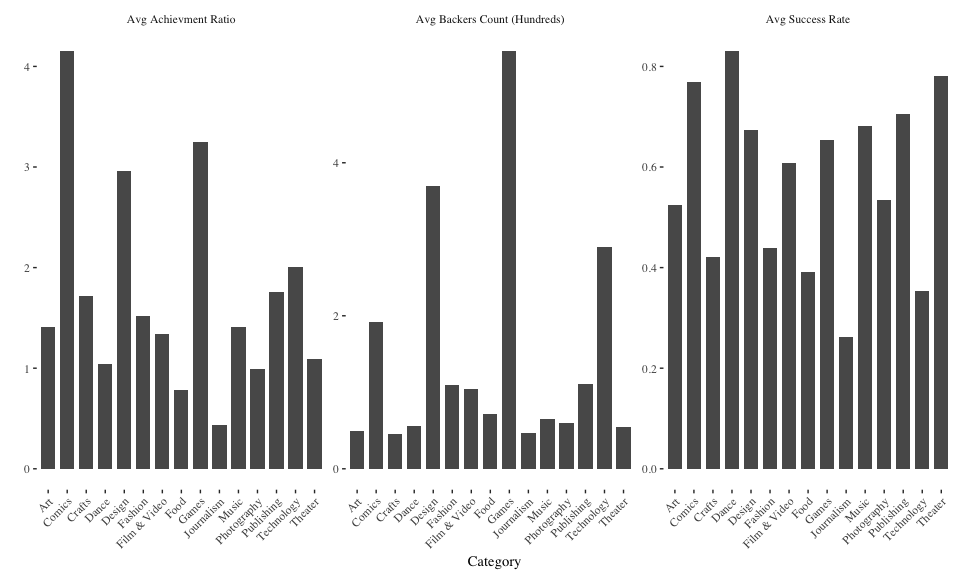
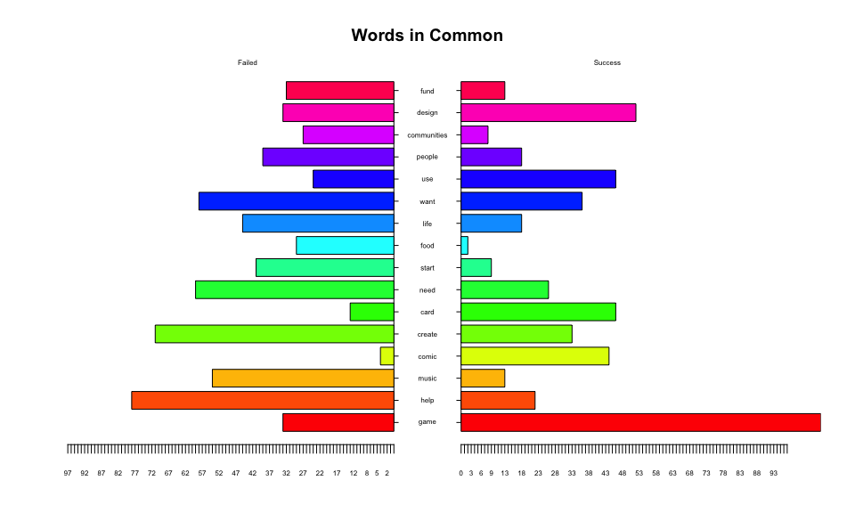
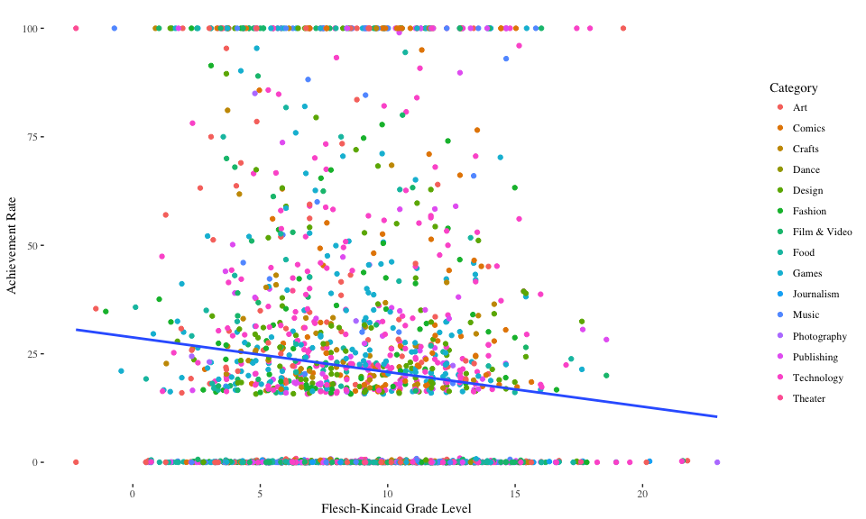
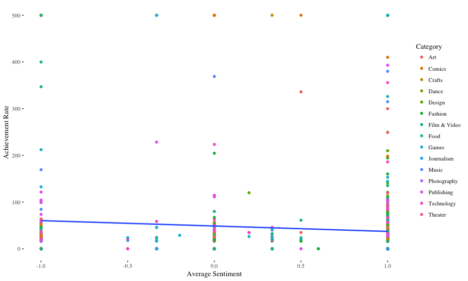
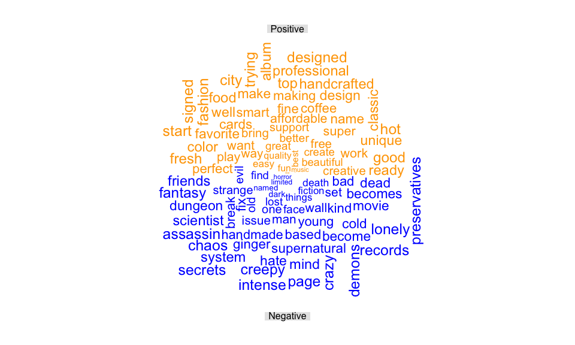
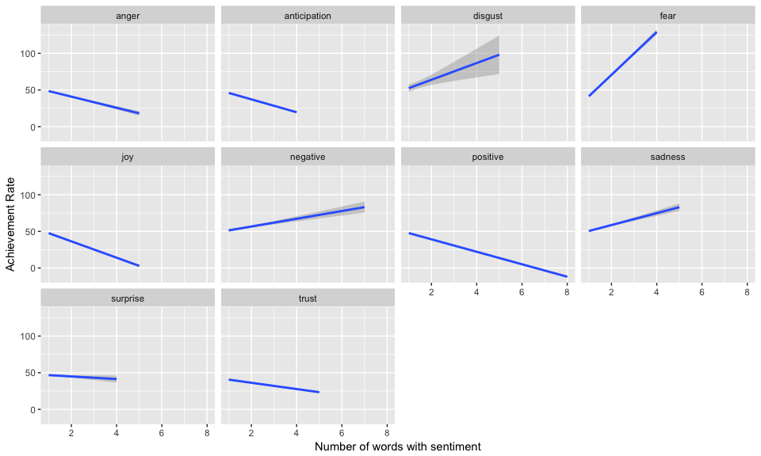

## Question 1




We can see that when looking at just the success rate, the difference between most categories is not too large, with a few, such as Comics, Dance, and Theater projects being the most likely to be a success. On the other hand, we see a few clear strong performers when looking at acievement ratio and average number of backers. Both Design and Games seem to perform very wll in both the measures, whereas Comics and Technology are very strong in one of the measures, but closer to the norm in another. It might be that projects which are niche and have a target audience which is closely knit (theater and dance) might be more likely to be successful, but projects such as games and design which might have a larger more dispersed audience raise more money/backers.

## Question 2

### A


### B




```
## [1] 5.1 4.1 4.1 2.1
```

### C



 Based on the plot it seems as if blubr which have denser language (bsed on the FK grade level) tend to be less succesful.
 
## Question 3
 
 
### A
 




Surprisingly it seems as if the achievement ratio falls as the average sentiment gets more positive. This seems somewhat odd, although it is positive that blurb which appeal to compassion might have negative words (for example, describing the state of impovershed children), but still be for a good cause.

### B




### C




Again the result seems odd, but is does match with out earlier result in (a). We see that for emotions that we may consider positive, the achievement ratio falls as the number of those words in the blurb increase, whereas the opposite is true for emotions that we would consider negative.
