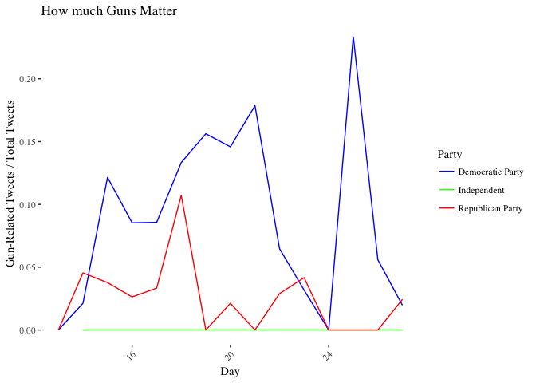

## Question 1: Who follows whom?

### A : Network of Followers


```r
Sen_edge <- read_csv("senators_follow.csv")
Sen_info <- read_csv("senators_twitter.csv")
```


```r
Sen_info2 <- Sen_info %>%
  select(State, Senator, source = `Official Twitter`, Party = `Party affiliation`)
Sen_info2 <- Sen_info2[,c(3,1,2,4)]

Sen_edge2 <- Sen_edge %>%
  filter(following == 1)

Sen_merged <- left_join(Sen_edge2, Sen_info2, by = "source") 


#G <- graph_from_data_frame(Sen_edge2, directed = T, vertices = Sen_info2)
# Something's wrong, the two don't match.
temp <- Sen_edge2[,1]
temp <- unique(temp)
temp$source <- sort(temp$source)
temp2 <- Sen_info2[,1]
temp2$source <- sort(temp2$source)
temp3 <- cbind(temp2, temp)
temp3$same <- temp3[,1] == temp3[,2]

## A few names in the info are off, matching manually
Sen_info2$source[Sen_info2$source =="jiminhofe"] <- "JimInhofe"
Sen_info2$source[Sen_info2$source == "SenDavidPerdue"] <- "sendavidperdue"
Sen_info2$source[Sen_info2$source == "senmarkey"] <- "SenMarkey"
Sen_info2$source[Sen_info2$source == "SenOrrinHatch"] <- "senorrinhatch"
Sen_info2$source[Sen_info2$source == "SenRobPortman"] <- "senrobportman"


G <- graph_from_data_frame(Sen_edge2, directed = T, vertices = Sen_info2)

indegree <- degree(G, mode = "in")
outdegree <- degree(G, mode = "out")

top_indegree <- sort(indegree, decreasing = T)[1:3]
top_outdegree <- sort(outdegree, decreasing = T)[1:3]

top_indegree
```

```
## SenJeffMerkley SenJohnKennedy      SenMarkey 
##             97             96             96
```

```r
top_outdegree
```

```
## SenatorCollins  SenJohnMcCain  lisamurkowski 
##             82             79             76
```

We can see that the Senators that follow the most number are Senator Susan Collins (R), Senator John McCain (R), and Senator Lisa Murkowski (R), whereas the senators which have the largest followings are Senator Jeff Merkley (D), Senator John Kennedy (R), and Senator Ed Markey (D).

It is interesting that all three of the Senators that follow the largest number are Republicans, two of which are female, whereas all three of the Senators with the largest followings are male.


```r
V(G)$Popularity <- degree(G, mode = 'in')
ggraph(G, layout = 'kk') + 
    geom_edge_fan(alpha = 0.05, show.legend = FALSE) + 
    geom_node_point(aes(size = Popularity, color = Party)) + 
    scale_color_manual(values=c("Blue", "Green", "Red")) +
    theme_graph(foreground = 'steelblue', 
                fg_text_colour = 'white') +
  ggtitle("Senate Twitter Network")
```


We see that there is strong clustering by party, moreover the nodes that are the biggest (most central) are the ones which seem the be the most moderate in terms of having following across party lines. The location of the two independents also makes some sense.

### B : Communities


```r
Clusters <- cluster_walktrap(G)
members <- membership(Clusters)
df <- data.frame(names(members), as.vector(members))
df <- df %>%
  rename(source = names.members., cluster = as.vector.members.) %>%
  left_join(Sen_info2, by = "source")

table(df$cluster, df$Party)
```

```
##    
##     Democratic Party Independent Republican Party
##   1               47           2                0
##   2                0           0               51
```


We can see that the natural clustering corresponds perfectly along party lines (with the independents being grouped with the Dems). Although this is not surprising, I wonder if the same would have been true 2 decades ago (with a hypothetical twitter).

## Question 2 : What are they tweeting about?

### A : Most Common Topics over Time

```r
senator_tweets <- readRDS("senator_tweets.RDS")
```


```r
Sen_tweets_2 <- senator_tweets %>%
  select(created_at, screen_name, is_retweet, hashtags) %>%
  filter(is_retweet == 0 & !is.na(hashtags)) %>%
  mutate(hashtags = tolower(hashtags))

H <- Sen_tweets_2$hashtags

H_mat <- str_split_fixed(H, ",", n = 20)
H_mat <- H_mat[, colSums(H_mat != "") != 0]
## Only one person has more than 10 hashtags. Ignoring those after then 10th.

H_mat <- H_mat[,1:10]

Sen_tweets_2 <- cbind(Sen_tweets_2, H_mat) %>%
  select(-hashtags)

Sen_tweets_2 <- gather(Sen_tweets_2, hashtag_number, hashtag, 4:13) %>%
  mutate(hashtag = gsub("c(", "", hashtag, fixed = TRUE)) %>%
  mutate(hashtag = gsub("[^[:alnum:]]", "", hashtag))

Sen_tweets_2 <- Sen_tweets_2 %>%
  mutate(created_at = as_datetime(created_at)) %>%
  mutate(created_at = ymd_hms(created_at)) %>%
  mutate(month = month(created_at),
         year = year(created_at)) 
```


Below we can see the wordcloud of hastags for each year from 2008 to 2018. In the earlier years there were very few tweeters and tweets and thus the wordclouds are sparse, however from 2011 onwards we see interesting patterns, with word like recognizable hashtags such as "Obamacare", "Benghazi", "Trumcare", "TaxReform", etc.


```r
set.seed(12345)
Sen_tweets_2a <- Sen_tweets_2 %>%
  select(hashtag, year) %>%
  filter(hashtag != "") %>%
  group_by(year, hashtag) %>%
  mutate(word_count = n()) %>%
  filter(year > 2010)

Sen_tweets_2a <- unique(Sen_tweets_2a) %>%
  group_by(year) %>%
  top_n(25, word_count)

par(mfrow=c(4,2))
#for (i in 2011:2018){
#  Temp2 <- Sen_tweets_2a %>%
#    filter(year == i)
#  wordcloud(Temp2$hashtag, Temp2$word_count, scale=c(4.5, 0.5))
#}
```

### 2011                                          2012


### 2013                                          2014


### 2015                                          2016


### 2017                                         2018


### B : Democrats vs. Republicans


```r
set.seed(123456)
Sen_tweets_2b <- Sen_tweets_2 %>%
  select(hashtag, year, screen_name) %>%
  filter(hashtag != "") %>%
  filter(year > 2015) %>%
  left_join(Sen_info2, by = c("screen_name" = "source")) %>%
  group_by(year, hashtag, Party) %>%
  mutate(word_count = n()) %>%
  ungroup() %>%
  distinct(year, hashtag, Party, word_count)

par(mfrow=c(3,2))
#for (i in 2016:2018) {
#  Temp <- Sen_tweets_2b %>%
#    mutate(year = as.numeric(year)) %>%
#    filter(year == i)
#  TempR <- Temp %>%
#    filter(Party == "Republican Party")
#  wordcloud(TempR$hashtag, TempR$word_count, max.words = 25, scale=c(4.5, .5), random.order = #FALSE, random.color = FALSE, colors= c("indianred1","indianred2","indianred3","indianred"))
#    TempD <- Temp %>%
#    filter(Party == "Democratic Party")
#  wordcloud(TempD$hashtag, TempD$word_count, max.words = 25, scale=c(4.5, .5), random.order = #FALSE, random.color = FALSE, colors= #c("lightsteelblue1","lightsteelblue2","lightsteelblue3","lightsteelblue"))
#}
```

### 2016


### 2017


### 2018


### C : Gun Control I - Dems vs. Reps


```r
Sen_tweets_2c <- Sen_tweets_2 %>%
  select(hashtag, year, screen_name) %>%
  filter(hashtag != "") %>%
  left_join(Sen_info2, by = c("screen_name" = "source")) %>%
  group_by(year, hashtag, Party) %>%
  mutate(word_count = n()) %>%
  ungroup()

Support_control <- c("guncontrol", "guncontrolnow", "gunsafety", "againagain", "safety", "ban", "shooting")
Oppose_control <- c("2ndamendment", "nra", "liberals", "gunsense", "firearms", "gunrights", "carry", "guns")

Support_control <- cbind(Support_control, c(rep("Support", 7)))
Oppose_control <- cbind(Oppose_control, c(rep("Oppose", 8)))

Gun_tags <- rbind(Support_control, Oppose_control)
Gun_tags <- data.frame(Gun_tags) %>%
  mutate(Support_control  = as.character(Support_control))

Sen_tweets_2c <- inner_join(Sen_tweets_2c, Gun_tags, by = c("hashtag" = "Support_control")) %>%
  rename(Position = V2)

Sen_tweets_2c <- Sen_tweets_2c %>%
  group_by(year, Party, Position) %>%
  mutate(total_ht = sum(word_count)) %>%
  ungroup() %>%
  mutate(year = as.factor(year))
```


```r
ggplot(Sen_tweets_2c, aes(x = year, y = total_ht)) +
    geom_bar(aes(fill = Party), stat='identity', position='dodge', width = .75 )  +
  ylab("# of Tweets") + xlab("Year") + ggtitle("Gun Control Tweets") +
  theme_tufte() +
  theme(axis.text.x = element_text(angle = 45, hjust = 1)) + 
  scale_fill_manual(values=c("Blue", "Green", "Red")) +
  facet_wrap(~Position, scales = "free") 
```


Above we present a bar plot showing the number of tweets per year, split by tweets which oppose gun control, and support gun control. The tweets opposing gun control are almost completely originated by Republicans, whereas tweets supporting gun control do come from both sides of the isle. Over time, in general there has been an increase in tweets supporting gun control, compared to those opposing.

The two peak years for the sides opposing Gun control and supporting gun control are 2013 and 2018 respectively. Below I present the wordclouds to look at which hashtags were dominating the tweets.

### 2013


```r
Temp <- Sen_tweets_2c %>%
  filter(year == 2013) %>%
  group_by(hashtag) %>%
  mutate(total_ht = n()) %>%
  ungroup() %>%
  distinct(hashtag, total_ht)

wordcloud(Temp$hashtag, Temp$total_ht, scale = c(3.5, 1.5))
```


### 2018


```r
Temp <- Sen_tweets_2c %>%
  filter(year == 2018) %>%
  group_by(hashtag) %>%
  mutate(total_ht = n()) %>%
  ungroup() %>%
  distinct(hashtag, total_ht)

wordcloud(Temp$hashtag, Temp$total_ht, scale = c(3.5, 1.5))
```


We see that 2013 both the hastags "2ndamendment" and "guncontrol" were big (amongst republicans), whereas in 2018 democrats widely used "gunsafety".

### D : Gun Control II - Parkland Shooting


```r
Sen_tweets_2d <- Sen_tweets_2 %>%
  mutate(Period = created_at > "2018-02-13" & created_at < "2018-02-28") %>%
  filter(Period == TRUE) %>%
  filter(hashtag != "") %>%
  mutate(Day = day(created_at)) %>%
  left_join(Sen_info2, by = c("screen_name" = "source")) %>%
  group_by(Party, Day) %>%
  mutate(total_daily_tweets = n()) %>%
  ungroup() %>%
  group_by(Day, hashtag) %>%
  mutate(tweet_num = n()) %>%
  ungroup() %>%
  group_by(Day, hashtag, Party) %>%
  mutate(tweet_num_byparty = n()) %>%
  ungroup() %>%
  distinct(Day, hashtag, Party, total_daily_tweets, tweet_num, tweet_num_byparty, .keep_all = TRUE) %>%
  group_by(Day) %>%
  mutate(max_tweets = max(tweet_num)) %>%
  ungroup()

Max_tweets <- Sen_tweets_2d %>%
  filter(max_tweets == tweet_num)

par(mfrow=c(1,2))
  Temp <- Sen_tweets_2d %>%
    filter(Day == 14 | Day == 15)
  TempR <- Temp %>%
    filter(Party == "Republican Party")
  wordcloud(TempR$hashtag, TempR$tweet_num, max.words = 25, scale=c(4.0, .4), random.order = FALSE, random.color = FALSE, colors= c("indianred1","indianred2","indianred3","indianred"))
    TempD <- Temp %>%
    filter(Party == "Democratic Party")
  wordcloud(TempD$hashtag, TempD$tweet_num, max.words = 25, scale=c(4.0, .4), random.order = FALSE, random.color = FALSE, colors= c("lightsteelblue1","lightsteelblue2","lightsteelblue3","lightsteelblue"))
```


The above wordcloud looks at the distribution of hashtags amonst Dems and Republicans for the dates of the 14th and 15th. In both cases, we see other issues dominate gun control, particularily for Republicans.


```r
par(mfrow=c(1,2))
  Temp <- Sen_tweets_2d %>%
    filter(Day >= 14 | Day <= 21)
  TempR <- Temp %>%
    filter(Party == "Republican Party")
  wordcloud(TempR$hashtag, TempR$tweet_num, max.words = 25, scale=c(2.5, .4), random.order = FALSE, random.color = FALSE, colors= c("indianred1","indianred2","indianred3","indianred"))
    TempD <- Temp %>%
    filter(Party == "Democratic Party")
  wordcloud(TempD$hashtag, TempD$tweet_num, max.words = 25, scale=c(2.5, .4), random.order = FALSE, random.color = FALSE, colors= c("lightsteelblue1","lightsteelblue2","lightsteelblue3","lightsteelblue"))
```


When we expand the scope of days we consider we see some Republicans talkin about the shooting (Studentstandup) although not gun control. Overall, both sides of the isle seem to be focusing on other issues.


```r
gun_issues <- c("guncontrol", "guncontrolnow", "gunsafety", "againagain", "safety", "ban", "shooting", "2ndamendment", "nra", "liberals", "gunsense", "firearms", "gunrights", "carry", "guns", "enoughisenough", "assaultweaponsban", "parklandshooting", "14straight", "parklandstudentsspeak", "marchforourlives", "backgroundchecks" , "endgunviolence", "stopgunviolence","enough", "parkland", "stonemanshooting", "banassaultweapons", "banbumpstocks", "gunreformnow", "floridaschoolshooting", "browardcounty", "prayersforflorida" )

gun_issues <- data.frame(gun_issues) %>%
  mutate(Gun_topic = 1)

Sen_tweets_2dd <- Sen_tweets_2 %>%
  mutate(Period = created_at > "2018-02-13" & created_at < "2018-02-28") %>%
  filter(Period == TRUE) %>%
  filter(hashtag != "") %>%
  mutate(Day = day(created_at)) %>%
  left_join(Sen_info2, by = c("screen_name" = "source"))

Sen_tweets_2dd <- left_join(Sen_tweets_2dd, gun_issues, by = c("hashtag" = "gun_issues"))
```

```
## Warning: Column `hashtag`/`gun_issues` joining character vector and factor,
## coercing into character vector
```

```r
Sen_tweets_2dd$Gun_topic[is.na(Sen_tweets_2dd$Gun_topic)] <- 0

Sen_tweets_2dd <- Sen_tweets_2dd %>%
  group_by(Day, Party) %>%
  mutate(total_daily_tweet_party = n(),
         total_gun_tweet_party = sum(Gun_topic),
         pct_about_guns = total_gun_tweet_party/total_daily_tweet_party) %>%
  ungroup() %>%
  distinct(Day, Party, .keep_all = TRUE)

ggplot(Sen_tweets_2dd, aes(x = Day, y = pct_about_guns)) +
    geom_line(aes(color = Party))  +
  ylab("Gun-Related Tweets / Total Tweets") + xlab("Day") + ggtitle("How much Guns Matter") +
  theme_tufte() +
  theme(axis.text.x = element_text(angle = 45, hjust = 1)) + 
  scale_color_manual(values=c("Blue", "Green", "Red"))
```



Based on the above graph we can see the percentage of daily tweets that were gun or shooting related among both parties. We clearly see that Democrats tend to talk more about guns throughout the month. 


## Question 3 : Are you talking to me?


### A : Identifying Re-Tweets


```r
senator_tweets <- readRDS("senator_tweets.RDS")
```


```r
sen_tweets_3 <- senator_tweets %>%
  filter(is_retweet == TRUE) %>%
  select(screen_name, text) %>%
  mutate(origin = sub(".*@ *(.*?) *:.*", "\\1", text))
```


```r
sen_tweets_3a <- inner_join(sen_tweets_3, Sen_info2, by = c("origin" = "source")) %>%
  select(screen_name, origin, origin_party = Party)

sen_tweets_3a <- inner_join(sen_tweets_3a, Sen_info2, by = c("screen_name" = "source")) %>%
  select(screen_name, origin, Main_party = Party, origin_party) %>%
  group_by(screen_name, origin_party) %>%
  mutate(RT_by_party = n()) %>%
  ungroup()

sen_tweets_3_noind <- sen_tweets_3a %>%
  filter(Main_party != "Independent") %>%
  arrange(desc(RT_by_party))

ggplot(sen_tweets_3_noind ,aes(x = screen_name, y = RT_by_party)) +
    geom_bar(aes(fill = origin_party), stat='identity', position='dodge', width = .75 )  +
  ylab("# of Tweets") + xlab("Year") + ggtitle("Retweeting along Party Lines") +
  theme_tufte() +
  coord_flip() +
  scale_fill_manual(values=c("Blue", "Green", "Red"), name = "Source of retweet" ) +
  facet_grid(Main_party~., scales = "free") 
```


```r
ggplot(sen_tweets_3_noind ,aes(x = screen_name, y = RT_by_party)) +
    geom_bar(aes(fill = origin_party), stat='identity', position='fill', width = .75 )  +
  ylab("# of Tweets") + xlab("Year") + ggtitle("Retweeting along Party Lines") +
  theme_tufte() +
  coord_flip() +
  scale_fill_manual(values=c("Blue", "Green", "Red"), name = "Source of retweet" ) +
  facet_grid(Main_party~., scales = "free")
```


We can see that across both parties the majority of re-tweeting is done along party lines. Although there are a few exceptions, such as Susan Collins, Rand Paul, and Dean Heller on the Republican side.


```r
sen_tweets_3a <- sen_tweets_3a %>%
  select(screen_name, origin)

G <- graph_from_data_frame(sen_tweets_3a, directed = T, vertices = Sen_info2)
V(G)$Popularity <- degree(G, mode = 'in')
ggraph(G, layout = 'kk') + 
    geom_edge_fan(alpha = 0.1, show.legend = FALSE) + 
    geom_node_point(aes(size = Popularity, color = Party)) + 
    scale_color_manual(values=c("Blue", "Green", "Red")) +
    theme_graph(foreground = 'steelblue', 
                fg_text_colour = 'white') +
  ggtitle("Senate re-tweet Network")
```


### B : Identifying Mentions


```r
sen_tweets_3b <- senator_tweets %>%
  select(screen_name, mentions_screen_name, is_retweet) %>%
  filter(is_retweet == FALSE,
         !is.na(mentions_screen_name))

H <- sen_tweets_3b$mentions_screen_name

H_mat <- str_split_fixed(H, ",", n = 20)
H_mat <- H_mat[, colSums(H_mat != "") != 0]


sen_tweets_3b <- cbind(sen_tweets_3b, H_mat) %>%
  select(-mentions_screen_name)

sen_tweets_3b <- gather(sen_tweets_3b, mention_number, mention, 3:21) %>%
  mutate(mention = gsub("c(", "", mention, fixed = TRUE)) %>%
  mutate(mention = gsub("[^[:alnum:]]", "", mention)) %>%
  select(screen_name, mention) %>%
  inner_join(Sen_info2, by = c("mention" = "source")) %>%
  select(screen_name, mention)

#sen_tweets_3b_inv <- sen_tweets_3b %>%
#  rename(Temp = screen_name, screen_name = mention) %>%
#  rename(mention = Temp) %>%
#  select(screen_name, mention)

#sen_bothsides <- rbind(sen_tweets_3b, sen_tweets_3b_inv) %>%
#  group_by(screen_name, mention) %>%
#  mutate(strenght = n()) %>%
#  ungroup() %>%
#  distinct(screen_name, mention, .keep_all = TRUE)
```


```r
G <- graph_from_data_frame(sen_tweets_3b, directed = FALSE, vertices = Sen_info2)
#G1 <- graph_from_data_frame(sen_bothsides, directed = FALSE, vertices = Sen_info2)
#X <- eigen_centrality(G, directed = FALSE, scale = TRUE, weights = NULL,options = arpack_defaults)[[1]]
#V(G1)$Centrality <- as.matrix(X)
V(G)$Popularity <- degree(G, mode = 'in')

ggraph(G, layout = 'kk') + 
    geom_edge_fan(alpha = 0.02, show.legend = FALSE) + 
    geom_node_point(aes(size = Popularity, color = Party)) + 
    scale_color_manual(values=c("Blue", "Green", "Red")) +
    theme_graph(foreground = 'steelblue', 
                fg_text_colour = 'white') +
  ggtitle("Senate Mentions Network")
```


We see that the majority of the mentions are also along party lines. However on both sides of the isle there are a few nodes which happen to be mentioned more by the opposing party. This is likely the heads of the respective parties which are mentioned in a negative light by the opposition. Interestingly, it seems as if in general the Republican senators tend to be more popular as measured by degree centrality when compared to the Democrats.
